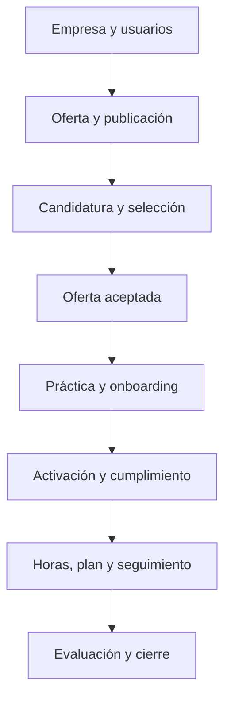
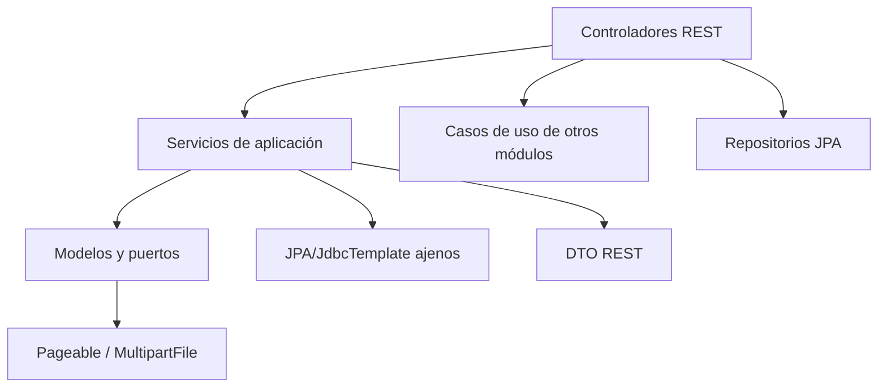
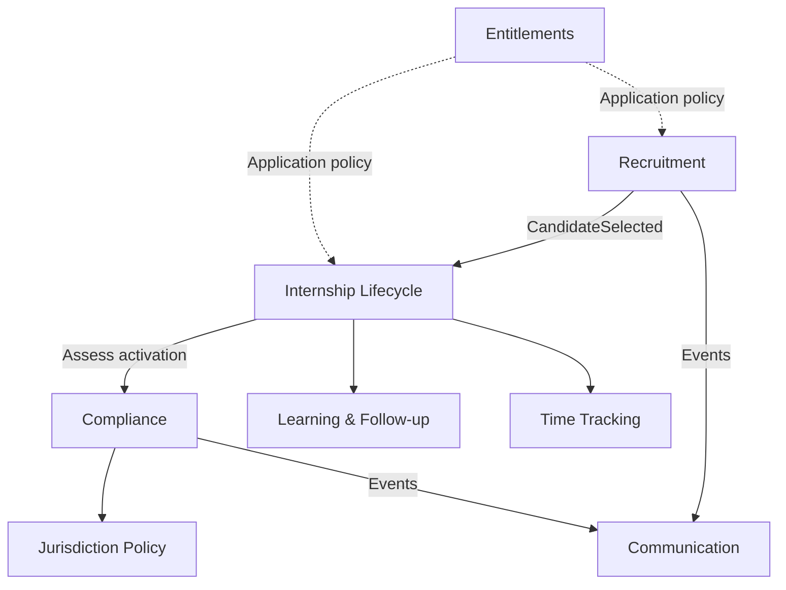

# ProPractix V1 — Auditoría de producto y arquitectura para V2

**Enfoque objetivo:** Domain-Driven Design (DDD), arquitectura hexagonal y monolito modular  
**Fecha de auditoría:** 11 de septiembre de 2026  
**Fuente analizada:** `MVP-develop.zip`  
**SHA-256:** `af802cd1fee2eb66d1fa0eb58748cd677fedd3c7061d9cde6829dff3e05f8451`  
**Alcance:** backend, frontend, modelo de datos, seguridad, internacionalización, jurisdicciones, pruebas, CI/CD y priorización funcional V1 → V2.

---

## 1. Resumen ejecutivo

ProPractix V1 contiene una cantidad importante de conocimiento de producto y varios activos técnicos que merece la pena conservar. No es un prototipo vacío: implementa un flujo amplio de reclutamiento, incorporación, gestión de prácticas y cumplimiento, con soporte inicial para múltiples jurisdicciones e idiomas.

Sin embargo, **la estructura del código parece hexagonal más de lo que realmente lo es**. Existen carpetas `domain`, `application` e `infrastructure`, pero las dependencias atraviesan esos límites con frecuencia; el dominio es principalmente anémico; la lógica de negocio está concentrada en servicios de aplicación grandes; y varios módulos se conocen mediante repositorios y entidades JPA internas. El resultado es un monolito funcional, pero no todavía un monolito modular con límites de negocio fiables.

La recomendación principal es:

> **Construir V2 como un monolito modular nuevo, reutilizando conocimiento, pruebas de comportamiento, lenguaje de negocio, migraciones seleccionadas y algunos adaptadores de V1; no copiar la organización interna de V1 módulo por módulo.**

Antes de iniciar V2 deben corregirse o aislarse tres problemas críticos en V1:

1. **Aislamiento entre empresas incompleto en ofertas.** Un usuario `COMPANY_HR` puede invocar varias operaciones por UUID sin que el controlador o el caso de uso verifiquen que la oferta pertenece a su empresa.
2. **La migración V126 no se ejecuta y, si se ubicara correctamente, fallaría.** Está fuera de la ruta de Flyway y usa columnas `key`/`value`, mientras la tabla define `config_key`/`config_value`.
3. **El motor de reglas legales falla en modo permisivo.** Una regla mal formada, un dato ausente o un operador desconocido puede ser interpretado como ausencia de infracción.

La V2 debería comenzar con España, pero modelando España como el primer *policy pack* de una jurisdicción, no como condicionales dispersos. Colombia y el resto de países deben permanecer catalogados, pero no activarse comercialmente hasta contar con reglas, documentos, pruebas y validación legal versionados.

### Evaluación resumida

| Dimensión | Estado | Lectura |
|---|---:|---|
| Valor funcional acumulado | Alto | Hay flujos reales y amplio conocimiento del negocio. |
| Claridad de producto | Media-baja | La superficie funcional supera al núcleo de valor y mezcla MVP, planes e integraciones. |
| DDD táctico | Bajo | Predominan modelos de datos mutables y servicios procedimentales. |
| Límites entre contextos | Bajo | Hay dependencias bidireccionales y acceso directo a infraestructura ajena. |
| Arquitectura hexagonal | Parcial | Existen puertos/adaptadores, pero no se respeta sistemáticamente la regla de dependencias. |
| Aislamiento multi-tenant | Riesgo alto | El patrón es correcto en varios flujos, pero no es uniforme. |
| Internacionalización | Media-alta | Once idiomas, aunque existen claves desalineadas y textos hardcodeados. |
| Multi-jurisdicción | Media | La base existe, pero falta versionado, tipado y una política segura ante errores. |
| Pruebas | Media | Buen volumen backend; CI no valida frontend ni E2E. |
| Operabilidad | Media-baja | Documentación raíz escasa, scripts inconsistentes y observabilidad limitada. |

---

## 2. Alcance y metodología

La auditoría se realizó mediante análisis estático del contenido completo del ZIP:

- inventario de archivos y líneas de código;
- estructura de paquetes y dependencias entre módulos;
- modelos de dominio, puertos, casos de uso, controladores y persistencia;
- rutas frontend y endpoints backend;
- migraciones Flyway y configuración por entorno;
- autenticación, autorización, aislamiento de tenant y carga de archivos;
- catálogos, reglas jurisdiccionales e internacionalización;
- pruebas unitarias, integración, E2E y workflow CI;
- documentación funcional incluida en el repositorio.

### Limitación de ejecución

No fue posible compilar o ejecutar las suites en este entorno porque las dependencias Maven y npm no estaban disponibles localmente y el acceso al repositorio público de Maven estaba bloqueado. El intento de compilación terminó antes de compilar el código por no poder resolver el *parent POM* de Spring Boot. Por tanto:

- los defectos señalados como **confirmados** se sustentan directamente en código/configuración;
- los riesgos de comportamiento se etiquetan como **riesgo** o **deben verificarse** cuando requieren ejecución;
- no se atribuye el fallo de compilación al repositorio.

---

## 3. Inventario técnico

### 3.1 Tamaño

| Elemento | Cantidad observada |
|---|---:|
| Archivos totales extraídos | 1.501 |
| Tamaño descomprimido | 62 MB |
| Clases Java de producción | 844 |
| Líneas Java de producción | 46.046 |
| Clases Java de pruebas | 123 |
| Líneas Java de pruebas | 24.174 |
| Archivos JS/JSX de frontend | 255 |
| Líneas JS/JSX de frontend | 42.972 |
| Componentes de página React, sin tests | 88 |
| Declaraciones `<Route>` | 92 |
| Controladores backend | 63 |
| Anotaciones de endpoint REST | 302 |
| Modelos ubicados en `domain/model` | 75 |
| Tablas creadas por las migraciones | 76 nombres únicos |
| Migraciones en `db/migration/common` | 107 |

### 3.2 Stack identificado

- Java 21 y Spring Boot.
- Spring MVC, Security, Data JPA, JDBC, Validation, Mail, Cache y Actuator.
- PostgreSQL 16 y Flyway.
- JWT, refresh token persistido y cookie `HttpOnly`.
- AWS S3/Secrets Manager, con LocalStack en desarrollo.
- DocuSign, Google Calendar y Outlook.
- React 18 + Vite.
- React Query, Zustand, React Hook Form, Zod, i18next, Recharts y dnd-kit.
- JUnit, Spring Test, Testcontainers, Vitest y Playwright.

### 3.3 Módulos backend actuales

Se observan 22 carpetas funcionales bajo `modules`: `admin`, `analytics`, `auth`, `calendar`, `company`, `compliance`, `dashboard`, `docusign`, `hiring`, `intern`, `internship`, `messaging`, `notifications`, `onboarding`, `operations`, `performance`, `reports`, `sena`, `subscription`, `talentpool`, `tutor` y `universitytutor`, además de `registration` y `shared/legal` fuera de esa convención.

Los módulos más grandes son:

| Módulo | Clases Java |
|---|---:|
| `hiring` | 90 |
| `admin` | 81 |
| `compliance` | 74 |
| `operations` | 62 |
| `performance` | 43 |
| `intern` | 38 |
| `auth` | 35 |
| `onboarding` | 35 |
| `notifications` | 32 |
| `internship` | 28 |
| `docusign` | 28 |

Esta distribución confirma que la complejidad central está en contratación, cumplimiento y operación de la práctica, pero la fragmentación actual no siempre coincide con verdaderos *bounded contexts*.

---

## 4. Mapa funcional de V1

La aplicación cubre cuatro recorridos principales:



### Capacidades encontradas

- registro de empresas y estudiantes;
- autenticación, verificación de email, recuperación de contraseña e impersonación administrativa;
- ofertas públicas y privadas;
- candidaturas, pipeline, entrevistas, puntuación y bolsa de talento;
- envío y aceptación de condiciones;
- creación y ciclo de vida de prácticas;
- onboarding y plantillas;
- convenios, Seguridad Social, PRL, GDPR, alertas y expediente legal;
- tutores de empresa y universidad;
- objetivos, plan de trabajo, horas y reuniones;
- evaluaciones, autoevaluaciones y encuesta de salida;
- notificaciones y mensajería;
- informes y analítica;
- planes, límites y *feature gates*;
- DocuSign y calendarios externos;
- configuración inicial de España y Colombia;
- catálogos activos para muchos otros países, aún sin configuración legal completa.

La amplitud es una fortaleza como fuente de aprendizaje, pero constituye un riesgo si se traslada completa al primer release de V2.

---

## 5. Hallazgos priorizados

### Escala

- **P0 — Crítico:** riesgo de seguridad, integridad legal o despliegue; atender antes de seguir ampliando V1.
- **P1 — Alto:** obstaculiza la reconstrucción o genera una probabilidad alta de defectos.
- **P2 — Medio:** deuda relevante que debe incorporarse al diseño/roadmap.
- **P3 — Bajo:** mejora deseable sin urgencia inmediata.

| ID | Prioridad | Hallazgo | Estado |
|---|---:|---|---|
| H-01 | P0 | Operaciones de ofertas sin comprobación de tenant | Confirmado |
| H-02 | P0 | Migración V126 ignorada y con SQL incompatible | Confirmado |
| H-03 | P0 | Motor de reglas legales en modo *fail-open* | Confirmado |
| H-04 | P1 | Límites hexagonales vulnerados en la capa de aplicación | Confirmado |
| H-05 | P1 | Dominio anémico y estados críticos representados como `String` | Confirmado |
| H-06 | P1 | Dependencias cíclicas entre módulos | Confirmado |
| H-07 | P1 | Servicio de compliance de 1.978 líneas con múltiples responsabilidades | Confirmado |
| H-08 | P1 | Credencial de sesión E2E incluida fuera de la ruta ignorada | Confirmado |
| H-09 | P1 | CI no compila ni prueba el frontend | Confirmado |
| H-10 | P1 | Catálogo de países “activos” excede jurisdicciones legalmente soportadas | Confirmado |
| H-11 | P1 | Reglas jurisdiccionales sin vigencia, versión ni validación de esquema | Confirmado |
| H-12 | P2 | Vocabulario de estados inconsistente | Confirmado |
| H-13 | P2 | Dos conceptos de país y defaults geográficos hardcodeados | Confirmado |
| H-14 | P2 | Carga de documentos sin límites/tipo robusto en varios flujos | Confirmado |
| H-15 | P2 | Contrato frontend-backend manual e inconsistente | Confirmado |
| H-16 | P2 | Cobertura i18n desigual y textos fuera del sistema de traducción | Confirmado |
| H-17 | P2 | Refresh tokens persistidos en texto claro y sin rotación | Confirmado |
| H-18 | P2 | Falta de pruebas automáticas de arquitectura y multi-tenancy | Confirmado |
| H-19 | P2 | Mezcla de dominio, planes comerciales y entitlements | Confirmado |
| H-20 | P3 | Documentación operativa raíz insuficiente y scripts obsoletos | Confirmado |

---

## 6. Detalle de hallazgos

### H-01 — Aislamiento entre tenants incompleto en ofertas — P0

**Evidencia**

En `server/src/main/java/com/propractix/modules/hiring/infrastructure/adapters/in/rest/OfferController.java`:

- `update` (líneas 109–120) recibe el UUID de la oferta y llama a `updateOffer` sin pasar el `companyId` autenticado;
- `history` (123–130) no recibe siquiera el encabezado de autorización en el método;
- `togglePublish` (133–139) opera solo con el UUID;
- `duplicate` (142–151) toma el usuario autenticado, pero no valida que la oferta sea de su empresa.

El rol `COMPANY_HR` es suficiente para entrar, pero el rol no demuestra propiedad sobre el recurso. Los casos de uso cargan por ID global.

**Impacto**

Si un UUID de otra empresa se conoce o filtra, existe riesgo de lectura del historial, modificación, publicación/cierre o duplicación de una oferta ajena. Es una vulnerabilidad de tipo IDOR/BOLA y rompe la promesa multi-tenant.

**Acción inmediata**

- Cambiar los contratos a `updateOffer(TenantId, OfferId, ...)`, `publishOffer(TenantId, OfferId)` y equivalentes.
- Consultar siempre por `id AND company_id`, salvo un caso de uso administrativo explícito.
- No confiar en controles de la UI.
- Añadir pruebas negativas A→B para cada endpoint con recurso por UUID.
- Revisar sistemáticamente los otros 302 endpoints con el mismo criterio.

**Regla para V2**

`TenantId` debe formar parte del contexto de ejecución y de todas las consultas sobre aggregates tenant-owned. Un ID global por sí solo no es una autorización.

---

### H-02 — Migración V126 ignorada y con columnas erróneas — P0

**Evidencia**

- Producción y configuración base cargan Flyway solo desde `classpath:db/migration/common` (`application.yml`, línea 24).
- `V126__mvp_scope_restrict_practice_types.sql` está en `db/migration/`, fuera de `common`.
- La secuencia cargada salta de V125 a V127.
- La migración usa `SET value` y `WHERE key` (líneas 18–19), pero V67 creó `config_value` y `config_key`.

**Impacto**

La restricción declarada para el MVP no se aplica: tipos de práctica fuera de alcance y el módulo SENA pueden permanecer activos. Si el archivo se mueve sin corregirlo, el SQL fallará.

**Acción inmediata**

1. No modificar una migración que ya haya sido aplicada en entornos compartidos sin conocer su historial.
2. Crear una migración nueva, por ejemplo V131, dentro de `common`.
3. Usar `config_key` y `config_value`.
4. Añadir un test que inicie PostgreSQL vacío y verifique el estado final esperado de catálogos.
5. Añadir un control CI que rechace migraciones `V*.sql` fuera de las ubicaciones declaradas.

---

### H-03 — Motor de reglas legales permisivo ante errores — P0

**Evidencia**

En `shared/legal/application/RuleValidationEngine.java`:

- si el valor requerido no está en los datos, devuelve “sin violación” (líneas 99–103);
- cualquier excepción al leer/evaluar una regla se registra y devuelve “sin violación” (120–123);
- un operador desconocido produce `true`, es decir, regla superada (166–169);
- la evaluación de fórmulas también convierte errores en ausencia de resultado (199–215).

**Impacto**

Una regla legal mal configurada puede desactivar silenciosamente una validación. Esto es especialmente grave si el sistema comunica que una práctica está legalmente lista.

**Acción inmediata**

- Separar `COMPLIANT`, `NON_COMPLIANT` e `INDETERMINATE/CONFIGURATION_ERROR`.
- Impedir activar una práctica cuando una regla obligatoria está indeterminada.
- Validar el JSON contra un esquema antes de publicar una versión del policy pack.
- Hacer que operadores desconocidos y campos obligatorios ausentes sean errores de configuración.
- Emitir una alerta operativa con rule ID, versión y jurisdicción.

**Regla para V2**

Las reglas de cumplimiento deben ser objetos tipados/versionados y su fallo debe ser explícito. “No pude evaluar” nunca equivale a “cumple”.

---

### H-04 — Violación sistemática de arquitectura hexagonal — P1

**Evidencia cuantitativa**

Se localizaron **122 imports** desde la capa `application` hacia tipos de infraestructura o framework de persistencia/web.

Ejemplos:

- `HiringService` importa directamente `UserJpaRepository` e `InternJpaRepository`.
- `ApplicationStageService`, `OfferSendingService` y `PipelineInterviewService` importan entidades/repositories JPA y DTO REST.
- `LegalComplianceService`, `DashboardService`, `ReportsService`, `AnalyticsService` y otros usan `JdbcTemplate` directamente desde `application`.
- puertos de dominio exponen `Page`, `Pageable` y `MultipartFile` de Spring.

**Impacto**

- Los casos de uso quedan acoplados a Spring, JPA, JDBC y HTTP.
- Los tests de dominio requieren más infraestructura.
- No se puede sustituir un adaptador sin tocar aplicación/dominio.
- La estructura de carpetas deja de proteger la arquitectura.

**Recomendación V2**

- Dominio sin Spring.
- Aplicación dependiente solo de dominio y puertos propios.
- Tipos propios como `PageQuery`, `PageResult`, `FileContent`, `ActorContext` y `TenantContext`.
- Mapeo REST en adaptadores de entrada.
- JPA/JDBC/S3/email únicamente en adaptadores de salida.
- ArchUnit para impedir imports prohibidos.

---

### H-05 — Modelo de dominio anémico y poco tipado — P1

**Evidencia**

De 75 modelos en `domain/model`, se encontraron aproximadamente 18 métodos públicos con comportamiento, concentrados sobre todo en planes e integraciones. La mayoría usa Lombok `@Data`/`@Builder` y expone setters para todos sus campos.

Ejemplos:

- `Offer`, `Application`, `Internship` y `Company` son contenedores mutables.
- `status`, `stage`, `practiceType`, `modality`, `currencyCode` y otros conceptos críticos se representan como `String`.
- Las transiciones se realizan en servicios mediante `setStatus(...)`.

**Impacto**

Las invariantes pueden omitirse según el servicio o endpoint que modifica el objeto. El compilador no protege estados ni transiciones y el lenguaje ubicuo se fragmenta en strings.

**Recomendación V2**

Introducir aggregates y value objects con comportamiento:

- `Offer.publish(policy, actor)`;
- `Application.scheduleInterview(...)`;
- `Application.select(...)`;
- `Internship.activate(complianceDecision)`;
- `Timesheet.submit()` y `Timesheet.approve(byTutor)`;
- `Money`, `WeeklyHours`, `DateRange`, `CountryCode`, `JurisdictionCode`, `PracticeTypeCode`;
- enums o estados sellados dentro del contexto propietario.

Los aggregates deben crearse válidos, no rellenarse mediante setters.

---

### H-06 — Dependencias cíclicas entre módulos — P1

**Evidencia**

Se observaron 295 imports entre módulos. Hay ciclos directos representativos:

- `auth ↔ subscription`;
- `company ↔ admin`;
- `internship ↔ operations`;
- `compliance ↔ onboarding`;
- `compliance ↔ operations`;
- `compliance ↔ universitytutor`;
- `subscription ↔ hiring`;
- `subscription ↔ internship`;
- `subscription ↔ compliance`;
- `subscription ↔ tutor`.

**Impacto**

No existe una dirección estable de dependencias. Cambios en planes, compliance o prácticas pueden propagarse por buena parte del sistema; extraer un módulo sería costoso; y la propiedad del dato no es clara.

**Recomendación V2**

- Definir un *context map* antes de implementar.
- Prohibir imports de infraestructura entre contextos.
- Usar una fachada de aplicación publicada o eventos de integración.
- Mantener un DAG de dependencias y validarlo con ArchUnit.
- Evitar que `subscription` sea conocido por el dominio: exponer un puerto de `EntitlementDecision` en la capa de aplicación.

---

### H-07 — Compliance concentra demasiadas responsabilidades — P1

`LegalComplianceService.java` tiene **1.978 líneas**. En una sola clase aparecen:

- SQL y `RowMapper`;
- convenios;
- documentos;
- Seguridad Social;
- PRL;
- consentimientos GDPR;
- generación de PDF;
- almacenamiento;
- emails y notificaciones;
- onboarding;
- tutor universitario;
- límites de plan;
- transiciones de estado de prácticas.

**Impacto**

Es un *god service* y una transacción conceptual demasiado amplia. Las reglas legales, orquestación de procesos, persistencia y renderizado documental no evolucionan independientemente.

**Recomendación V2**

Separar al menos:

- `AgreementApplicationService`;
- `SocialSecurityApplicationService`;
- `RiskPreventionApplicationService`;
- `ConsentApplicationService`;
- `ComplianceAssessmentService`;
- `DocumentGenerationPort`;
- `DocumentStoragePort`;
- `InternshipActivationProcessManager`.

El contexto puede seguir siendo uno durante el primer release, pero con aggregates y puertos distintos.

---

### H-08 — Estado autenticado E2E incluido en el ZIP — P1

Existe `client/tests/tests/e2e/.auth/super-admin.json`, que contiene una cookie `refresh_token` y datos de sesión. El `.gitignore` cubre `client/tests/e2e/.auth/`, pero no esta ruta duplicada `client/tests/tests/e2e/.auth/`.

**Impacto**

Aunque parezca un entorno local, es material de autenticación que no debe versionarse ni distribuirse. También puede contener datos personales del usuario de prueba.

**Acción inmediata**

- Revocar el token y eliminar el archivo del historial cuando proceda.
- Corregir la ruta del test y ampliar reglas de ignore.
- Generar estado autenticado en CI, nunca almacenarlo en el repositorio.
- Añadir escaneo de secretos y artefactos Playwright.

---

### H-09 — CI cubre solo backend — P1

El workflow `.github/workflows/ci.yml` compila, prueba y analiza únicamente `server`. No ejecuta:

- `npm ci`;
- `npm run build`;
- Vitest;
- Playwright;
- linting del frontend;
- comprobación de claves i18n;
- escaneo de dependencias/contenedores.

**Impacto**

Es posible integrar cambios con frontend roto, contratos API incompatibles o rutas E2E inválidas.

**Recomendación**

Crear jobs separados y paralelos para backend, frontend y pruebas de contrato; ejecutar un E2E mínimo del journey principal después de desplegar el stack efímero.

---

### H-10 — Países seleccionables sin soporte legal completo — P1

V79 inserta numerosos países con `active=true` y `legally_configured=false`. `JurisdictionService.getActiveJurisdictions()` devuelve los activos y el registro los presenta. Esto permite que una empresa seleccione una jurisdicción no soportada plenamente.

**Impacto de producto**

El usuario puede interpretar “seleccionable” como “soportado”. Un banner de validación pendiente no sustituye una definición comercial clara.

**Recomendación V2**

Reemplazar dos booleanos por un estado explícito:

- `CATALOGUED`;
- `INTERNAL_TEST`;
- `PILOT`;
- `SUPPORTED`;
- `DEPRECATED`.

Para el primer release, España debe ser `SUPPORTED`; las demás, `CATALOGUED` y no seleccionables salvo *feature flag* de piloto.

---

### H-11 — Reglas jurisdiccionales sin ciclo de vida — P1

Las tablas `jurisdiction_config` y `jurisdiction_rules` contienen clave/valor y JSON, pero no modelan claramente:

- versión de policy pack;
- `effective_from` / `effective_to`;
- estado `DRAFT/PUBLISHED/RETIRED`;
- autor, aprobador y motivo del cambio;
- esquema de configuración;
- compatibilidad con prácticas ya iniciadas;
- instantánea de reglas aplicada a una decisión.

**Impacto**

Una actualización puede cambiar retrospectivamente la interpretación de prácticas existentes y dificultar auditorías.

**Recomendación V2**

Modelar `JurisdictionPolicyPack` como aggregate versionado. Cada decisión de cumplimiento debe registrar `policyPackVersion`, entradas relevantes, resultado y momento de evaluación.

---

### H-12 — Vocabulario de estados inconsistente — P2

`InterviewStatus` declara `PENDING`, pero DB/API/servicios usan `SCHEDULED`; el propio código documenta la divergencia. En ofertas, la UI/documentación usa “PUBLISHED” como alias mientras el dominio persiste `ACTIVE`.

**Impacto**

Mapeos especiales, errores de serialización y mayor dificultad para hablar de estados con producto/QA.

**Recomendación**

Un estado canónico por contexto. La traducción es una etiqueta de UI, no otro valor de dominio.

---

### H-13 — Dos fuentes de país y defaults hardcodeados — P2

Existen simultáneamente:

- tabla/catálogo `countries`;
- tabla/catálogo `jurisdictions`;
- `Company.jurisdictionId`;
- `Company.addressCountry` como texto;
- mapas estáticos de moneda/zona horaria en `CompanyLocaleDefaults`;
- mapa estático de locale en frontend.

Además, `CompanyLocaleDefaults` usa España como fallback implícito.

**Impacto**

Una empresa puede terminar con país de dirección, jurisdicción, moneda y zona horaria incoherentes.

**Recomendación V2**

`CountryCode` ISO debe ser dato canónico; `JurisdictionId` debe referenciar una política legal; moneda, locale y zona horaria deben resolverse desde configuración versionada, con override explícito y validado.

---

### H-14 — Carga de archivos insuficientemente restringida — P2

Los documentos generales de convenio y Seguridad Social verifican que el archivo no esté vacío y sanitizan el nombre, pero no se observó validación consistente de:

- tamaño máximo;
- MIME real y firma mágica;
- extensiones permitidas;
- antivirus/malware;
- cuarentena;
- cifrado y retención por tipo documental.

Las plantillas corporativas validan `.docx` por nombre, lo cual no demuestra que el contenido sea DOCX.

**Recomendación**

Centralizar una política de ingestión documental. Subir a cuarentena, validar tamaño/tipo/contenido, escanear, registrar hash y promover a almacenamiento definitivo. El puerto de dominio no debe recibir `MultipartFile`.

---

### H-15 — Contrato frontend-backend manual — P2

Las funciones API manejan respuestas de formas distintas: `r.data`, `r.data.data`, `r.data.data ?? r.data` y estructuras paginadas personalizadas. El frontend es JavaScript sin tipos de contrato generados.

**Impacto**

El contrato efectivo queda duplicado manualmente y puede romperse sin feedback de compilación.

**Recomendación V2**

- OpenAPI como contrato publicado por los adaptadores REST.
- Cliente TypeScript generado o validado.
- Envelope y errores consistentes.
- Pruebas de contrato para los journeys críticos.

---

### H-16 — Internacionalización amplia, pero desigual — P2

La aplicación incluye once idiomas. Español e inglés tienen 3.335 claves coincidentes, pero otros idiomas presentan diferencias; alemán tiene 216 claves ausentes respecto a inglés y la mayoría de los restantes tiene 32–33 ausentes y 27 adicionales. También hay textos de interfaz hardcodeados, por ejemplo abreviaturas de calendario y mensajes generados en servicios.

**Recomendación**

- Definir español e inglés como idiomas con soporte completo inicial.
- Marcar los demás como beta hasta alcanzar paridad.
- Validar claves en CI.
- Mantener textos de dominio parametrizables como datos traducibles cuando dependan de jurisdicción.
- No traducir códigos de estado ni identificadores de reglas.

---

### H-17 — Refresh token sin hash ni rotación — P2

Los refresh tokens se generan como UUID, se guardan en la tabla en texto claro y el refresh emite solo un nuevo access token, reutilizando el mismo refresh token hasta expiración o revocación.

**Impacto**

Una lectura indebida de la base permite reutilizar tokens. Sin rotación no hay detección de replay por familia de sesión.

**Recomendación**

- Guardar solo hash del token.
- Rotar en cada refresh.
- Detectar reutilización y revocar la familia.
- Asociar metadatos mínimos de sesión/dispositivo.
- Hacer fallar el arranque si el secreto JWT no tiene entropía suficiente; no rellenar silenciosamente secretos cortos.

Como punto positivo, el access token se mantiene en memoria en el frontend y el refresh token usa cookie `HttpOnly`, reduciendo exposición a JavaScript.

---

### H-18 — No hay guardrails automáticos de arquitectura — P2

No se encontraron pruebas ArchUnit ni reglas equivalentes que impidan:

- imports `application → infrastructure`;
- imports de infraestructura entre módulos;
- ciclos entre contextos;
- uso de tipos Spring dentro de dominio;
- controladores accediendo a repositorios.

**Recomendación V2**

Estas restricciones deben formar parte del build desde el incremento 0. La arquitectura que solo vive en un documento se degrada rápidamente.

---

### H-19 — Planes comerciales contaminan los flujos de negocio — P2

`PlanEnforcementService` es importado desde contratación, compliance, onboarding, prácticas, tutores y DocuSign; `Company` incluso contiene `plan`. Esto introduce ciclos y mezcla tres conceptos:

- capacidad de negocio;
- entitlement comercial;
- suscripción/facturación.

**Recomendación V2**

El caso de uso consulta un puerto `EntitlementDecision` antes de ejecutar una acción. Los aggregates no deben conocer `STARTER/PROFESSIONAL/ENTERPRISE`. Las reglas de negocio permanecen válidas independientemente del plan contratado.

---

### H-20 — Documentación y scripts operativos inconsistentes — P3

- El `README.md` solo contiene una nota de reparación de Flyway.
- `package.json` intenta ejecutar `./gradlew bootRun`, pero el backend incluido usa Maven (`mvnw`).
- El grafo incluido fue construido sobre un commit distinto del indicado por el ZIP y no debe tomarse como evidencia actual.

**Recomendación**

Crear documentación mínima ejecutable: requisitos, arranque, perfiles, secretos, migraciones, tests, arquitectura y troubleshooting. Validar comandos del README en CI.

---

## 7. Fortalezas que deben conservarse

La reconstrucción no debe ignorar los buenos activos de V1:

1. **Conocimiento funcional extenso.** Las historias implícitas en páginas, endpoints y tests son una especificación útil.
2. **Separación JPA/domain en varios módulos.** Aunque incompleta, demuestra una dirección correcta y ofrece mappers/adaptadores reutilizables selectivamente.
3. **Buen número de pruebas backend.** Hay 77 tests y 45 IT aproximadamente, más seis specs E2E.
4. **PostgreSQL + Flyway.** Es una base adecuada si se disciplina el ciclo de migraciones.
5. **JWT con access token en memoria y refresh cookie `HttpOnly`.** Es un mejor punto de partida que persistir access tokens en `localStorage`.
6. **Cabeceras de seguridad.** Backend y Nginx configuran CSP, HSTS, `X-Content-Type-Options` y protección de frames.
7. **Almacenamiento detrás de un puerto.** Existen implementaciones filesystem y S3.
8. **Internacionalización real.** Frontend y backend ya manejan catálogo amplio de traducciones.
9. **Primer modelo multi-jurisdicción.** `jurisdictions`, `jurisdiction_config`, `jurisdiction_rules`, plantillas y catálogos constituyen una base conceptual aprovechable.
10. **Tests de intención arquitectónica.** Existen señales como `NoHardcodedCurrencyCheckTest`; conviene convertirlas en una suite estructural más amplia.

---

## 8. Evaluación DDD y arquitectura hexagonal

### 8.1 Estado actual



La flecha ideal debería apuntar hacia dominio/puertos; las flechas laterales y hacia infraestructura explican el acoplamiento observado.

### 8.2 Contextos propuestos para V2

| Bounded Context | Responsabilidad | Tipo |
|---|---|---|
| Identity & Access | cuentas, autenticación, roles, sesión e impersonación | Genérico |
| Organization | empresa, sedes, miembros y tutores internos | Core/supporting |
| Recruitment | ofertas, candidaturas, pipeline, entrevistas y selección | Core |
| Internship Lifecycle | creación, estados, participantes, fechas y cierre | Core |
| Compliance | expediente, requisitos y decisión de activación | Core para España |
| Jurisdiction Policy | policy packs, reglas, catálogos y vigencias | Supporting estratégico |
| Learning & Follow-up | plan formativo, objetivos, actividades y evaluaciones | Core posterior |
| Time Tracking | partes de horas, envío y aprobación | Supporting |
| Documents | ingestión, almacenamiento, plantillas y generación | Genérico |
| Communication | notificaciones, email y mensajería | Genérico |
| Entitlements | capacidades y límites comerciales | Supporting |
| Platform Administration | soporte, auditoría y operación de plataforma | Supporting |
| Integrations | DocuSign, calendarios y futuros proveedores | Genérico |

`Jurisdiction Policy` no debería vivir en `shared`. Es conocimiento de negocio con lenguaje, cambios y ciclo de vida propios.

### 8.3 Context map objetivo



Las líneas de entitlement son políticas de aplicación; no dependencias del dominio.

### 8.4 Estructura de un módulo V2

```text
recruitment/
├── domain/
│   ├── model/
│   ├── event/
│   ├── service/
│   └── port/
├── application/
│   ├── command/
│   ├── query/
│   ├── handler/
│   └── port/
└── adapter/
    ├── in/rest/
    └── out/persistence/
```

Reglas obligatorias:

- `domain` no importa Spring, JPA, Jackson ni adaptadores;
- `application` no importa `adapter`;
- un contexto no importa infraestructura de otro;
- el modelo JPA no es el aggregate;
- cada comando identifica actor y tenant;
- transacciones en handlers de aplicación;
- eventos de dominio dentro del aggregate y eventos de integración mediante outbox;
- consultas complejas pueden usar read models dedicados sin forzar aggregates.

---

## 9. Modelo de jurisdicciones recomendado

### 9.1 Principio

> España es la primera configuración publicada; no es un `if` especial.

### 9.2 Aggregate propuesto

```text
JurisdictionPolicyPack
├── jurisdictionCode
├── version
├── status: DRAFT | PUBLISHED | RETIRED
├── effectiveFrom / effectiveTo
├── defaultLocale / currency / timezone
├── practiceTypes
├── activationRequirements
├── workingTimePolicies
├── documentPolicies
├── consentPolicies
├── validationRules
└── publicationAudit
```

### 9.3 Decisión de cumplimiento

Una evaluación debería producir y persistir:

```text
ComplianceDecision
├── internshipId
├── jurisdictionCode
├── policyPackVersion
├── evaluatedAt
├── status: COMPLIANT | NON_COMPLIANT | INDETERMINATE
├── satisfiedRequirements
├── missingRequirements
└── configurationErrors
```

### 9.4 Reglas configurables frente a código

No todo debe convertirse en JSON. Se recomienda:

- **datos configurables:** umbrales, documentos requeridos, tipos de práctica, etiquetas y referencias;
- **reglas tipadas en código:** transiciones, invariantes, cálculos complejos y efectos laterales;
- **estrategias por jurisdicción:** cuando la semántica difiera realmente;
- **JSON validado:** solo para estructuras conocidas y versionadas, nunca como lenguaje universal improvisado.

### 9.5 España V1 del policy pack

El primer pack debería incluir únicamente lo necesario para el journey inicial y debe ser validado por especialista legal antes de comunicar cumplimiento:

- tipos de práctica dentro del alcance comercial;
- requisitos para crear/activar/cerrar una práctica;
- documentos y consentimientos;
- reglas de horas y fechas usadas por el producto;
- plantillas necesarias;
- mensajes y referencias;
- suite de ejemplos aprobados y rechazados.

---

## 10. Matriz de decisión V1 → V2

| Capacidad V1 | Valor | Decisión V2 | Incremento sugerido | Observación |
|---|---:|---|---:|---|
| Registro/login/recuperación | Alto | Reutilizar conocimiento; reimplementar límites | 1 | Base de todo journey. |
| Empresa y membresía | Alto | Reescribir como `Organization` | 1 | Separar país, jurisdicción y plan. |
| Jurisdicción España | Muy alto | Rediseñar y conservar datos validados | 1 | Policy pack publicado y versionado. |
| Crear/publicar oferta | Muy alto | Mantener simplificado | 2 | Primer valor visible. |
| Portal público de ofertas | Muy alto | Mantener | 2 | Sin analítica avanzada inicialmente. |
| Perfil de estudiante/CV | Alto | Mantener mínimo | 3 | Solo datos necesarios para aplicar. |
| Candidatura | Muy alto | Mantener | 3 | Flujo completo empresa-candidato. |
| Pipeline | Muy alto | Simplificar | 4 | Estados mínimos y transiciones tipadas. |
| Entrevistas | Alto | Mantener básico | 4 | Sin calendario externo. |
| Rúbricas/scoring | Medio | Posponer | 9+ | No bloquea selección inicial. |
| Envío/aceptación de condiciones | Muy alto | Mantener y endurecer | 5 | Produce `CandidateSelected`. |
| Creación de práctica | Muy alto | Mantener | 5 | Resultado de aceptación, idempotente. |
| Onboarding | Alto | Simplificar | 6 | Checklist generado por policy. |
| Convenio/documentos España | Muy alto | Reescribir por aggregate/puertos | 6 | Parte del expediente. |
| PRL/GDPR/Seguridad Social | Muy alto | Mantener según alcance validado | 6 | Activación con decisión explícita. |
| Horas | Alto | Mantener básico | 7 | Registrar, enviar, aprobar/rechazar. |
| Plan formativo/objetivos | Alto | Mantener básico | 7 | Valor para tutor y estudiante. |
| Reuniones | Medio | Posponer o mínimo | 8 | Sincronización externa fuera. |
| Evaluaciones | Medio-alto | Mantener después del seguimiento | 8 | Una plantilla inicial. |
| Tutor de empresa | Alto | Mantener | 6–7 | Dentro de Organization/participación. |
| Tutor universitario | Medio | Posponer | 9+ | Añadir cuando el journey lo exija. |
| Notificaciones in-app/email | Alto | Infraestructura mínima desde eventos | 2–8 | Solo eventos críticos al inicio. |
| Mensajería interna | Bajo inicial | Posponer | 10+ | No sustituye herramientas existentes. |
| Bolsa de talento | Medio | Posponer | 10+ | No bloquea el flujo principal. |
| Analytics avanzados | Bajo inicial | Posponer | 10+ | Métricas de producto fuera del core. |
| Reports/exportaciones | Medio | Posponer salvo export legal mínimo | 9+ | Evitar motor genérico temprano. |
| Planes/suscripción | Medio comercial | Desacoplar; introducir tarde | 9+ | Entitlements fuera del dominio core. |
| DocuSign | Medio | Posponer como adaptador | 10+ | Firma manual primero. |
| Calendar sync | Bajo inicial | Posponer | 10+ | Reuniones internas primero. |
| SENA/Colombia | Alto futuro | No incluir en release España | Ola 2 | Segundo policy pack, no excepción. |
| Super admin amplio | Medio | Mínimo operacional | 1/9+ | Solo soporte imprescindible. |

---

## 11. Roadmap incremental recomendado

Cada incremento termina con un journey usable, desplegable y medible.

### Incremento 0 — Fundación y guardrails

**Resultado:** repositorio V2 desplegable con límites arquitectónicos verificables.

- monolito modular;
- módulos iniciales y reglas ArchUnit;
- PostgreSQL/Flyway sin `out-of-order` en producción;
- OpenAPI y cliente TypeScript;
- tenant/actor context;
- outbox;
- auditoría técnica mínima;
- CI backend + frontend + migraciones + seguridad;
- observabilidad básica;
- decisión ADR sobre IDs, tiempo y eventos.

### Incremento 1 — Empresa operativa en España

**Resultado:** una empresa española puede registrarse, configurar los datos mínimos e invitar a su primer usuario.

- Identity & Access;
- Organization;
- España `SUPPORTED`;
- idioma español e inglés;
- moneda/zona horaria derivadas y editables según política;
- autorización tenant-safe.

### Incremento 2 — Publicar una oferta

**Resultado:** la empresa crea una oferta, la publica y obtiene una URL pública.

- `Offer` aggregate;
- borrador/publicación/cierre;
- validaciones del policy pack España;
- listado y detalle públicos;
- evento `OfferPublished`.

### Incremento 3 — Recibir una candidatura

**Resultado:** un estudiante crea perfil mínimo, aplica y la empresa ve la candidatura.

- `CandidateProfile` mínimo;
- `Application` aggregate;
- prevención de duplicados;
- consentimiento/privacidad asociado;
- inbox de candidaturas;
- eventos y notificación básica.

### Incremento 4 — Seleccionar candidato

**Resultado:** la empresa revisa, agenda entrevista, registra resultado y selecciona/rechaza.

- pipeline mínimo;
- entrevista básica;
- motivos obligatorios donde correspondan;
- historial de transiciones;
- sin rúbrica avanzada.

### Incremento 5 — Aceptar y crear práctica

**Resultado:** se envían condiciones, el candidato acepta y se crea una práctica pendiente de configuración.

- versión de condiciones;
- aceptación auditable;
- evento idempotente `CandidateSelected`;
- creación de `Internship`;
- proceso compensable si falla un paso.

### Incremento 6 — Activar práctica en España

**Resultado:** empresa y estudiante completan el expediente mínimo y la práctica se activa solo con una decisión de cumplimiento válida.

- onboarding mínimo;
- documentos España;
- requisitos legales dentro del alcance validado;
- `ComplianceDecision` versionada;
- estado `INDETERMINATE` ante errores;
- audit trail.

### Incremento 7 — Ejecutar la práctica

**Resultado:** estudiante registra horas y actividades; tutor revisa progreso.

- timesheets;
- plan formativo;
- objetivos/actividades;
- aprobación por tutor;
- dashboard operativo mínimo.

### Incremento 8 — Seguimiento y cierre

**Resultado:** se realiza evaluación, cierre y exportación del expediente esencial.

- evaluación inicial;
- cierre de práctica;
- expediente/export mínimo;
- retención y eventos de cierre.

### Ola posterior

Planes y entitlements, tutor universitario, analítica, reportes avanzados, mensajería, DocuSign, calendarios y Colombia deben entrar cuando exista evidencia de valor y el core tenga métricas de uso estables.

---

## 12. Requisitos no funcionales para V2

### Seguridad y multi-tenancy

- toda consulta tenant-owned filtra por tenant en repositorio;
- pruebas de aislamiento para lectura y escritura;
- políticas administrativas explícitas, no bypass implícito;
- refresh token hasheado/rotado;
- escaneo de secretos;
- límites y validación de archivos;
- auditoría de acciones sensibles.

### Integridad legal

- policy packs versionados y publicables;
- evaluación trivaluada;
- instantánea de la versión usada;
- trazabilidad de entradas y resultado;
- alertas de configuración;
- revisión legal fuera del ciclo de desarrollo técnico.

### Fiabilidad

- idempotencia en aceptación→práctica y webhooks;
- outbox transaccional;
- reintentos con límites;
- jobs con locking distribuido si hay más de una instancia;
- backups y prueba de restauración;
- migraciones forward-only verificadas en base vacía y snapshot reciente.

### Observabilidad

- correlation ID, actor ID y tenant ID en logs estructurados;
- métricas de errores por caso de uso;
- métricas de reglas indeterminadas;
- trazas de integraciones;
- alertas sobre cola/outbox y jobs.

### Rendimiento

- paginación consistente;
- evitar N+1 como el conteo por oferta realizado individualmente;
- read models para dashboard/pipeline;
- límites de exportación y procesamiento asíncrono para archivos grandes.

---

## 13. Estrategia de pruebas V2

### Pirámide propuesta

| Nivel | Objetivo |
|---|---|
| Dominio | invariantes, transiciones y value objects sin Spring |
| Aplicación | comandos/queries con puertos falsos |
| Adaptadores | mapeo REST, JPA, SQL, S3, email y proveedores |
| Integración | PostgreSQL real con Testcontainers y migraciones completas |
| Contrato | OpenAPI y consumidor frontend |
| Arquitectura | dependencias, ciclos y ausencia de frameworks en dominio |
| Seguridad | matriz rol × tenant × recurso × acción |
| E2E | journeys verticales completos por incremento |

### Casos obligatorios de multi-tenancy

Para cada aggregate tenant-owned:

1. empresa A puede leer/modificar su recurso;
2. empresa B no puede leerlo;
3. empresa B no puede modificarlo;
4. un UUID inexistente y uno ajeno no revelan información diferencial innecesaria;
5. super admin usa un caso de uso separado y auditado;
6. búsquedas/listados nunca mezclan tenants.

### Casos obligatorios de reglas

- regla válida que cumple;
- regla válida que incumple;
- campo requerido ausente;
- operador desconocido;
- JSON inválido;
- versión no publicada;
- regla fuera de vigencia;
- práctica histórica con policy pack antiguo;
- jurisdicción no soportada.

---

## 14. Plan de remediación de V1 mientras nace V2

### Primeras 72 horas

1. Corregir H-01 en ofertas y revisar endpoints similares.
2. Revocar/eliminar el estado autenticado E2E distribuido.
3. Sustituir V126 por una migración nueva válida en `common`.
4. Cambiar el motor legal para no considerar los errores como cumplimiento.
5. Añadir pruebas de regresión para los cuatro puntos.

### Primeras 2 semanas

1. Ejecutar revisión sistemática BOLA/IDOR en los 302 endpoints.
2. Añadir CI de frontend y prueba de migraciones.
3. Añadir límites de upload y validación de tipo.
4. Hash/rotación de refresh tokens.
5. Restringir jurisdicciones seleccionables al alcance realmente soportado.
6. Documentar el estado de soporte país por país.

### Primer mes

1. Crear ADRs y skeleton V2.
2. Definir lenguaje ubicuo y context map.
3. Crear suite ArchUnit.
4. Extraer ejemplos de aceptación desde tests V1.
5. Publicar `SpainPolicyPack v1` con revisión funcional/legal.
6. Implementar Incremento 1 sin reutilizar repositorios cruzados de V1.

---

## 15. Definition of Done por incremento

Un incremento V2 está terminado solo si:

- entrega un journey de extremo a extremo con valor observable;
- define aggregate, invariantes y lenguaje;
- filtra tenant en todos los accesos;
- tiene tests de dominio, aplicación, integración y un E2E feliz;
- tiene prueba negativa de autorización;
- las migraciones funcionan en base vacía y actualización soportada;
- OpenAPI y cliente están sincronizados;
- textos español/inglés están completos;
- métricas/logs permiten operar el flujo;
- fallos externos son reintentables o compensables;
- no introduce ciclos o imports prohibidos;
- la documentación/ADR relevante está actualizada;
- puede desplegarse independientemente del siguiente incremento.

---

## 16. Decisiones recomendadas

| Decisión | Recomendación |
|---|---|
| ¿Reescribir desde cero? | No desde cero conceptual; sí crear una base V2 limpia. |
| ¿Reutilizar código V1? | Solo piezas evaluadas: adaptadores, tests, SQL y utilidades sin acoplamiento. |
| ¿Microservicios? | No. Monolito modular hasta que exista una razón operacional real. |
| ¿España primero? | Sí, como primer policy pack versionado. |
| ¿Colombia desde el día 1? | Catalogada y contemplada en el diseño; no habilitada funcionalmente. |
| ¿Motor universal de reglas? | No. Reglas tipadas + configuración validada. |
| ¿Planes desde el primer incremento? | No en el core; entitlement simple y desacoplado cuando sea necesario. |
| ¿Eventos? | Eventos de dominio internos y outbox para integración entre contextos. |
| ¿CQRS? | Ligero: comandos por aggregates y read models para consultas complejas. |
| ¿Una base por módulo? | No inicialmente; un PostgreSQL con propiedad lógica de tablas/esquemas. |

---

## 17. Conclusión

V1 demuestra que el problema de producto está comprendido y que existe una cantidad valiosa de funcionalidad. Su principal limitación no es la tecnología elegida, sino la falta de límites firmes entre negocio, infraestructura, jurisdicción y monetización.

La V2 debe proteger cuatro decisiones desde el primer commit:

1. **cada incremento entrega un journey usable;**
2. **cada contexto posee su modelo y sus datos;**
3. **cada acceso está acotado por actor y tenant;**
4. **cada decisión legal se asocia a una política versionada y nunca falla silenciosamente.**

Con esos guardrails, ProPractix puede comenzar de forma enfocada en España y crecer a Colombia u otros países sin convertir cada nueva jurisdicción en condicionales repartidos por toda la aplicación.

---

## Anexo A — Evidencias principales

| Evidencia | Ruta |
|---|---|
| Operaciones de oferta sin tenant | `server/src/main/java/com/propractix/modules/hiring/infrastructure/adapters/in/rest/OfferController.java:109-151` |
| Ruta Flyway | `server/src/main/resources/application.yml:22-28` |
| Migración fuera de ruta y columnas erróneas | `server/src/main/resources/db/migration/V126__mvp_scope_restrict_practice_types.sql:1-20` |
| Esquema real de config | `server/src/main/resources/db/migration/common/V67__create_jurisdiction_config.sql:3-13` |
| Motor legal permisivo | `server/src/main/java/com/propractix/shared/legal/application/RuleValidationEngine.java:84-123,159-169,199-215` |
| Application → JPA | `server/src/main/java/com/propractix/modules/hiring/application/HiringService.java:14-27` y servicios vecinos |
| God service de compliance | `server/src/main/java/com/propractix/modules/compliance/application/LegalComplianceService.java` |
| Estado entrevista divergente | `server/src/main/java/com/propractix/shared/enums/InterviewStatus.java` y `HiringService.java:39-42` |
| Defaults geográficos hardcodeados | `server/src/main/java/com/propractix/modules/company/domain/support/CompanyLocaleDefaults.java` |
| Refresh token en texto claro | `server/src/main/java/com/propractix/modules/auth/infrastructure/adapters/out/persistence/RefreshTokenEntity.java` |
| CI solo backend | `.github/workflows/ci.yml` |
| Scripts Gradle obsoletos | `package.json:6-8` |
| Auth state E2E fuera del ignore | `client/tests/tests/e2e/.auth/super-admin.json` y `.gitignore:12` |
| Claves i18n | `client/src/i18n/locales/*.json` |

## Anexo B — Próximo entregable recomendado

El siguiente artefacto debería ser un **Domain & Context Blueprint ejecutable**, que incluya:

- lenguaje ubicuo;
- context map final;
- aggregates e invariantes;
- eventos y contratos entre contextos;
- modelo `SpainPolicyPack v1`;
- comandos, queries y puertos de los incrementos 1–3;
- esquema inicial de base de datos;
- ADRs y reglas ArchUnit;
- backlog vertical con criterios de aceptación.
