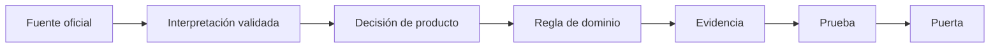
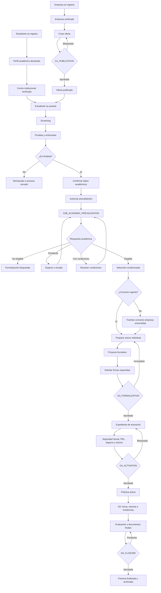

# ProPractix V2 — Blueprint de dominio y mapas legales para España

**Versión:** 1.3
**Fecha:** 12 de septiembre de 2026  
**Enfoque:** Domain-Driven Design (DDD), arquitectura hexagonal y monolito modular  
**Estado:** alcance de producto y arquitectura aprobado; reglas jurídicas pendientes de validación profesional

> Este documento no constituye asesoramiento jurídico ni certifica el cumplimiento legal. Define las materias que deben contrastarse, su traducción al dominio y las puertas que deben bloquear una operación cuando la evidencia sea insuficiente.

## 1. Objetivo y alcance

Las implicaciones legales se diseñan desde el inicio, pero se implementan progresivamente. El MVP español soportará únicamente prácticas académicas externas universitarias curriculares y extracurriculares, con empresa y universidad actuando en España. Formación Profesional, contratos formativos, movilidad internacional compleja y otras jurisdicciones quedan como `PolicyPack` futuros.

ProPractix será un producto orientado principalmente a empresas. Las empresas serán los tenants y usuarios operativos principales; las universidades no necesitarán registrarse ni adoptar la plataforma para que una práctica pueda formalizarse. Participarán como instituciones externas mediante documentos, contactos oficiales, enlaces seguros o, de forma opcional y posterior, un workspace institucional.

El primer piloto se limitará a universidades españolas identificadas en el catálogo interno y con información institucional suficiente para evaluar la práctica, empresas privadas, estudiantes mayores de edad y matriculados y prácticas presenciales o híbridas autorizables por la universidad. Un convenio podrá existir previamente o tramitarse durante la formalización, pero deberá estar firmado y vigente antes de superar `G3_FORMALIZATION` o iniciar la práctica. Quedan fuera del piloto las administraciones públicas, la formación sanitaria asistencial, las empresas o universidades extranjeras y cualquier práctica sin una institución educativa responsable.

El perfil de una empresa podrá conservar un país registral distinto de España para no hardcodear el modelo organizativo. Ese dato puede ayudar a elegir el locale inicial de la interfaz, pero no habilita operaciones legales en dicho país. La jurisdicción de una oferta o práctica se clasifica por separado y, si no existe un `PolicyPack` soportado, el proceso queda `OUT_OF_SCOPE`; nunca se aplican reglas españolas como fallback jurídico.

La clasificación jurídica debe ocurrir antes de crear el expediente definitivo. Una práctica universitaria, una estancia de FP y un contrato formativo son conceptos de dominio diferentes y nunca deben compartir reglas por conveniencia técnica.

## 2. Trazabilidad normativa

Cada regla debe recorrer esta cadena:



El sistema conservará jurisdicción, modalidad, fuente, artículo, vigencia, versión, responsable jurídico, evidencia y decisión. Una regla no evaluable produce `UNKNOWN`; en puertas críticas, `UNKNOWN` bloquea igual que `NON_COMPLIANT`.

Estados de una política: `IDENTIFIED`, `RESEARCHED`, `LEGAL_REVIEW`, `APPROVED`, `PUBLISHED`, `SUPERSEDED`, `SUSPENDED`, `EXPIRED`.

Resultados de evaluación: `COMPLIANT`, `NON_COMPLIANT`, `NOT_APPLICABLE`, `UNKNOWN`.

## 3. Puertas de cumplimiento

| Puerta | Momento | Criterio resumido |
|---|---|---|
| `G0_SCOPE` | Clasificación | Modalidad, jurisdicción y alcance aprobados. |
| `G1_PUBLICATION` | Publicar oferta | Condiciones, jornada, privacidad e igualdad revisadas. |
| `G2_APPLICATION` | Recibir candidatura | Base jurídica, información y elegibilidad disponibles. |
| `G2B_ACADEMIC_PREVALIDATION` | Convertir al estudiante en selección condicionada | Universidad, matrícula, modalidad y condiciones propuestas preevaluadas. |
| `G3_FORMALIZATION` | Formalizar | Convenio, proyecto, firmas y condiciones completos. |
| `G4_ACTIVATION` | Iniciar práctica | Seguros, tutores, Seguridad Social, prevención y evidencias válidas. |
| `G5_OPERATION` | Desarrollar | Horas, ausencias, cambios, incidentes y seguimiento controlados. |
| `G6_CLOSURE` | Finalizar | Evaluación, certificado, conservación y cierre trazables. |

### 3.1 Principio de intervención universitaria

La universidad no recibirá información por cada candidatura, entrevista o prueba técnica. Intervendrá cuando el estudiante alcance el estado `FINALIST`, porque en ese momento existe una posibilidad real de formalización y resulta proporcionado comprobar la elegibilidad académica antes de que la empresa emita un compromiso definitivo.

El correo institucional del estudiante sirve como indicio verificable de vinculación, pero no acredita por sí solo matrícula vigente, asignatura curricular, número de créditos ni autorización de la práctica. Las comunicaciones de prevalidación se enviarán a un contacto oficial de prácticas, coordinador o tutor verificado; nunca a una dirección inferida automáticamente a partir del dominio del estudiante.

La participación institucional admite tres modalidades:

| Modalidad | Uso |
|---|---|
| `EXTERNAL_PROCESS` | La universidad utiliza su propio sistema y ProPractix conserva la respuesta o documento como evidencia. |
| `SECURE_INVITATION` | Un contacto universitario revisa, responde, aporta o firma mediante un enlace seguro limitado al expediente. |
| `INSTITUTION_WORKSPACE` | La universidad acepta voluntariamente un espacio para gestionar múltiples estudiantes, tutores y documentos. |

Ninguna de estas modalidades convierte necesariamente a la universidad en cliente o tenant. El workspace se ofrecerá por volumen, recurrencia o solicitud expresa, pero su aceptación no será requisito para continuar usando la plataforma.

### 3.2 Flujo integral empresa–estudiante–universidad



Regla central:

> La empresa puede completar el proceso de selección sin intervención universitaria. Al llegar a finalista, el estudiante confirma sus datos y se inicia la prevalidación académica. La empresa solo realiza una selección condicionada hasta conocer que la práctica es formalizable.

### 3.3 Convenio marco y anexo individual

ProPractix distinguirá dos objetos documentales:

| Documento | Finalidad | Firmantes configurables |
|---|---|---|
| `COOPERATION_AGREEMENT` | Establecer el marco entre empresa y universidad. | Representante de empresa y representante universitario. |
| `INDIVIDUAL_INTERNSHIP_ANNEX` | Concretar estudiante, fechas, jornada, ayuda, tutores y proyecto formativo. | Estudiante, empresa y universidad según política institucional. |

El estudiante no sustituye a la universidad en la firma del convenio marco. La matriz de firmantes, el orden y el método de firma se resolverán mediante `InstitutionPolicyPack` y deberán contrastarse con cada institución.

### 3.4 Estados de la prevalidación académica

```text
DECLARED
EMAIL_VERIFIED
PRECHECK_REQUESTED
ELIGIBLE
ELIGIBLE_WITH_CONDITIONS
NOT_ELIGIBLE
PENDING_INSTITUTION_RESPONSE
EXPIRED
```

Solo `ELIGIBLE`, o `ELIGIBLE_WITH_CONDITIONS` una vez resueltas sus condiciones, permite avanzar hacia `G3_FORMALIZATION`. La falta de respuesta no se transforma automáticamente en aprobación.

## 4. Inventario maestro de mapas legales

### 4.1 Estructura y clasificación

| ID | Mapa que debe contrastarse | Evidencia/resultado | Puerta |
|---|---|---|---|
| `ML-00` | Clasificación de la relación: universitaria curricular/extracurricular, FP, contrato u otra; exclusión de sustitución laboral. Todo supuesto distinto de una práctica universitaria española admitida por `D-001` devolverá `OUT_OF_SCOPE`. | `InternshipLegalClassification` aprobada o rechazo trazable por alcance. | G0 |
| `ML-01` | Jerarquía normativa: UE, estatal, autonómica, universidad, convenio y condiciones individuales. | Fuentes y precedencia versionadas. | G0 |
| `ML-02` | Territorialidad: comunidad, universidad, centros, teletrabajo, movilidad y entidad extranjera. | Ámbito territorial resuelto. | G0 |
| `ML-03` | Sujetos y responsabilidades: estudiante, universidad, empresa, tutores y plataforma. | Roles, obligaciones y firmantes. | G0–G3 |
| `ML-04` | Elegibilidad y prevalidación: matrícula, estudios, asignatura, incompatibilidades, contacto institucional, momento de consulta y reglas universitarias. | `AcademicEligibilityCheck` trazable y evidencia de respuesta. | G2–G4 |

### 4.2 Constitución de la práctica

| ID | Mapa que debe contrastarse | Evidencia mínima | Puerta |
|---|---|---|---|
| `ML-05` | Convenio de cooperación: partes, vigencia, firmas, permisos, seguros, datos, rescisión y ayuda. | Convenio firmado y versión. | G3–G4 |
| `ML-06` | Proyecto formativo: objetivos, competencias, actividades, relación con estudios, centro y evaluación. | Proyecto aprobado. | G3–G4 |
| `ML-07` | Tutorización: designación, idoneidad e incompatibilidades de tutor académico y empresarial. | Nombramientos aceptados. | G4 |
| `ML-08` | Duración, jornada, horario, descansos, calendario y compatibilidad académica. | Calendario aprobado. | G1–G4 |
| `ML-09` | Ayuda económica y fiscalidad: bolsa, remuneración, pagos, retenciones y responsable. | Condiciones económicas validadas. | G1–G3 |
| `ML-10` | Seguros: escolar, accidentes, responsabilidad civil, cobertura, exclusiones y vigencia. | Póliza/certificado aplicable. | G4 |

### 4.3 Activación, trabajo seguro y ubicación

| ID | Mapa que debe contrastarse | Evidencia mínima | Puerta |
|---|---|---|---|
| `ML-11` | Seguridad Social: inclusión, altas/bajas, plazos, cotización, remuneración y no remuneración. | Justificante o no aplicabilidad aprobada. | G4–G6 |
| `ML-12` | Prevención de riesgos: evaluación, información, formación, equipos, emergencias y coordinación. | Evaluación y aceptación. | G4–G5 |
| `ML-13` | Lugar/modalidad: presencial, híbrida, remota, desplazamientos y múltiples centros. | Centros y condiciones autorizados. | G4–G5 |
| `ML-14` | Menores: edad, autorizaciones, riesgos prohibidos y contacto habitual con menores. | Verificación y permisos. | G2–G5 |

### 4.4 Derechos, privacidad e inclusión

| ID | Mapa que debe contrastarse | Evidencia mínima | Puerta |
|---|---|---|---|
| `ML-15` | Protección de datos: responsables, base jurídica, transparencia, derechos, cesiones, encargos, transferencias y brechas. | Registro, avisos y consentimientos/aceptaciones. | G1–G6 |
| `ML-16` | Igualdad y no discriminación: criterios, lenguaje, decisiones, accesibilidad y rechazos. | Criterios objetivos y trazabilidad. | G1–G6 |
| `ML-17` | Acoso y comunicación: protocolos, canal, confidencialidad, escalamiento y represalias. | Protocolo comunicado y canal. | G4–G5 |
| `ML-18` | Discapacidad y accesibilidad: ajustes razonables, recursos, tecnología y evaluación. | Adaptaciones minimizadas y acordadas. | G2–G6 |
| `ML-19` | Extranjería y movilidad: estancia, autorización, compatibilidad y documentación. | Verificación por responsable autorizado. | G2–G4 |

### 4.5 Desarrollo y cierre

| ID | Mapa que debe contrastarse | Evidencia mínima | Puerta |
|---|---|---|---|
| `ML-20` | Seguimiento y evaluación: informes, memoria, competencias, horas y criterios. | Informes y evaluación. | G5–G6 |
| `ML-21` | Asistencia, permisos y ausencias: exámenes, enfermedad, recuperación y festivos. | Registro y resolución. | G5 |
| `ML-22` | Modificación del proyecto: actividades, horario, duración, tutor o centro. | Nueva versión aprobada. | G5 |
| `ML-23` | Incidentes, suspensión y rescisión: causas, procedimiento, notificación y alegaciones. | Expediente de decisión. | G5–G6 |
| `ML-24` | Certificación y cierre: contenido, horas, valoración y reconocimiento académico. | Certificado e informes finales. | G6 |
| `ML-25` | Propiedad intelectual y confidencialidad: resultados, secretos, repositorios y publicaciones. | Cláusulas aceptadas. | G3–G6 |
| `ML-26` | Conservación, bloqueo, supresión y anonimización de expediente y evidencias. | Política y registro de eliminación. | G2–G6 |
| `ML-27` | Firma/evidencia electrónica: identidad, integridad, sello temporal, representación y admisibilidad. | Documento, hash, firmantes y sello. | G3–G6 |

### 4.6 Formación Profesional (alcance futuro independiente)

`ML-FP-01` régimen general/intensivo; `ML-FP-02` plan de formación; `ML-FP-03` resultados de aprendizaje; `ML-FP-04` tutores y corresponsabilidad; `ML-FP-05` prevención previa; `ML-FP-06` duración/distribución; `ML-FP-07` relación contractual; `ML-FP-08` normativa autonómica. Estos mapas no se implementan reutilizando los universitarios.

## 5. Traducción a DDD

Bounded Contexts: `Jurisdiction`, `Organization`, `Student`, `AcademicInstitutionCatalog`, `Recruitment`, `Internship`, `Learning`, `Compliance`, `Documents`, `Identity` y `Notifications`. `Organization` administra empresas, miembros, país registral, locale empresarial y aislamiento tenant; `Student` posee el perfil y las declaraciones académicas personales; `Identity` conserva exclusivamente cuentas, credenciales y sesiones. `AcademicInstitutionCatalog` representa universidades externas, contactos verificados y perfiles institucionales sin exigir cuentas ni tenancy.

Aggregates principales:

```text
LegalPolicyPack(jurisdiction, modality, version, validity, sources, rules, approval)
ComplianceCase(internshipId, policyVersion, requirements, evidence, decisions, unknowns)
Internship(classification, participants, tutors, dates, schedule, project, compliance, status)
LegalRequirement(code, applicability, severity, evidenceTypes, blockingGate, source)
StudentProfile(userId, status, localePreference)
AcademicDeclaration(studentId, institutionId?, institutionText?, degreeText, version, verificationStatus)
AcademicInstitution(officialName, identifier, territory, domains, status)
InstitutionPolicyPack(institutionId, modalities, documents, signers, workflow, version)
AcademicEligibilityCase(studentId, institutionId, proposedTerms, evidence, decision, status)
FormalizationCase(companyId, studentId, institutionId, agreement, annex, signatures, status)
```

El aggregate `Internship` no cambia de estado sin una decisión de cumplimiento aprobada y vinculada a una política vigente. Los eventos (`OfferPublished`, `CandidateBecameFinalist`, `AcademicPrevalidationRequested`, `AcademicEligibilityConfirmed`, `CandidateConditionallySelected`, `AgreementSigned`, `InternshipFormalized`, `InternshipActivated`, `InternshipSuspended`, `InternshipCompleted`) conectan contextos sin acoplarlos.

## 6. Arquitectura hexagonal

```text
adapters → application → domain
```

Puertos: `LegalPolicyRepository`, `LegalSourceRegistry`, `ComplianceEvaluationPort`, `EvidenceRepository`, `SignatureVerificationPort`, `SocialSecurityVerificationPort`, `AcademicInstitutionPolicyPort`, `AcademicEligibilityVerificationPort`, `InstitutionContactDirectoryPort`, `DocumentStoragePort` y `NotificationPort`.

Adaptadores: PostgreSQL/Flyway, almacenamiento de documentos, firma electrónica, sistemas universitarios, enlaces seguros, carga manual de evidencias, Seguridad Social, correo y mensajería. Ningún adaptador modifica directamente un aggregate; aporta datos y evidencias mediante puertos. Las reglas no deben contener condicionales como `if country == "ES"`; deben resolver `requirementsFor(jurisdiction, modality)`.

## 7. Versionado normativo y gobierno

Una modificación normativa crea un nuevo `LegalPolicyPack`, conserva la versión publicada, registra fecha efectiva, ejecuta análisis de impacto, identifica expedientes afectados y requiere aprobación antes de migrar reglas. Cada práctica conserva la política con la que fue evaluada.

Ficha obligatoria por mapa:

```markdown
## ML-XX — Nombre
- Jurisdicción y modalidad:
- Pregunta jurídica:
- Fuente oficial y artículo:
- Interpretación y supuestos:
- Responsable de la obligación:
- Evidencia requerida:
- Regla de producto y puerta:
- Consecuencia del incumplimiento:
- Fecha efectiva/revisión:
- Revisor jurídico y estado:
- Casos de prueba:
```

Roles: Product Owner (alcance), experto de dominio (operativa), asesoría jurídica (interpretación), responsable de compliance (mapas), arquitectura (políticas y límites), desarrollo (implementación), QA (pruebas) y operaciones (incidencias/evidencias). Nadie debería interpretar, implementar y certificar en solitario.

## 8. Priorización

**P0 — bloquea activar prácticas:** `ML-00`, `01`, `03`, `04`, `05`, `06`, `07`, `08`, `10`, `11`, `12`, `15`, `16`, `20`, `23`, `24`.  
**P1 — según el caso:** `ML-09`, `13`, `14`, `17`, `18`, `19`, `25`, `27`.  
**P2 — expansión:** `ML-02` avanzado, `ML-21`, `22`, `26`, todos los `ML-FP-*`, movilidad internacional y nuevas jurisdicciones.

## 9. Roadmap incremental desplegable

Los incrementos 0–8 corresponden exclusivamente al alcance aprobado en `D-001`. La primera puesta en producción se realizará con una o varias universidades identificadas en el catálogo y con información suficiente mediante `InstitutionPolicyPack`. Esto no exige que la universidad se registre: incorporar otra institución consiste en validar sus contactos, documentos y reglas, no en crearle obligatoriamente un tenant.

| Incremento | Valor usable | Mapas mínimos |
|---|---|---|
| 0 — Foundation | Monolito modular, DDD, hexagonal, i18n, jurisdicción y gobierno. | `ML-00–02` |
| 1 — Identity, Student & Organizations | Registro de empresa y estudiante, catálogo institucional, declaración académica personal no verificada y aislamiento tenant. | `ML-03`, `ML-15` |
| 2 — Job Offer | Crear y publicar oferta con condiciones transparentes. | `ML-08`, `ML-09`, `ML-16` |
| 3 — Application | Candidatura y reconfirmación de la declaración académica para ese proceso; el correo institucional sigue siendo un indicio y no se notifica todavía a la universidad. | `ML-04`, `ML-15`, `ML-18`, `ML-19` |
| 4 — Selection & Prevalidation | Screening, entrevistas, paso a finalista y prevalidación académica con selección condicionada. | `ML-04`, `ML-15`, `ML-16`, `ML-26` |
| 5 — Formalization | Convenio, proyecto, cláusulas y firmas. | `ML-05`, `06`, `09`, `10`, `25`, `27` |
| 6 — Activation | Checklist legal y transición a `ACTIVE`. | `ML-07`, `11`, `12`, `13`, `14` |
| 7 — Operation | Horas, permisos, cambios, incidencias y seguimiento. | `ML-20–23` |
| 8 — Closure | Evaluación, certificado, conservación y cierre. | `ML-20`, `24`, `26` |
| Futuro — Colombia | Vinculación formativa y contrato de aprendizaje como mecanismos jurídicos independientes. | Blueprint legal colombiano y `PolicyPack` propios |
| Futuro — FP/países | Nuevos `PolicyPack` aislados. | `ML-FP-*` y mapas locales |

Cada incremento debe ser desplegable, demostrable y usable, con dominio, casos de uso, puertos, adaptadores, persistencia, API, UI, traducciones, migración, pruebas unitarias/integración/end-to-end, observabilidad y documentación mínima.

## 10. Definition of Done legal

Una funcionalidad normativa solo está terminada cuando existe fuente oficial vigente, interpretación aprobada, ámbito y versión, aplicabilidad definida, responsable identificado, evidencia verificable, puerta asociada, pruebas de límites y excepciones, comportamiento seguro ante `UNKNOWN`, aislamiento multi-tenant, textos multidioma y fecha de revisión. El producto debe informar de su alcance sin presentarse como asesor jurídico.

## 11. Fuentes oficiales iniciales a contrastar

- [Real Decreto 592/2014](https://www.boe.es/buscar/act.php?id=BOE-A-2014-8138), prácticas académicas externas.
- [Real Decreto 1791/2010](https://www.boe.es/buscar/act.php?id=BOE-A-2010-20147), Estatuto del Estudiante Universitario.
- [Ley General de la Seguridad Social](https://www.boe.es/buscar/act.php?id=BOE-A-2015-11724) y [Real Decreto-ley 2/2023](https://www.boe.es/buscar/act.php?id=BOE-A-2023-6967).
- [Ley 31/1995](https://www.boe.es/buscar/act.php?id=BOE-A-1995-24292), prevención de riesgos laborales.
- [RGPD](https://eur-lex.europa.eu/eli/reg/2016/679/oj) y [Ley Orgánica 3/2018](https://www.boe.es/buscar/act.php?id=BOE-A-2018-16673).
- Procedimientos y modelos oficiales de cada universidad; como ejemplo operativo inicial, [información para entidades colaboradoras de la UCM](https://www.ucm.es/ope/informacion-para-entidades-colaboradoras) y su [flujo de anexos de prácticas](https://informatica.ucm.es/practicas-en-empresa-grados). Estos ejemplos no se generalizarán automáticamente a otras instituciones.
- [Real Decreto 659/2023](https://www.boe.es/buscar/act.php?id=BOE-A-2023-16889), Formación Profesional.
- Normativa autonómica, reglamento de prácticas universitario, convenio aplicable y criterios vigentes de Seguridad Social, AEPD, INSST y autoridades educativas.

Los textos consolidados son un punto de partida informativo: antes de publicar una regla deben revisarse modificaciones, transitorias, vigencia y fecha efectiva con asesoría jurídica.

### 11.1 Fuentes consideradas para priorizar España frente a Colombia

La decisión de iniciar por España también ha considerado la [Ley 2466 de 2025 de Colombia](https://www.alcaldiabogota.gov.co/sisjur/normas/Norma1.jsp?i=181933) y el [Decreto 223 de 2026](https://www.funcionpublica.gov.co/eva/gestornormativo/norma.php?i=272856). Este último diferencia la vinculación formativa no laboral del contrato de aprendizaje laboral y añade obligaciones relacionadas con registros administrativos, riesgos laborales, apoyo de sostenimiento, cuotas de aprendizaje y sistemas gestionados por el Ministerio del Trabajo y el SENA.

Estas referencias justifican el orden de las jurisdicciones, pero no forman parte del `LegalPolicyPack` español ni sustituyen un futuro blueprint jurídico específico para Colombia.

## 12. Registro de decisiones de producto y arquitectura

### D-001 — España como primera jurisdicción del MVP

| Campo | Valor |
|---|---|
| Estado de producto y arquitectura | `ACCEPTED` |
| Estado jurídico | `PENDING_LEGAL_VALIDATION` |
| Fecha | 12 de septiembre de 2026 |
| Policy Pack inicial | `ES-UNIVERSITY-EXTERNAL` |

#### Decisión

ProPractix V2 implementará inicialmente prácticas académicas externas universitarias en España, tanto curriculares como extracurriculares, dentro del marco del Real Decreto 592/2014 y de la normativa interna y los convenios aplicables. El producto estará orientado a empresas: estas podrán registrarse directamente y actuarán como tenants principales. Las universidades serán instituciones externas referenciadas y no necesitarán registrarse para que una práctica pueda tramitarse.

El piloto queda limitado a:

- Universidades españolas identificadas en el catálogo interno y con información suficiente para evaluar y formalizar la práctica.
- Empresas privadas establecidas o actuando en España.
- Estudiantes mayores de edad y matriculados.
- Convenios de cooperación educativa vigentes o susceptibles de tramitarse antes de `G3_FORMALIZATION`.
- Prácticas presenciales o híbridas autorizadas por la universidad.

Quedan fuera del MVP:

- Formación Profesional.
- Contratos formativos laborales.
- Menores de edad.
- Administraciones públicas.
- Formación sanitaria asistencial.
- Movilidad internacional.
- Empresas o universidades extranjeras.
- Prácticas sin institución educativa responsable.

#### Justificación

Las prácticas universitarias españolas curriculares y extracurriculares comparten naturaleza formativa no laboral y un ciclo documental común. Frente a Colombia, este alcance evita incorporar en el primer MVP la bifurcación entre vinculación formativa y contrato de aprendizaje laboral, así como integraciones y reglas relacionadas con SENA, SGVA, PILA, cuotas de aprendizaje y comunicaciones al Ministerio del Trabajo.

La mayor variación española se concentra en los reglamentos universitarios y convenios. Se resolverá mediante `InstitutionPolicyPack`, superpuesto al `LegalPolicyPack` estatal, sin introducir condiciones específicas de una universidad en el aggregate `Internship`. La ausencia de una cuenta universitaria no impedirá tramitar el expediente mediante proceso externo, invitación segura o carga de evidencias.

#### Consecuencias arquitectónicas

- Se publicará primero `ES-UNIVERSITY-EXTERNAL`.
- Cada universidad utilizada en el piloto tendrá un registro institucional y, cuando sea necesario, un `InstitutionPolicyPack` versionado.
- Las universidades no serán tenants por defecto ni dispondrán de un formulario público obligatorio de inscripción.
- La empresa y el estudiante conservarán sus formularios de registro; la universidad participará por expediente o mediante workspace opcional.
- El correo institucional verificará afiliación aparente, pero no sustituirá la prevalidación de elegibilidad.
- `G2B_ACADEMIC_PREVALIDATION` se ejecutará al pasar el candidato a finalista.
- La selección será condicionada hasta recibir una decisión académica suficiente.
- `G0_SCOPE` devolverá `OUT_OF_SCOPE` para cualquier modalidad no incluida.
- Las reglas españolas permanecerán fuera del núcleo del aggregate.
- Un estado `UNKNOWN` bloqueará las puertas críticas.
- Colombia se implementará después mediante políticas y modelos propios.

### D-002 — Colombia como segunda jurisdicción candidata

| Campo | Valor |
|---|---|
| Estado | `PROPOSED` |
| Dependencia | MVP español estabilizado y blueprint jurídico colombiano aprobado |

Colombia será la segunda jurisdicción candidata para comprobar la extensibilidad del modelo. Antes de implementarla deberá modelarse explícitamente `EngagementMechanism`, diferenciando `FORMATIVE_LINK_CO` y `APPRENTICESHIP_CONTRACT_CO`; no se traducirá como una configuración superficial de `ES-UNIVERSITY-EXTERNAL`.

### D-003 — Participación universitaria sin inscripción obligatoria

| Campo | Valor |
|---|---|
| Estado | `ACCEPTED` |
| Orientación comercial | Empresa |
| Tenant principal | Empresa |
| Universidad | Institución externa con participación progresiva |

La universidad podrá interactuar mediante `EXTERNAL_PROCESS`, `SECURE_INVITATION` o `INSTITUTION_WORKSPACE`. El workspace será opcional y podrá ofrecerse cuando exista volumen recurrente de estudiantes, relación continuada con empresas o solicitud expresa de la institución. El umbral será una política comercial configurable y nunca determinará por sí mismo la validez jurídica de una práctica.

### D-004 — Prevalidación académica al llegar a finalista

| Campo | Valor |
|---|---|
| Estado | `ACCEPTED` |
| Momento | Transición a `FINALIST` |
| Resultado | Selección condicionada, bloqueo o condiciones pendientes |
| Puerta | `G2B_ACADEMIC_PREVALIDATION` |

No se notificará a la universidad cada candidatura ni se compartirán pruebas, puntuaciones o notas internas. Al llegar a finalista, el estudiante confirmará sus datos y será informado de la comunicación necesaria. ProPractix remitirá únicamente los datos requeridos para determinar si la práctica propuesta puede formalizarse. La base jurídica, transparencia, minimización y conservación de esta comunicación deberán quedar aprobadas en `ML-15`.

### D-005 — País empresarial, locale y jurisdicción separados

| Campo | Valor |
|---|---|
| Estado | `ACCEPTED` |
| País empresarial | Información propia de `Company` |
| Fallback de interfaz | Locale configurado inicialmente como español (`es`) |
| Fallback jurídico | Ninguno |

`Company.registeredCountry` conserva el país configurado para la empresa. En el primer acceso, la interfaz intenta usar el locale empresarial configurado y, si no existe, la correspondencia administrada para dicho país. Una preferencia explícita posterior del usuario prevalece. Países, locales soportados, correspondencias país→locale y fallback se obtienen de configuración tipada; el valor inicial del fallback es español. Ninguna etiqueta visible se deriva de una enum o texto incrustado en código.

Esta resolución solo afecta presentación. La jurisdicción legal de una oferta o práctica se clasifica independientemente mediante `Jurisdiction`. Una empresa francesa podría conservar `FR` y usar `fr` cuando el producto lo soporte, pero mientras no exista un `PolicyPack` francés publicado sus operaciones reguladas quedarán `OUT_OF_SCOPE` o bloqueadas. No se aplicará `ES-UNIVERSITY-EXTERNAL` por defecto a una empresa, oferta o práctica extranjera.

### D-006 — Contexto Student y declaración académica por etapas

| Campo | Valor |
|---|---|
| Estado | `ACCEPTED` |
| Propietario del perfil | `Student` |
| Incremento 1 | Declaración personal, editable y no verificada |
| Incremento 3 | Reconfirmación vinculada a la candidatura |

`Student` será un bounded context independiente y poseerá `StudentProfile`, `StudentOnboarding` y `AcademicDeclaration`. `Identity` seguirá limitado a cuenta, credenciales, verificación y sesiones. Una cuenta global podrá tener perfil estudiantil y membresías empresariales sin mezclar su propiedad.

La declaración del Incremento 1 permite elegir una institución del catálogo o indicar que no se encuentra, además de declarar la titulación como texto. No demuestra matrícula, elegibilidad ni aprobación universitaria. En el Incremento 3 se reconfirma y se vincula a una candidatura concreta; las verificaciones institucionales se ejecutan únicamente en las puertas posteriores definidas por D-004.

## 13. Criterio de revisión de D-001

`D-001`, `D-003`, `D-004`, `D-005` y `D-006` deberán revisarse si cambia la normativa estatal aplicable, si una universidad exige un flujo incompatible con el modelo común, si el MVP incorpora otra modalidad educativa o si la validación jurídica concluye que algún supuesto incluido requiere un bounded context o proceso diferente.

```text
LegalPolicyPack: ES-UNIVERSITY-EXTERNAL
InstitutionPolicyPack: ES-{UNIVERSITY_CODE}-{VERSION}
Unsupported classification result: OUT_OF_SCOPE
```
