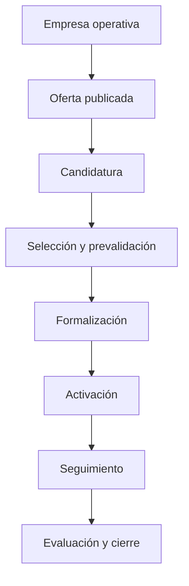
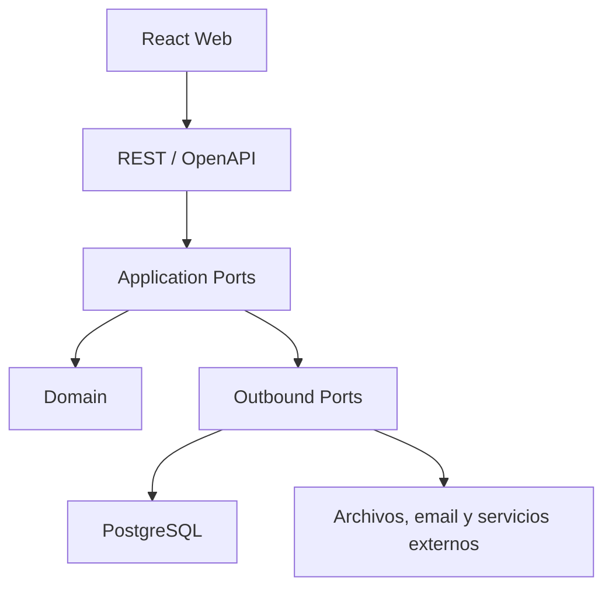
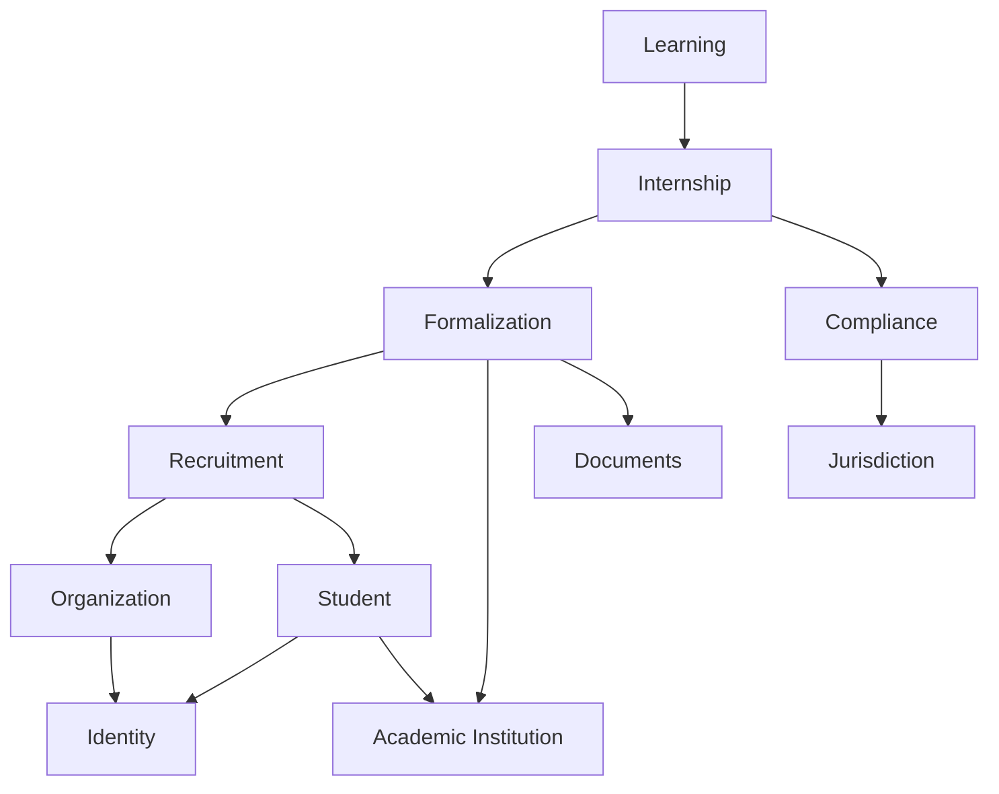
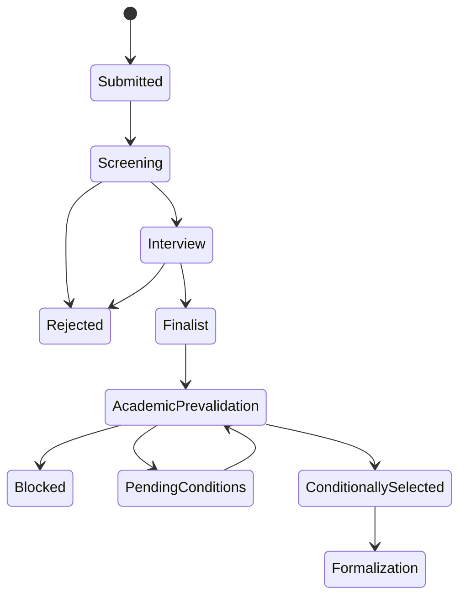
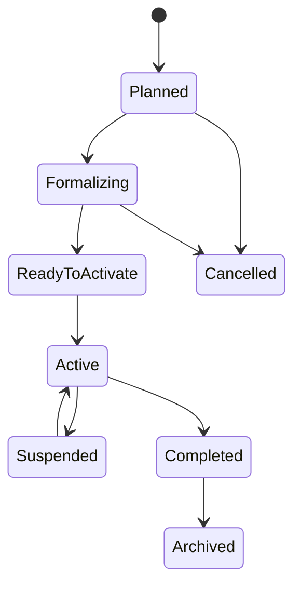
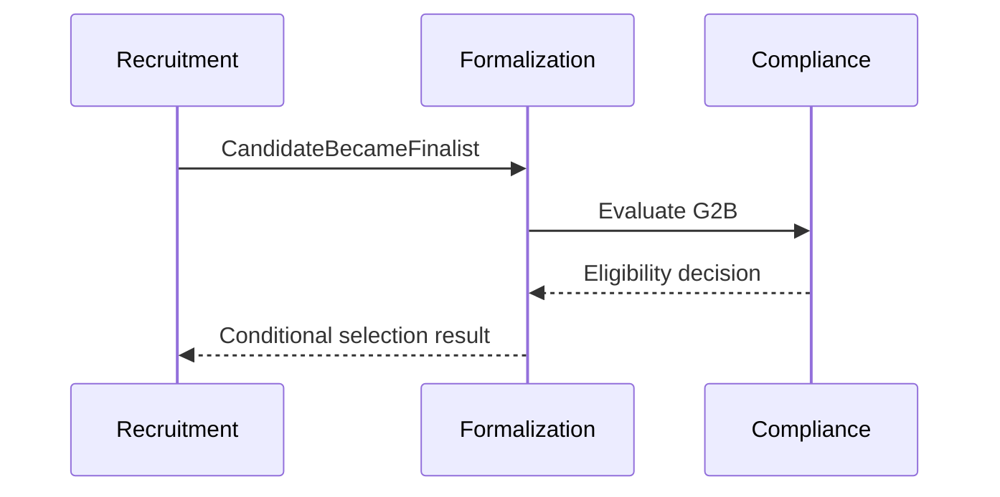

# ProPractix V2 — Especificación de arquitectura y técnica para Codex

**Versión:** 1.1
**Fecha:** 12 de septiembre de 2026  
**Estado:** `APPROVED_FOR_IMPLEMENTATION`
**Ámbito:** MVP de prácticas académicas externas universitarias en España  
**Destinatario principal:** Codex y equipo de desarrollo

> Este documento es un contrato técnico de implementación. No constituye asesoramiento jurídico ni autoriza a Codex a inventar, interpretar o publicar reglas legales. Toda regla bloqueante debe proceder de un mapa legal aprobado y versionado.

## 1. Propósito

Esta especificación traduce las decisiones de producto, dominio y cumplimiento de ProPractix V2 a instrucciones implementables. Debe permitir que Codex construya incrementos verticales sin reproducir la fragmentación, los cruces de tenant, el dominio anémico ni el comportamiento legal permisivo identificados en V1.

Documentos de referencia obligatorios:

1. `ProPractix-V2-Blueprint-Dominio-y-Mapas-Legales-Espana.md`, versión 1.2 o posterior.
2. `ProPractix-V1-Auditoria-Hallazgos-V2-DDD-Hexagonal.md`.
3. `ProPractix-V2-DDD-Hexagonal-Blueprint.md`.

En caso de contradicción:

1. prevalece la petición explícita más reciente del Product Owner;
2. después, las decisiones aceptadas `D-001`, `D-003` y `D-004` del blueprint legal;
3. después, esta especificación;
4. después, los ADR aprobados;
5. el código existente nunca prevalece automáticamente sobre una decisión documentada.

## 2. Lenguaje normativo

- **DEBE / NO DEBE:** requisito obligatorio.
- **DEBERÍA / NO DEBERÍA:** comportamiento recomendado; apartarse exige un ADR.
- **PUEDE:** opción permitida, no obligatoria.

Codex DEBE señalar cualquier contradicción o decisión ausente antes de adoptar una alternativa con impacto en seguridad, cumplimiento, persistencia o límites de contexto.

## 3. Resultado de producto

ProPractix V2 ayudará a una empresa a gestionar el ciclo completo de una práctica:



Cada incremento DEBE dejar una versión desplegable, demostrable y usable. La infraestructura técnica se introduce dentro del primer recorrido que la necesita; no se considerará un release de producto un esqueleto sin usuario capaz de completar una tarea útil.

## 4. Alcance inicial

### 4.1 Incluido

- Empresas privadas establecidas o actuando en España.
- Empresas como tenants y clientes principales.
- País registral de la empresa y locale de interfaz modelados por separado.
- Usuarios de empresa con roles limitados.
- Estudiantes mayores de edad y matriculados.
- Prácticas universitarias curriculares y extracurriculares.
- Universidades españolas como instituciones externas referenciadas.
- Ofertas, candidaturas, selección y entrevistas básicas.
- Prevalidación académica cuando el candidato llega a `FINALIST`.
- Convenio marco, anexo individual y proyecto formativo.
- Expediente de activación, seguimiento básico y cierre.
- Interfaz en español e inglés desde el primer incremento.

### 4.2 Fuera del MVP

- Formación Profesional.
- Contratos formativos laborales.
- Menores de edad.
- Administraciones públicas.
- Formación sanitaria asistencial.
- Movilidad internacional.
- Operación de ofertas o prácticas para empresas o universidades extranjeras.
- Colombia y demás jurisdicciones.
- Microservicios.
- Motor jurídico universal.
- Analítica avanzada, mensajería interna y calendarios externos.
- DocuSign como dependencia obligatoria.
- Workspace universitario completo, salvo que un incremento posterior lo autorice.

## 5. Decisiones de producto obligatorias

1. La empresa es el tenant principal.
2. La universidad NO es tenant por defecto y NO necesita registrarse.
3. La empresa y el estudiante conservan formularios de registro separados.
4. La universidad participa mediante `EXTERNAL_PROCESS`, `SECURE_INVITATION` o, opcionalmente, `INSTITUTION_WORKSPACE`.
5. No se informa a la universidad de cada candidatura, entrevista o prueba.
6. La prevalidación académica se inicia al alcanzar `FINALIST`.
7. La selección es condicionada hasta resolver la prevalidación.
8. El correo institucional es una evidencia de afiliación aparente, no prueba suficiente de elegibilidad.
9. El estudiante no sustituye a la universidad en la firma del convenio marco.
10. `UNKNOWN` o `INDETERMINATE` de una evaluación jurídica/de cumplimiento bloquean cualquier puerta legal crítica; el `INDETERMINATE` técnico de la ruta de correo se rige por D-007 y no bloquea H03.
11. El país registral de la empresa, el idioma de interfaz y la jurisdicción legal son conceptos distintos.
12. Un locale no soportado cae a español; una jurisdicción no soportada nunca cae a las reglas españolas.
13. Países, locales, etiquetas y políticas se resuelven mediante catálogos o configuración validada; no mediante condicionales o textos visibles dispersos en código.
14. El autorregistro empresarial exige un correo cuyo dominio no figure como proveedor público/común en la política vigente; el dominio propio sigue permitido aunque use Google Workspace, Microsoft 365 u otro proveedor como infraestructura.
15. Admitir un dominio no verifica la identidad, existencia o representación legal de la empresa.
16. La comprobación de ruta de correo es la validación técnica principal; `NO_MAIL_ROUTE` y los fallos transitorios `INDETERMINATE` no bloquean H03, mantienen la solicitud pendiente de verificación y se reintentan.
17. Cada incremento aprobado se despliega sobre un único entorno AWS `staging`; el entorno inicial usa una topología Docker Compose económica y portable según ADR-009.

## 6. Arquitectura objetivo

### 6.1 Estilo

- Monolito modular desplegable como una unidad.
- Domain-Driven Design táctico dentro de los contextos relevantes.
- Arquitectura hexagonal con dependencias dirigidas hacia el dominio.
- Comunicación entre módulos mediante contratos de aplicación y eventos internos.
- PostgreSQL único con propiedad lógica de datos por módulo.
- CQRS ligero: comandos sobre aggregates y modelos de lectura para consultas complejas.
- Outbox transaccional para eventos que produzcan efectos asíncronos.



### 6.2 Regla de dependencias

Permitido:

```text
adapter -> application -> domain
configuration -> adapter/application
```

Prohibido:

```text
domain -> Spring/JPA/HTTP/AWS
application -> JpaRepository/JpaEntity/controller
module A -> persistence internals of module B
```

El dominio DEBE compilar y probarse sin levantar Spring ni PostgreSQL.

## 7. Baseline tecnológico

La baseline aprovecha el conocimiento de V1 sin copiar su arquitectura:

| Área | Baseline |
|---|---|
| Runtime backend | Java 21 LTS |
| Framework backend | Spring Boot, Spring MVC, Security, Validation y Actuator |
| Build backend | Maven Wrapper; no scripts Gradle residuales |
| Persistencia | PostgreSQL 16, JPA/Hibernate en adapters y JDBC cuando sea necesario |
| Migraciones | Flyway, forward-only |
| Frontend | React, TypeScript estricto y Vite |
| Estado servidor | TanStack/React Query |
| Formularios | React Hook Form + Zod |
| Estado cliente | Zustand únicamente para estado transversal no procedente del servidor |
| i18n | i18next con español e inglés |
| Backend testing | JUnit, Spring Test, Testcontainers y ArchUnit |
| Frontend testing | Vitest, Testing Library y Playwright |
| Contrato | OpenAPI y cliente TypeScript generado |
| Desarrollo local | Docker Compose y almacenamiento compatible con S3 |

Las versiones exactas DEBEN fijarse en el repositorio y registrarse en un ADR. Codex NO DEBE actualizar una versión mayor ni introducir una librería estructural nueva sin justificarla.

## 8. Estructura del repositorio

```text
/server
/client
/docs
/infra
/.github/workflows
```

- `server`: aplicación Spring Boot y migraciones.
- `client`: aplicación React/TypeScript.
- `docs`: ADR, diagramas, contratos y decisiones.
- `infra`: Docker Compose y configuración local.
- `.github/workflows`: validación continua.

El `package.json` raíz PUEDE ofrecer comandos de orquestación, pero cualquier comando backend DEBE delegar en Maven Wrapper y no asumir Gradle.

## 9. Bounded Contexts

| Contexto | Responsabilidad | Datos propios |
|---|---|---|
| `identity` | Identidad, credenciales, sesiones y autenticación. | Usuarios, credenciales, refresh tokens. |
| `student` | Perfil del estudiante, onboarding y declaraciones académicas personales. | StudentProfile, StudentOnboarding, AcademicDeclaration. |
| `organization` | Empresas, miembros, sedes, roles empresariales y tenant. | Company, memberships, locations. |
| `academicinstitution` | Catálogo externo de universidades, dominios, contactos y perfiles. | AcademicInstitution, InstitutionContact, InstitutionPolicyPack. |
| `jurisdiction` | Policy packs por país, modalidad, versión y vigencia. | LegalPolicyPack, fuentes y publicaciones. |
| `recruitment` | Ofertas, candidaturas, entrevistas y selección. | JobOffer, Application, Interview. |
| `formalization` | Prevalidación, convenio, anexo, firmantes y preparación de la práctica. | AcademicEligibilityCase, FormalizationCase. |
| `internship` | Ciclo de vida de la práctica y participantes. | Internship. |
| `learning` | Proyecto formativo, objetivos, horas y evaluación. | TrainingProject, Timesheet, Evaluation. |
| `compliance` | Requisitos, evidencias, decisiones y puertas. | ComplianceCase, RequirementDecision. |
| `documents` | Archivos, plantillas, versiones, hashes y firmas. | DocumentEnvelope, DocumentVersion, SignatureRequest. |
| `notifications` | Entrega de comunicaciones derivadas de eventos. | Notification, DeliveryAttempt. |
| `administration` | Operaciones internas excepcionales y auditadas. | SupportCase y proyecciones administrativas. |

`billing`, `analytics`, `messaging`, `talentpool` e integraciones avanzadas quedan fuera hasta que un incremento los justifique.

### 9.1 Dependencias entre contextos



Las flechas van del consumidor al proveedor de un contrato público; no representan acceso directo a tablas ni entidades internas. `notifications` implementa capacidades de entrega solicitadas por los contextos propietarios y no consulta repositorios ajenos.

`organization` posee `CompanyEmailAdmissionPolicy`. La política clasifica únicamente el dominio normalizado después de `@` mediante un catálogo versionado y configurable. No inspecciona si el MX pertenece a Google, Microsoft u otro proveedor, porque un dominio corporativo propio puede utilizar cualquiera de esas infraestructuras.

Después de superar la política, `organization` usa `EmailDomainRoutingVerificationPort` como validación técnica principal. El adapter devuelve `MAIL_CAPABLE`, `NO_MAIL_ROUTE` o `INDETERMINATE`; ninguno de los dos últimos rechaza H03. Ambos dejan el onboarding pendiente de verificación, activan backoff y pueden resolverse por reintento o por la verificación efectiva del enlace. La política ausente continúa siendo un fallo cerrado distinto de un resultado DNS.

## 10. Estructura interna de cada módulo backend

Cada contexto DEBE seguir estas rutas conceptuales:

```text
com.propractix.<context>.domain.model
com.propractix.<context>.domain.event
com.propractix.<context>.domain.service
com.propractix.<context>.application.port.in
com.propractix.<context>.application.port.out
com.propractix.<context>.application.command
com.propractix.<context>.application.query
com.propractix.<context>.application.service
com.propractix.<context>.adapter.in.rest
com.propractix.<context>.adapter.out.persistence
com.propractix.<context>.adapter.out.integration
com.propractix.<context>.configuration
```

Reglas:

- Los casos de uso públicos son interfaces inbound.
- Los repositorios, reloj, almacenamiento, correo e integraciones son ports outbound.
- Los controllers solo autentican el contexto, validan forma, llaman a un caso de uso y mapean la respuesta.
- Los mappers REST no se reutilizan como mappers de persistencia.
- Los DTO no entran en el dominio.
- Las entidades JPA no son aggregates de dominio.
- No se crea un paquete `shared` para depositar lógica sin propietario.

Código realmente transversal permitido:

- tipos de identidad técnica;
- resultado/paginación;
- reloj y generación de ID;
- infraestructura de eventos;
- utilidades criptográficas;
- errores técnicos estandarizados.

Un concepto de negocio compartido DEBE tener un contexto propietario y publicarse mediante contrato.

## 11. Modelo de dominio inicial

### 11.1 Aggregates y propiedad

| Aggregate | Contexto | Tenant scope | Invariantes principales |
|---|---|---|---|
| `Company` | organization | Company | Identidad legal mínima, estado y membresías coherentes. |
| `UserAccount` | identity | Global/actor | Email normalizado, sesión y credenciales seguras. |
| `StudentProfile` | student | User/student-owned | Un perfil por usuario; ningún tenant empresarial implícito. |
| `AcademicDeclaration` | student | Student-owned | Declaración editable, versionada y no probatoria; referencia institucional opcional. |
| `AcademicInstitution` | academicinstitution | Global catalog | Identificador y dominios institucionales no ambiguos. |
| `LegalPolicyPack` | jurisdiction | Global | Versión, vigencia, esquema y aprobación antes de publicar. |
| `InstitutionPolicyPack` | academicinstitution | Global/institution | Reglas institucionales versionadas y no retroactivas. |
| `JobOffer` | recruitment | Company | Solo la empresa propietaria modifica; publicación mediante G1. |
| `Application` | recruitment | Company + student | Una candidatura activa por estudiante y oferta; historial inmutable. |
| `AcademicEligibilityCase` | formalization | Company + student | Consulta mínima, trazable y vinculada a términos propuestos. |
| `FormalizationCase` | formalization | Company | Convenio, anexo y firmas coherentes antes de G3. |
| `Internship` | internship | Company | Transiciones protegidas por puertas y decisiones versionadas. |
| `ComplianceCase` | compliance | Company | Evaluación reproducible, evidencia y política exacta. |
| `DocumentEnvelope` | documents | Según propietario | Versiones inmutables, hash y firmantes requeridos. |

### 11.2 Value Objects obligatorios

No usar `String`, `Long` o `BigDecimal` desnudos para conceptos centrales. Como mínimo:

```text
CompanyId
TenantId
UserId
StudentId
AcademicInstitutionId
JobOfferId
ApplicationId
InternshipId
PolicyPackId
PolicyVersion
CountryCode
LocaleCode
CurrencyCode
EmailAddress
TaxIdentifier
DateRange
WeeklySchedule
Money
DocumentHash
CorrelationId
```

- Dinero: `BigDecimal` + moneda; nunca `double`.
- Instantes técnicos: UTC mediante `Instant`.
- Fechas académicas/locales: `LocalDate` más `ZoneId` cuando corresponda.
- El tiempo se obtiene mediante un `Clock` inyectable.
- Los IDs se generan en aplicación o dominio mediante un port; no depender de secuencias expuestas.

### 11.3 Prohibiciones de modelado

- No usar setters públicos para cambiar estados.
- No representar estados con strings libres.
- No guardar un objeto JSON arbitrario como sustituto de una regla tipada.
- No cargar un aggregate completo para una proyección de lectura si existe un read model.
- No mantener relaciones JPA entre aggregates de módulos diferentes.
- No reutilizar `Company` para representar una universidad.

## 12. Estados y transiciones

### 12.1 Oferta

```text
DRAFT -> PUBLISHED -> CLOSED
DRAFT -> CANCELLED
PUBLISHED -> CANCELLED
```

Solo `publish(decision)` puede producir `PUBLISHED`; la decisión DEBE acreditar `G1_PUBLICATION`.

### 12.2 Candidatura y selección



La universidad no recibe ninguna comunicación antes de `Finalist`.

### 12.3 Prevalidación académica

```text
DECLARED
EMAIL_VERIFIED
PRECHECK_REQUESTED
ELIGIBLE
ELIGIBLE_WITH_CONDITIONS
NOT_ELIGIBLE
PENDING_INSTITUTION_RESPONSE
EXPIRED
```

`PENDING_INSTITUTION_RESPONSE`, `EXPIRED` y cualquier error técnico NO equivalen a `ELIGIBLE`.

### 12.4 Práctica



Solo métodos del aggregate ejecutan transiciones y emiten los eventos correspondientes.

## 13. Casos de uso y eventos

### 13.1 Casos de uso iniciales

```text
RegisterCompany
VerifyCompany
InviteCompanyMember
RegisterStudent
RecordAcademicDeclaration
VerifyInstitutionalEmail
CreateJobOffer
PublishJobOffer
CloseJobOffer
SubmitApplication
MoveApplicationToScreening
ScheduleInterview
RecordInterviewOutcome
MarkCandidateAsFinalist
RequestAcademicPrevalidation
RecordAcademicEligibilityDecision
ConditionallySelectCandidate
OpenFormalizationCase
RegisterExistingAgreement
RequestCooperationAgreement
PrepareIndividualAnnex
RequestSignatures
EvaluateComplianceGate
ActivateInternship
RecordTimesheet
CompleteInternship
ArchiveInternship
```

### 13.2 Eventos

```text
CompanyRegistered
CompanyVerified
StudentProfileActivated
AcademicDeclarationRecorded
JobOfferPublished
ApplicationSubmitted
CandidateBecameFinalist
AcademicPrevalidationRequested
AcademicEligibilityConfirmed
AcademicEligibilityRejected
CandidateConditionallySelected
FormalizationOpened
AgreementSigned
IndividualAnnexCompleted
InternshipFormalized
InternshipActivated
InternshipSuspended
InternshipCompleted
InternshipArchived
```

Los nombres de evento son pasado consumado. Cada evento incluye `eventId`, `occurredAt`, `correlationId`, actor, tenant cuando aplique, aggregate ID y versión del contrato.

## 14. Comunicación entre módulos

- Una transacción modifica aggregates de un solo contexto.
- Un módulo consumidor reacciona a eventos después del commit.
- Los efectos que no puedan perderse usan outbox.
- Los handlers DEBEN ser idempotentes.
- No se usa una transacción distribuida.
- Los fallos parciales producen estados recuperables y auditables.
- Un módulo no importa repositorios ni entidades JPA de otro.

Ejemplo selección–formalización:



## 15. Multi-tenancy y autorización

### 15.1 Regla principal

El `tenantId` efectivo procede del contexto autenticado. Nunca se confía en un `tenantId` enviado en el body, query o path para decidir propiedad.

Todo repositorio tenant-owned DEBE expresar el tenant en su contrato:

```java
Optional<JobOffer> findById(TenantId tenantId, JobOfferId offerId);
void save(TenantId tenantId, JobOffer offer);
```

No permitido:

```java
Optional<JobOffer> findById(JobOfferId offerId);
```

cuando el recurso pertenece a una empresa.

### 15.2 Roles iniciales

| Rol | Alcance |
|---|---|
| `COMPANY_OWNER` | Administración de la empresa y miembros. |
| `COMPANY_RECRUITER` | Ofertas, candidaturas y selección. |
| `COMPANY_TUTOR` | Prácticas asignadas, horas e informes. |
| `STUDENT` | Perfil y expedientes propios. |
| `PLATFORM_ADMIN` | Operaciones excepcionales mediante casos de uso auditados. |
| `EXTERNAL_INSTITUTION_PARTICIPANT` | Solo expediente, acción y tiempo concedidos por invitación. |

La UI oculta acciones no disponibles, pero el backend siempre vuelve a autorizarlas.

### 15.3 Enlaces institucionales seguros

Un enlace de universidad DEBE ser:

- de un solo propósito;
- limitado a un expediente y acción;
- firmado y almacenado como hash;
- de corta duración configurable;
- revocable;
- de un solo uso cuando la acción sea irreversible;
- protegido frente a enumeración;
- auditado sin registrar el token;
- acompañado de verificación adicional para firmas o datos sensibles.

## 16. Autenticación y sesiones

- Access token de vida corta mantenido en memoria del cliente.
- Refresh token en cookie `HttpOnly`, `Secure` y `SameSite` apropiado.
- Refresh token hasheado, rotado y revocable.
- Detección de reutilización de refresh token.
- Protección de los endpoints de cookie mediante comprobación de origen/CSRF según el diseño adoptado.
- CORS con allowlist explícita.
- Contraseñas con un algoritmo adaptativo aprobado y parámetros versionados.
- Verificación de email mediante JWS de propósito único vinculado a un registro atómico, sin persistir el token; recuperación de contraseña mediante secreto hasheado, expirable y de un solo uso.
- No persistir credenciales ni access tokens en `localStorage`.
- No versionar estados autenticados E2E ni secretos.

## 17. API HTTP

### 17.1 Convenciones

- Prefijo `/api/v1`.
- JSON UTF-8.
- Fechas ISO 8601.
- Errores `application/problem+json` con código estable de dominio.
- OpenAPI es el contrato fuente para generar el cliente TypeScript.
- No devolver entidades JPA ni objetos de dominio directamente.
- Paginación consistente en todos los listados.
- Operaciones sensibles aceptan `Idempotency-Key` cuando puedan repetirse.
- `correlationId` entra o se genera y se devuelve en la respuesta.
- La API no revela si un UUID pertenece a otro tenant.

### 17.2 Recursos iniciales

```text
/api/v1/companies
/api/v1/company-members
/api/v1/student-onboardings
/api/v1/students/me/academic-declaration
/api/v1/academic-institutions
/api/v1/job-offers
/api/v1/applications
/api/v1/interviews
/api/v1/academic-eligibility-cases
/api/v1/formalization-cases
/api/v1/internships
/api/v1/compliance-cases
/api/v1/documents
```

Las transiciones importantes se modelan como acciones explícitas:

```text
POST /job-offers/{id}/publish
POST /applications/{id}/mark-finalist
POST /academic-eligibility-cases/{id}/request
POST /formalization-cases/{id}/evaluate
POST /internships/{id}/activate
```

No usar un `PATCH status` genérico para saltarse invariantes.

### 17.3 Concurrencia e idempotencia

- Aggregates mutables usan versión optimista.
- Un conflicto devuelve un error estable y recuperable.
- `CandidateConditionallySelected`, creación de `FormalizationCase`, activación y webhooks son idempotentes.
- La misma clave con payload diferente se rechaza.
- La aceptación de documentos conserva versión y hash exactos.

## 18. Persistencia y migraciones

### 18.1 PostgreSQL

- Una base de datos para el monolito modular.
- Cada tabla tiene un único contexto propietario.
- Los módulos consumidores usan APIs, eventos o read models; no escriben tablas ajenas.
- `tenant_id` es obligatorio en tablas tenant-owned y forma parte de índices/constraints relevantes.
- Claves foráneas se usan dentro de un módulo; entre aggregates/módulos se prefieren IDs y validación contractual.
- Auditoría y outbox son append-oriented.
- Datos personales se separan de eventos cuando su retención difiera.

### 18.2 JPA

- Entidades JPA en `adapter.out.persistence`.
- Mappers explícitos dominio–persistencia.
- No usar lazy loading fuera del adapter.
- Evitar grafos de entidades extensos.
- Consultas de dashboard/pipeline pueden usar JDBC o proyecciones dedicadas.
- Revisar N+1 mediante tests y métricas.

### 18.3 Flyway

- Una única ubicación canónica declarada inicialmente: `server/src/main/resources/db/migration`.
- Versiones globalmente únicas.
- Migraciones aplicadas nunca se editan.
- Correcciones mediante una migración nueva.
- `out-of-order` deshabilitado en producción.
- CI prueba base vacía y actualización desde el último snapshot soportado.
- CI rechaza archivos `V*.sql` fuera de la ubicación declarada.
- Cada migración destructiva exige estrategia de compatibilidad y rollback operacional.

## 19. Outbox, jobs y entrega

- Evento de dominio y fila outbox se confirman en la misma transacción.
- El dispatcher marca entrega con reintentos limitados y backoff.
- Los consumidores deduplican por `eventId`.
- Los jobs tienen locking si existen varias instancias.
- Una notificación fallida no revierte una decisión de dominio ya confirmada.
- Las dead letters generan alerta y una operación de reintento auditada.

No introducir Kafka en el MVP. El contrato de eventos debe permitir cambiar el transporte en el futuro sin modificar el dominio.

## 20. Documentos y archivos

- El dominio guarda metadatos y referencias; los bytes viven detrás de `DocumentStoragePort`.
- Cada versión conserva hash criptográfico, tamaño, MIME detectado, propietario, autor y fecha.
- Los tipos y tamaños permitidos se configuran explícitamente.
- Los archivos se almacenan inicialmente en cuarentena hasta validar tipo y controles de seguridad.
- Las URLs de descarga son temporales y autorizadas por recurso.
- Un documento firmado es inmutable; una corrección crea otra versión.
- La eliminación respeta retención, bloqueo y trazabilidad.
- Para el MVP se admite firma externa con carga de evidencia; la firma integrada es un adapter posterior.

Objetos mínimos:

```text
DocumentEnvelope
DocumentVersion
SignaturePolicy
SignatureRequest
SignatureEvidence
RetentionPolicy
```

## 21. Cumplimiento y políticas

### 21.1 Modelo

```text
LegalPolicyPack
InstitutionPolicyPack
LegalRequirement
ApplicabilityRule
EvidenceRequirement
ComplianceDecision
```

Cada decisión guarda:

- policy pack y versión;
- fecha de evaluación;
- entradas normalizadas;
- requisitos aplicados;
- evidencias consultadas;
- resultado por requisito;
- resultado global;
- actor o sistema evaluador;
- explicación orientada a auditoría.

### 21.2 Resultados

```text
COMPLIANT
NON_COMPLIANT
NOT_APPLICABLE
UNKNOWN
```

No capturar excepciones para devolver `COMPLIANT`. Una regla inexistente, JSON inválido, operador desconocido, dependencia caída o dato crítico ausente produce `UNKNOWN` y bloquea puertas críticas.

### 21.3 Publicación

- `DRAFT` puede probarse internamente.
- Solo `APPROVED` puede pasar a `PUBLISHED`.
- Una versión publicada no se modifica.
- `validFrom` y `validUntil` son obligatorios cuando aplique.
- Cada práctica conserva la versión utilizada.
- Codex NO DEBE convertir una interpretación pendiente en un booleano de producción.

## 22. Prevalidación académica

### 22.1 Momento

`MarkCandidateAsFinalist` genera o activa `AcademicEligibilityCase`. No se contacta a la universidad durante la postulación o entrevistas.

### 22.2 Datos mínimos

- Identidad necesaria del estudiante.
- Universidad y titulación declaradas.
- Modalidad curricular/extracurricular.
- Empresa.
- Fechas, horas y jornada propuestas.
- Resumen formativo estrictamente necesario.
- Identidad y propósito del contacto.

No compartir CV completo, pruebas técnicas, puntuaciones, notas de entrevista ni motivos internos.

### 22.3 Respuesta

```text
ELIGIBLE
ELIGIBLE_WITH_CONDITIONS
NOT_ELIGIBLE
PENDING_INSTITUTION_RESPONSE
```

La fuente de la respuesta y su evidencia se conservan. Una aprobación se vincula a los términos evaluados; cambios materiales de fechas, horas, modalidad o proyecto pueden invalidarla y exigir reevaluación.

### 22.4 Ausencia de integración

El MVP DEBE funcionar sin API universitaria:

1. contacto oficial verificado;
2. enlace seguro o proceso externo;
3. respuesta estructurada o documento;
4. revisión asistida cuando sea necesario;
5. evidencia anexada al caso.

## 23. Convenio y formalización

El sistema diferencia:

| Documento | Regla |
|---|---|
| `COOPERATION_AGREEMENT` | Marco empresa–universidad; el estudiante no sustituye la firma institucional. |
| `INDIVIDUAL_INTERNSHIP_ANNEX` | Condiciones particulares y firmantes definidos por política institucional. |
| `TRAINING_PROJECT` | Objetivos, competencias y actividades vinculados a estudios. |

`G3_FORMALIZATION` solo se aprueba cuando:

- existe convenio aplicable firmado y vigente;
- el anexo corresponde a la versión de condiciones aceptada;
- el proyecto formativo está completo;
- todos los firmantes requeridos han aportado evidencia válida;
- no existen condiciones académicas abiertas;
- la política usada está publicada y vigente.

## 24. Frontend

### 24.1 Organización

Las features reflejan capacidades, no tipos técnicos globales:

```text
src/app
src/features/auth
src/features/company
src/features/student
src/features/job-offers
src/features/applications
src/features/selection
src/features/formalization
src/features/internships
src/features/compliance
src/features/documents
src/features/administration
src/shared/ui
src/shared/api
src/shared/i18n
```

### 24.2 Reglas

- TypeScript en modo estricto.
- React Query posee estado de servidor, caché y mutaciones.
- Zustand no duplica recursos remotos.
- Formularios con React Hook Form y schemas Zod.
- Cliente API generado desde OpenAPI.
- Ningún componente llama `fetch` fuera de `shared/api` o adapters definidos.
- Rutas lazy por feature cuando aporte valor.
- Estados loading, empty, error y retry son obligatorios.
- Accesibilidad por teclado, labels, foco y contraste.
- Fechas, moneda y números se formatean por locale.
- No mostrar una acción como completada antes de confirmación backend.

### 24.3 i18n

- Toda cadena de UI usa clave.
- Español e inglés completos en cada incremento.
- CI compara paridad de claves.
- Textos legales/documentales tienen versión separada de las traducciones generales.
- Datos introducidos por usuarios no se consideran automáticamente traducibles.
- Java, TypeScript y OpenAPI exponen códigos estables; ninguna enum o estado aporta directamente una etiqueta visible.
- Etiquetas, mensajes de validación, estados, acciones, ayudas y errores presentados al usuario se resuelven desde catálogos i18n.
- En el primer acceso empresarial, el locale se resuelve desde el locale configurado para la empresa o desde la correspondencia de su país registral.
- Una preferencia posterior del usuario prevalece sobre el locale empresarial.
- Solo se seleccionan locales soportados; el fallback de interfaz es `es`.
- El fallback de idioma nunca selecciona un `LegalPolicyPack` ni modifica la jurisdicción aplicable.

## 25. Privacidad y auditoría

- Definir base jurídica y aviso por finalidad antes de comunicar datos a la universidad.
- Solicitar solo datos necesarios.
- No tratar una casilla genérica como solución universal de base jurídica.
- Separar aceptación de términos, información de privacidad y autorizaciones específicas.
- Aplicar retención por tipo de dato y estado de candidatura/práctica.
- Los logs no contienen CV, documentos, tokens, notas sensibles ni cuerpos completos.
- Las acciones sensibles generan audit event con actor, tenant, recurso, acción, resultado y correlation ID.
- La auditoría no es editable por usuarios operativos.

## 26. Observabilidad

Backend:

- logs JSON estructurados;
- `correlationId`, actor y tenant cuando aplique;
- métricas Micrometer/Actuator;
- health/readiness separados;
- trazas en integraciones externas;
- redacción de PII y secretos.

Métricas mínimas de producto/operación:

```text
company_registration_success_total
job_offer_publication_failure_total
application_submission_total
academic_prevalidation_pending_total
academic_prevalidation_duration
compliance_unknown_total
gate_blocked_total{gate,reason}
outbox_pending_total
notification_failure_total
```

Alertas mínimas:

- outbox acumulado;
- jobs fallidos;
- incremento de `UNKNOWN`;
- expiración próxima de policy packs;
- fallos repetidos de almacenamiento o correo;
- health/readiness no disponible.

## 27. Estrategia de pruebas

| Nivel | Obligación |
|---|---|
| Dominio | Invariantes y transiciones sin Spring. |
| Aplicación | Casos de uso con ports falsos y escenarios de error. |
| Adapter | REST, mappers, persistencia, archivos y correo. |
| Integración | PostgreSQL real, Testcontainers y migraciones completas. |
| Contrato | OpenAPI y compatibilidad del cliente TypeScript. |
| Arquitectura | ArchUnit: dependencias, ciclos y ausencia de frameworks en domain. |
| Frontend | Componentes, formularios, estados y accesibilidad. |
| Seguridad | Rol × tenant × recurso × acción. |
| E2E | Journey feliz y bloqueos relevantes del incremento. |

### 27.1 Casos obligatorios de tenant

Para cada recurso tenant-owned:

1. empresa A puede leerlo y modificarlo;
2. empresa B no puede leerlo;
3. empresa B no puede modificarlo;
4. listados nunca mezclan empresas;
5. identificador ajeno no filtra existencia de forma innecesaria;
6. administrador usa un caso de uso distinto y auditado.

### 27.2 Casos obligatorios de políticas

- regla aplicable que cumple;
- regla aplicable que incumple;
- regla no aplicable;
- campo requerido ausente;
- operador o esquema desconocido;
- política no publicada;
- política fuera de vigencia;
- dependencia externa caída;
- práctica histórica con versión anterior;
- jurisdicción no soportada.

### 27.3 E2E prioritarios

1. Empresa se registra y crea oferta.
2. Estudiante se registra y aplica.
3. Empresa mueve candidato a finalista.
4. Prevalidación elegible produce selección condicionada.
5. Prevalidación no elegible bloquea formalización.
6. Falta de respuesta mantiene el caso pendiente.
7. Convenio/anexo incompletos bloquean G3.
8. Cumplimiento incompleto bloquea G4.
9. Práctica activa registra seguimiento y se cierra.
10. Intento cross-tenant falla en lectura y escritura.

## 28. CI/CD

El pipeline DEBE ejecutar jobs separados y paralelizables:

### Backend

- formato/lint acordado;
- compilación;
- tests de dominio y aplicación;
- tests de integración;
- ArchUnit;
- generación/validación OpenAPI.

### Frontend

- `npm ci`;
- lint;
- typecheck;
- Vitest;
- build;
- paridad i18n.

### Base de datos

- migraciones sobre PostgreSQL vacío;
- actualización desde snapshot soportado;
- rechazo de migraciones fuera de ruta;
- detección de migraciones aplicadas modificadas.

### Seguridad y contrato

- escaneo de secretos;
- análisis de dependencias;
- validación de contenedor;
- prueba de contrato frontend/backend;
- E2E mínimo contra stack efímero.

### Despliegue de `staging`

- imágenes OCI reproducibles de cliente y servidor, etiquetadas con el SHA completo;
- manifiesto de release con digests inmutables;
- autenticación GitHub→AWS mediante OIDC y rol de permisos mínimos;
- aprobación del GitHub Environment antes de desplegar;
- migración Flyway controlada, readiness y smoke tests;
- rollback al manifiesto anterior sin intentar revertir migraciones aplicadas;
- backup/restore smoke test y evidencia del release desplegado;
- ningún despliegue de una rama de trabajo sin revisión.

No se permite fusionar si backend o frontend no compilan, si falla el aislamiento tenant o si una migración no puede aplicarse.

## 29. Configuración y entornos

- Configuración mediante variables de entorno tipadas y validadas al arranque.
- Secretos fuera del repositorio.
- Perfiles: `local`, `test`, `staging`, `production` con diferencias mínimas.
- El dominio no consulta variables de entorno.
- Flags de funcionalidad en Application; nunca para saltarse una invariante legal.
- Países habilitados, locales soportados, correspondencias país→locale y locale de fallback se cargan desde configuración tipada con valores por entorno.
- La política de dominios públicos no admitidos para onboarding empresarial se carga desde configuración tipada y versionada, con comportamiento fail-closed si no está disponible al exponer H03.
- Timeout, caché, backoff y límite de reintentos de `EmailDomainRoutingVerificationPort` proceden de configuración validada. `NO_MAIL_ROUTE` e `INDETERMINATE` no bloquean H03 ni se presentan como prueba de que el solicitante no controla el correo.
- El fallback de presentación no se reutiliza para resolver jurisdicción, moneda, zona horaria ni política legal.
- Jurisdicciones con estados `CATALOGUED`, `INTERNAL_TEST`, `PILOT`, `SUPPORTED`, `DEPRECATED`.
- Solo `SUPPORTED`, o `PILOT` con flag y tenant autorizado, es seleccionable.
- `staging` usa AWS según ADR-009; región, host, imágenes, endpoints y secretos son configuración de infraestructura y nunca entran en el dominio.
- Producción no se aprovisiona en el Incremento 1 y `staging` usa solo datos sintéticos mientras las puertas de privacidad aplicables estén pendientes.

## 30. Roadmap de implementación

### Incremento 1 — Empresa, identidad, estudiante y catálogo

Valor demostrable:

- empresa registrada en `SELF_DECLARED`, con primer usuario y correo verificados;
- correo del primer administrador admitido por la política empresarial, sin confundir esa admisión con verificación de la empresa;
- ruta de correo evaluada como control técnico principal, con degradación recuperable ante indisponibilidad DNS;
- primer usuario operativo;
- estudiante registrado;
- correo verificado;
- universidad y titulación declaradas de forma personal, editable y no verificada;
- catálogo institucional consultable;
- aislamiento tenant probado.

Incluye la fundación mínima: repositorio, CI, seguridad, i18n, migraciones, observabilidad, reglas ArchUnit y despliegue AWS `staging` necesarios para este recorrido.

### Incremento 2 — Oferta publicable

- creación, edición, publicación, cierre y URL pública;
- `G1_PUBLICATION`;
- evento `JobOfferPublished`;
- búsqueda/listado público mínimo.

### Incremento 3 — Candidatura

- reconfirmación de la declaración académica para la candidatura, sin convertirla en prueba de elegibilidad;
- candidatura única;
- privacidad versionada;
- inbox empresarial;
- `G2_APPLICATION`;
- sin contacto universitario.

### Incremento 4 — Selección y prevalidación

- screening e entrevista básica;
- finalista;
- `AcademicEligibilityCase`;
- contacto institucional seguro o proceso externo;
- `G2B_ACADEMIC_PREVALIDATION`;
- selección condicionada.

### Incremento 5 — Formalización

- convenio existente o nuevo;
- anexo individual;
- proyecto formativo;
- matriz de firmantes;
- evidencia de firma externa;
- `G3_FORMALIZATION`.

### Incremento 6 — Activación

- expediente de cumplimiento;
- tutores, seguros, Seguridad Social y PRL según política aprobada;
- `G4_ACTIVATION`;
- práctica `ACTIVE` solo con decisión válida.

### Incremento 7 — Operación

- horas y actividades;
- aprobación del tutor empresarial;
- ausencias e incidencia mínima;
- `G5_OPERATION`.

### Incremento 8 — Cierre

- informe del tutor;
- memoria del estudiante;
- evaluación;
- certificado/exportación mínima;
- retención y `G6_CLOSURE`.

## 31. Definition of Ready de una historia

Codex NO DEBE implementar una historia si falta alguno de estos elementos aplicables:

- actor y valor esperado;
- contexto propietario;
- estado inicial y resultado;
- reglas e invariantes;
- alcance tenant;
- contrato de entrada/salida;
- criterios de aceptación;
- errores esperados;
- puerta legal afectada;
- policy pack aprobado si la regla es bloqueante;
- comportamiento ante `UNKNOWN`;
- eventos emitidos/consumidos;
- migración necesaria;
- estrategia de prueba.

Si falta información no crítica, Codex PUEDE documentar una suposición reversible. Si altera dominio, seguridad, privacidad o cumplimiento, DEBE detenerse y solicitar decisión.

## 32. Definition of Done por incremento

Un incremento está terminado solo si:

- entrega el journey prometido de extremo a extremo;
- backend y frontend están integrados;
- dominio, casos de uso, ports y adapters respetan límites;
- todos los accesos tenant-owned filtran por tenant;
- migraciones funcionan en base vacía y actualización soportada;
- OpenAPI y cliente generado están sincronizados;
- español e inglés están completos;
- no existen etiquetas visibles hardcodeadas y la paridad de catálogos i18n está verificada;
- añadir un país o locale soportado no exige modificar aggregates ni introducir condicionales por código de país;
- cambiar la política de dominios públicos no exige modificar el aggregate ni textos de UI, y todos sus errores se resuelven por códigos i18n;
- la comprobación técnica de correo diferencia `MAIL_CAPABLE`, `NO_MAIL_ROUTE` e `INDETERMINATE`; los dos últimos dejan el onboarding pendiente de verificación sin rechazarlo;
- existen tests de dominio, aplicación, integración y E2E;
- existe al menos una prueba negativa de autorización;
- fallos externos son reintentables o dejan estado recuperable;
- logs y métricas permiten operar el flujo;
- documentación y ADR están actualizados;
- no quedan secretos, tokens o archivos autenticados en Git;
- la versión está desplegada y validada en `staging`, o existe evidencia explícita de un bloqueo externo en `CL0_CLOUD_STAGING` que impide cerrar el incremento;
- la versión puede desplegarse sin depender del siguiente incremento.

## 33. ADR obligatorios antes o durante el Incremento 1

| ADR | Decisión |
|---|---|
| `ADR-001` | Monolito modular y estrategia de módulos. |
| `ADR-002` | Organización hexagonal de paquetes. |
| `ADR-003` | Modelo multi-tenant y propagación de TenantContext. |
| `ADR-004` | IDs, tiempo, zonas horarias y concurrencia optimista. |
| `ADR-005` | Eventos internos y outbox. |
| `ADR-006` | Separación dominio/JPA y propiedad de tablas. |
| `ADR-007` | Access token, refresh cookie y protección CSRF/origin. |
| `ADR-008` | OpenAPI, errores e idempotencia. |
| `ADR-009` | Despliegue cloud incremental en AWS. |
| `ADR-010` | Policy packs y publicación de reglas. |
| `ADR-011` | Almacenamiento, versiones y firma documental. |
| `ADR-012` | Enlaces seguros para participantes universitarios. |
| `ADR-013` | Estructura frontend y cliente generado. |

Los ADR deben contener contexto, decisión, alternativas, consecuencias y fecha. No se crean ADR para justificar retroactivamente una implementación ya realizada.

## 34. Instrucciones operativas para Codex

Cuando se solicite implementar un incremento, Codex DEBE:

1. Leer esta especificación, el blueprint legal y los ADR aplicables.
2. Inspeccionar el repositorio y conservar cambios existentes no relacionados.
3. Identificar bounded contexts, aggregates, tablas, endpoints y pantallas afectados.
4. Presentar un plan limitado al incremento solicitado.
5. Implementar primero comportamiento de dominio y pruebas de invariantes.
6. Añadir casos de uso y ports.
7. Implementar adapters de persistencia/API/integración.
8. Generar o actualizar OpenAPI y cliente TypeScript.
9. Completar UI, i18n y estados de error.
10. Ejecutar tests y validaciones relevantes.
11. Actualizar ADR/documentación si cambió una decisión.
12. Entregar un resumen con archivos modificados, pruebas ejecutadas, resultados y riesgos pendientes.

Codex NO DEBE:

- implementar varios incrementos sin autorización;
- copiar módulos completos de V1;
- introducir microservicios, Kafka o CQRS completo;
- acceder directamente a tablas de otro contexto;
- confiar en un tenant enviado por el cliente;
- añadir condicionales `if country == "ES"` al dominio;
- convertir errores jurídicos en cumplimiento;
- crear una cuenta universitaria obligatoria;
- notificar candidaturas o pruebas a la universidad;
- inventar firmantes, plazos o requisitos legales;
- editar migraciones ya aplicadas;
- omitir frontend, i18n o pruebas para declarar terminado un incremento.

## 35. Plantilla de solicitud de implementación

```markdown
# Implementar incremento N — Nombre

## Resultado de usuario

## Casos de uso incluidos

## Fuera de alcance

## Bounded contexts afectados

## Aggregates e invariantes

## Puertas legales y policy packs aprobados

## Endpoints y pantallas

## Eventos

## Migraciones

## Criterios de aceptación

## Pruebas obligatorias

## Evidencia de finalización
```

## 36. Primera orden recomendada para Codex

La primera orden no debería ser “construye ProPractix V2”. Debe ser:

> Implementa el Incremento 1 definido en esta especificación. Antes de modificar código, revisa los ADR-001 a ADR-009 aceptados, el context map inicial, el esquema mínimo de datos y el recorrido E2E empresa–estudiante–catálogo. No implementes ofertas, candidaturas, prevalidación ni formalización. El resultado debe desplegarse en `staging` según ADR-009, permitir registrar y verificar una empresa y un estudiante, consultar el catálogo institucional y demostrar aislamiento multi-tenant.

Esta orden mantiene el alcance verificable y evita que Codex convierta el blueprint completo en una implementación monolítica sin hitos de producto.
