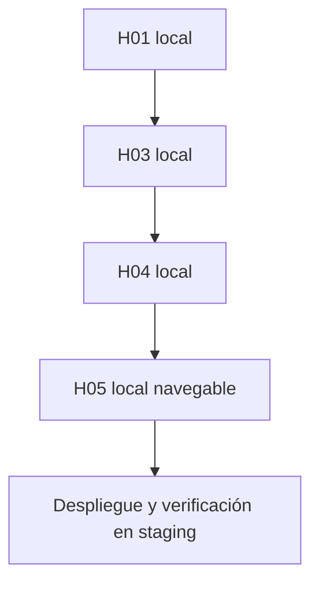

# ADR-009 — Despliegue cloud incremental en AWS

- Estado: Aceptado — revisión 2
- Fecha: 2026-09-13
- Decisores: Producto, Arquitectura, Operaciones y Seguridad
- Reemplaza: revisión 1 aprobada el 2026-09-12

## Contexto

ProPractix V2 necesita validar en un entorno real la configuración, las migraciones, los contenedores, el backup/restore y el rollback. Ese objetivo no debe bloquear la entrega de valor local: durante el Incremento 1 las historias H01, H03, H04 y H05 pueden completarse y cerrarse con su aceptación local antes del primer despliegue AWS.

`staging` sirve inicialmente a una sola persona. La prioridad operativa es minimizar recursos y desembolso, aprovechar los créditos del AWS Free Plan y no anticipar una topología de producción.

La cuenta AWS fue creada el 2026-09-13 bajo Free Plan. AWS documenta que el plan termina a los seis meses o al agotar créditos, lo que ocurra primero, y que la cuenta se cierra si no se convierte expresamente a Paid Plan. Esta conversión nunca será automática por decisión del proyecto.

AWS es solo infraestructura. Ningún bounded context, aggregate o caso de uso dependerá de AWS, y el entorno local seguirá ejecutándose mediante Docker Compose.

## Decisión

### Entornos y secuencia de valor

| Entorno | Propósito | Datos |
|---|---|---|
| `local` | Desarrollo y aceptación funcional individual | Fixtures locales |
| `test` | Pruebas automatizadas | Efímeros |
| `staging` | Validación integrada de H05 y releases posteriores | Sintéticos mientras las puertas de privacidad aplicables estén pendientes |
| `production` | Operación real | No se aprovisiona en el Incremento 1 |

El Incremento 1 mantiene un único `staging` AWS. No se crea un entorno permanente por rama ni por historia.

La aceptación local y la promoción cloud son hitos distintos:



Cerrar H01 localmente habilita sus sucesoras cuando sus propios gates estén cerrados. `CL0_CLOUD_STAGING` no bloquea ese cierre local ni obliga a desplegar una base sin recorrido funcional.

### Baseline de staging

La topología inicial será:

- región `eu-north-1` (Europa, Estocolmo);
- una instancia `t4g.small` ARM64 con Amazon Linux 2023, sujeta a verificación de disponibilidad y coste antes de cada aprovisionamiento;
- créditos CPU en modo `standard`, salvo nueva decisión explícita;
- un único volumen EBS `gp3` cifrado, inicialmente de 16 GiB;
- Docker Compose para Caddy, cliente web, Spring Boot y PostgreSQL 16;
- PostgreSQL en el mismo host, sin puerto público;
- dos repositorios privados ECR, imágenes inmutables y lifecycle de retención;
- SSM Parameter Store Standard; `SecureString` para valores sensibles;
- un bucket S3 operativo privado para backups y manifiestos de release;
- administración y despliegue mediante AWS Systems Manager;
- infraestructura reproducible con OpenTofu según ADR-011.

No habrá alta disponibilidad. RDS, App Runner, ECS, EKS, balanceadores, NAT Gateway, endpoints VPC de pago, AWS Backup y Secrets Manager quedan fuera de la baseline.

### Red y acceso

Hasta que H05 requiera acceso navegable:

- no se reserva Elastic IP;
- no se configura DNS ni TLS público;
- el Security Group no contiene reglas de entrada;
- no se abren 22, 80, 443 ni 5432;
- el acceso del único tester se realiza con Session Manager y port forwarding.

La instancia podrá recibir una IPv4 pública dinámica solo cuando sea necesaria para egress hacia SSM, ECR y repositorios de paquetes. Esa dirección no habilita ingreso, pero sí tiene precio horario. OpenTofu permitirá desactivarla, y el plan deberá mostrar su coste estimado antes de aplicar. Una alternativa sin IPv4 pública —IPv6 o endpoints privados— requerirá una evaluación posterior de coste y complejidad.

Cuando H05 esté lista se decidirá separadamente si continuar con port forwarding o añadir exposición pública, DNS, HTTPS y una dirección estable. Nada de ello se presupone en esta revisión.

### Artefactos y promoción

- Backend y frontend se construyen una vez en CI como imágenes OCI compatibles con `linux/arm64`.
- Cada imagen se etiqueta con el SHA completo; `latest` no identifica una release.
- Un manifiesto fija SHA y digest de cliente y servidor.
- CI se ejecuta en pull requests sin credenciales AWS.
- La promoción usa `workflow_dispatch`, GitHub Environment `staging` y aprobación humana.
- GitHub obtiene credenciales temporales mediante OIDC; no se crean access keys permanentes.
- El rol de despliegue solo puede publicar en los repositorios ECR aprobados, escribir manifiestos y enviar/consultar comandos SSM sobre la instancia de staging.
- La instancia obtiene imágenes y parámetros mediante su Instance Role.
- Flyway se ejecuta antes de declarar saludable la release.
- Readiness y smoke tests deben pasar antes de marcar la release activa.
- Un fallo recupera el manifiesto anterior; nunca ejecuta una down migration.

El `sub` OIDC esperado usa el formato inmutable actual de GitHub y el Environment `staging`:

```text
repo:omarjtoscano@206257688/propractix-v2@1367197608:environment:staging
```

El claim real y `aud=sts.amazonaws.com` se verificarán en un workflow diagnóstico antes de crear definitivamente la trust policy. No se permiten comodines de propietario o repositorio.

### Datos, secretos y copias

- No se almacenan secretos en Git, imágenes, Compose versionado, variables OpenTofu, state o logs.
- OpenTofu crea rutas y permisos de Parameter Store, pero los valores sensibles se introducen fuera de IaC.
- No se crea una clave KMS administrada por el cliente para esta baseline; se usan mecanismos administrados por AWS.
- `pg_dump` genera backups lógicos que se suben cifrados al bucket operativo.
- Antes de cerrar `CL0` se restaura un backup sintético en un PostgreSQL vacío y se verifica su contenido.
- Restore de base de datos es recuperación, no rollback ordinario de release.

### Coste y ciclo de vida de la cuenta

El objetivo es desembolso aproximado de 0 EUR mientras el Free Plan y sus créditos estén vigentes. El techo de producto es 20 EUR/mes, no un objetivo de consumo.

La cuenta Free Plan usa créditos para las instancias EC2 elegibles, incluida `t4g.small`. La prueba promocional específica de 750 horas mensuales de `t4g.small` hasta el 2026-12-31 es una oferta de corta duración del Paid Plan y no se presupone para esta cuenta mientras continúe en Free Plan.

La IPv4 pública dedicada cuesta actualmente USD 0,005 por hora. Mantener una durante 720 horas consumiría aproximadamente USD 3,60 de créditos al mes. El coste se vuelve a comprobar antes de `tofu apply` porque precios, elegibilidad y moneda son datos operativos temporales.

Se configura un AWS Budget equivalente al techo aprobado, con avisos al 50 %, 80 %, 100 % y forecast de superación, enviados a `omarjtoscano@outlook.com`. El Budget no es un freno automático del gasto.

No se compra Savings Plan, Reserved Instance ni se convierte la cuenta a Paid Plan sin aprobación humana. Se registran como hitos operativos el agotamiento de créditos y la fecha máxima aproximada 2027-03-13.

### Estado de `CL0_CLOUD_STAGING`

El gate usa tres estados:

1. `PENDING`: faltan controles de cuenta, infraestructura o evidencia.
2. `READY_FOR_APPLICATION`: cuenta y baseline están preparadas y probadas con artefactos sintéticos, sin exigir que H05 exista.
3. `CLOSED`: H05 fue desplegada y verificada con promoción, readiness, smoke, rollback y backup/restore.

`DEPLOYED_AND_VERIFIED` es una evidencia requerida para `CLOSED`, no un cuarto estado del gate.

## Relación con DDD y arquitectura hexagonal

- El dominio no importa SDK de AWS.
- Aplicación define puertos cuando necesita almacenamiento, correo, reloj u otras capacidades externas.
- Los adapters implementan esos puertos y `configuration` realiza el wiring.
- Cambiar EC2, ECR, S3 o el proveedor cloud no modifica aggregates ni políticas legales.
- País empresarial, locale, jurisdicción legal y región cloud permanecen separados.

## Consecuencias

- Las historias entregan valor y se aceptan localmente sin esperar infraestructura externa.
- El primer despliegue útil valida un recorrido navegable, no una carcasa técnica.
- `staging` tiene un único punto de fallo y no representa producción.
- La baseline consume créditos aunque el desembolso sea cero; coste cero y factura cero no son equivalentes.
- ARM64 se convierte en plataforma obligatoria de las imágenes desplegables mientras se mantenga `t4g.small`.
- Detener la instancia reduce cómputo e IPv4, pero EBS, ECR y S3 pueden seguir consumiendo créditos.
- Producción requerirá un ADR posterior sobre alta disponibilidad, recuperación, datos reales, seguridad y coste.

## Alternativas consideradas

- **Desplegar H01 inmediatamente:** rechazado; no entrega un recorrido navegable y bloqueaba artificialmente H03–H05.
- **EC2 privada con NAT Gateway:** rechazado por coste fijo innecesario.
- **Endpoints VPC para SSM/ECR/S3:** aplazados; aumentan coste y recursos para un solo tester.
- **IPv6-only:** viable, pero aplazado hasta demostrar que reduce coste sin dificultar herramientas o dependencias.
- **EIP desde el inicio:** rechazado; no hace falta una dirección estable antes de exponer H05.
- **RDS/ECS/Fargate/ALB/EKS:** rechazados para la baseline por coste y complejidad.
- **GHCR:** viable, pero se elige ECR privado para autenticación IAM sin PAT persistente.

## Conformidad

- `tofu fmt -check`, `tofu validate` y plan revisado.
- IAM Access Analyzer valida las políticas antes de aplicarlas.
- Root MFA habilitado y root sin access keys.
- `docker compose config` válido y sin secretos versionados.
- Security Group sin ingress y sin SSH/PostgreSQL públicos.
- OIDC real restringido al repositorio y Environment aprobados.
- Push/pull ECR y comando/Session Manager probados con artefactos sintéticos.
- Release fijada por SHA/digest, rollback sintético y backup/restore verificados.
- Budget, tags y ausencia de secretos en Git/state comprobados.
- `CL0` solo se cierra después de desplegar y verificar H05.

## Fuentes operativas consultadas

- [AWS: Choosing a plan](https://docs.aws.amazon.com/awsaccountbilling/latest/aboutv2/free-tier-plans.html), consultado el 2026-09-13.
- [AWS Free Compute](https://aws.amazon.com/free/compute/), consultado el 2026-09-13.
- [Amazon VPC Pricing](https://aws.amazon.com/vpc/pricing/), consultado el 2026-09-13.
- [Amazon EC2 FAQs — T4g free trial](https://aws.amazon.com/ec2/faqs/), consultado el 2026-09-13.
- [GitHub Actions OIDC reference](https://docs.github.com/en/actions/reference/security/oidc), consultado el 2026-09-13.

Los precios, promociones y condiciones de plan deben verificarse otra vez inmediatamente antes de aprovisionar, renovar o cambiar la modalidad de cuenta.
