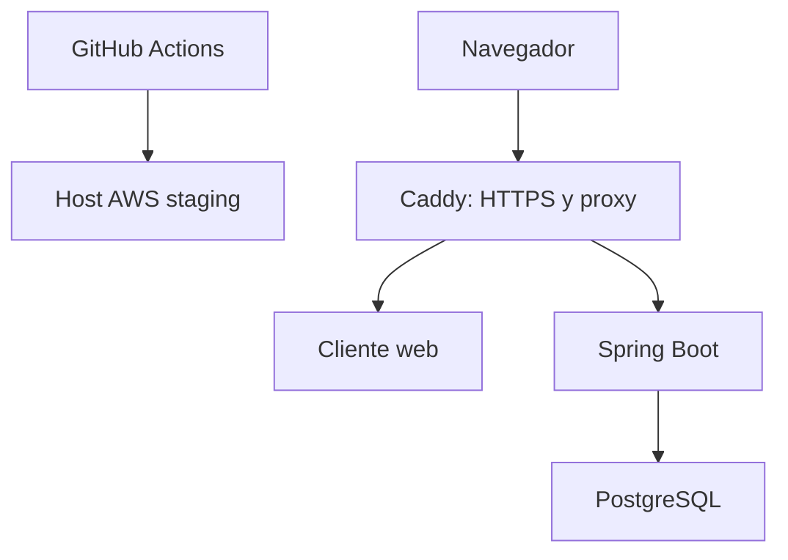

# ADR-009 — Despliegue cloud incremental en AWS

- Estado: Aceptado — revisión 1
- Fecha: 2026-09-12
- Decisores: Producto, Arquitectura, Operaciones y Seguridad

## Contexto

Cada incremento de ProPractix V2 debe terminar en una versión desplegable, demostrable y usable. El equipo necesita validar desde el Incremento 1 la configuración real, las migraciones, los contenedores, la observabilidad y el rollback sin asumir desde el principio el coste operativo de una plataforma de alta disponibilidad.

AWS permite comenzar con créditos y servicios elegibles, pero su oferta gratuita para cuentas nuevas es temporal. A 2026-09-12, el Free Plan ofrece hasta USD 200 en créditos y dura como máximo seis meses; por tanto, no se considera una base gratuita permanente ni se permitirá que su vencimiento convierta silenciosamente la cuenta a consumo pagado.

La solución debe seguir siendo portable. Ningún bounded context, aggregate o caso de uso dependerá de AWS, y el entorno local seguirá ejecutándose mediante Docker Compose.

## Decisión

### Entornos

Se mantienen cuatro perfiles con configuración externa y diferencias mínimas:

| Entorno | Propósito | Datos |
|---|---|---|
| `local` | Desarrollo individual | Fixtures locales |
| `test` | Pruebas automatizadas | Efímeros |
| `staging` | Demostración y validación de cada incremento | Sintéticos hasta cerrar las puertas de privacidad aplicables |
| `production` | Operación real | No se aprovisiona en el Incremento 1 |

El Incremento 1 creará un único entorno compartido `staging` en AWS. No se crea un entorno permanente por rama o incremento. Cada entrega aprobada sustituye de forma controlada la versión anterior y conserva una referencia al artefacto previo para rollback.

### Infraestructura inicial

La primera topología será un único host Linux elegible para el AWS Free Plan, con un mínimo de 2 GiB de memoria, ejecutando una release coordinada mediante Docker Compose:

- Se preferirá una instancia `t4g.small` cuando siga siendo elegible, esté disponible en la región y todas las imágenes soporten `linux/arm64`.
- El tamaño concreto se resuelve por configuración de infraestructura y puede sustituirse sin cambiar código de dominio.
- La región inicial preferida será Europa (España), actualmente `eu-south-2`, previa comprobación de disponibilidad de cada servicio. La región no se incrusta en Java, TypeScript ni imágenes.
- PostgreSQL comparte el host únicamente en `staging`. Usa un volumen persistente y una copia externa cifrada; esta decisión no autoriza la misma topología para producción.
- El frontend se entrega como contenido estático detrás de Caddy y el backend no se expone directamente.
- RDS, App Runner, ECS, balanceadores, NAT Gateway y Kubernetes quedan fuera de la baseline para evitar coste y complejidad prematuros.

Antes de que termine el Free Plan, Producto y Operaciones decidirán explícitamente entre mantener EC2 en modalidad pagada, trasladar el mismo stack portable a Lightsail o adoptar servicios administrados. Lightsail de 2 GiB, publicado a USD 12/mes en la fecha de este ADR, es una referencia de coste, no un compromiso ni una constante del sistema.

### Artefactos y despliegue

- Backend y frontend se construyen una sola vez en CI como imágenes OCI reproducibles.
- Toda imagen se etiqueta con el SHA completo del commit; `latest` no identifica una release desplegable.
- Un manifiesto de release fija los digests exactos del cliente y servidor.
- CI se ejecuta en cada pull request. El despliegue a `staging` requiere que las validaciones estén verdes y una aprobación del GitHub Environment.
- El workflow de despliegue recibe un commit o manifiesto aprobado mediante `workflow_dispatch`; no despliega automáticamente una rama de trabajo.
- GitHub autentica contra AWS mediante OIDC y un rol de permisos mínimos. No se guardan access keys de larga duración en GitHub.
- El host recibe la orden mediante AWS Systems Manager cuando la instancia y región lo permitan. No se abre SSH a Internet para automatizar despliegues.
- Flyway se ejecuta una sola vez antes de declarar saludable la nueva release.
- El despliegue comprueba readiness, ejecuta smoke tests y solo entonces marca la release como activa.
- Ante fallo, se recupera el manifiesto anterior. Una migración incompatible debe tener estrategia forward-compatible; rollback de imagen nunca deshace una migración aplicada.

### Datos, secretos y copias

- Ningún secreto se almacena en Git, imágenes, archivos Compose versionados o logs.
- Los secretos de `staging` se resuelven desde AWS Systems Manager Parameter Store o un mecanismo equivalente aprobado.
- PostgreSQL no expone su puerto públicamente.
- HTTPS es obligatorio fuera de `local`.
- Mientras `P0_PRIVACY` permanezca pendiente, `staging` utiliza exclusivamente datos sintéticos.
- Se ejecuta una copia lógica cifrada de PostgreSQL hacia almacenamiento externo compatible con S3 y se prueba su restauración antes de cerrar el incremento.
- Retención, frecuencia y eliminación de copias se configuran por entorno y deben alinearse con ML-15 antes de almacenar datos reales.

### Coste y seguridad de cuenta

La puerta `CL0_CLOUD_STAGING` exige antes del primer despliegue:

1. cuenta AWS y modalidad de facturación elegidas explícitamente por el propietario;
2. MFA en la cuenta raíz y ausencia de access keys del usuario raíz;
3. región y servicios comprobados;
4. presupuesto y alertas de consumo configurados;
5. rol OIDC de despliegue con permisos mínimos;
6. DNS/TLS o URL temporal aprobada;
7. parámetros y secretos creados fuera del repositorio;
8. destino, cifrado y restauración de backup verificados;
9. procedimiento de despliegue, health check y rollback probado;
10. fecha de vencimiento de créditos registrada y revisión previa calendarizada.

En el Free Plan no se activan servicios exclusivos del plan pagado. Migrar a Paid Plan requiere una decisión humana; las alertas de presupuesto no se consideran un límite duro de gasto.

## Relación con DDD y arquitectura hexagonal

AWS, Docker, DNS, almacenamiento y CI/CD son detalles de infraestructura:

- el dominio no importa SDK de AWS;
- aplicación define puertos cuando necesita archivos, correo, reloj u otras capacidades externas;
- los adapters implementan esos puertos;
- `configuration` realiza el wiring;
- cambiar de EC2 a Lightsail o a otro proveedor no modifica aggregates ni políticas legales;
- país empresarial, locale, jurisdicción y región cloud permanecen separados.

## Observabilidad mínima

- Spring Boot Actuator publica liveness y readiness sin datos sensibles.
- Logs JSON incluyen `correlationId`, release SHA y entorno.
- Los contenedores tienen rotación de logs y límites de recursos.
- Se registran despliegue iniciado, completado, fallido y rollback.
- Las métricas y alertas cloud adicionales se habilitan solo después de evaluar su coste.

## Alternativas consideradas

- **App Runner + RDS:** aplazado; simplifica operación, pero introduce coste fijo y más servicios antes de validar el producto.
- **ECS/Fargate + ALB:** rechazado para el MVP inicial por coste y complejidad.
- **Kubernetes:** rechazado; no existe una necesidad de orquestación que lo justifique.
- **Render gratuito:** rechazado como entorno persistente porque su PostgreSQL gratuito caduca.
- **Cloud Run + base externa:** viable, pero aplazado para evitar operar dos proveedores y conservar una ruta AWS coherente.
- **Solo despliegues locales:** rechazado porque no valida el requisito de incremento desplegable en un entorno real.

## Consecuencias

- El primer entorno será económico, portable y suficiente para demostraciones con poco tráfico.
- `staging` tendrá un único punto de fallo y no representa producción de alta disponibilidad.
- La aplicación deberá soportar `linux/arm64` si se elige `t4g.small`.
- Las migraciones y el rollback se ejercitan desde H01.
- El vencimiento de créditos se convierte en una decisión operativa visible.
- Producción requerirá un ADR posterior que evalúe base gestionada, alta disponibilidad, recuperación, capacidad, protección de datos y coste real.

## Fuentes de coste consultadas

- [AWS Free Tier](https://aws.amazon.com/free/), consultado el 2026-09-12.
- [AWS Free Compute](https://aws.amazon.com/free/compute/), consultado el 2026-09-12.
- [Amazon Lightsail Pricing](https://aws.amazon.com/lightsail/pricing/), consultado el 2026-09-12.
- [AWS App Runner Pricing](https://aws.amazon.com/apprunner/pricing/), consultado el 2026-09-12.

Los precios y condiciones promocionales son datos operativos temporales. Deben volver a comprobarse antes de aprovisionar o renovar recursos.

## Conformidad de la implementación

- `docker compose config` valida la release sin secretos versionados.
- Las imágenes están fijadas por digest/SHA y soportan la arquitectura seleccionada.
- CI puede construir y probar sin credenciales AWS.
- El despliegue usa OIDC, aprobación de entorno y permisos mínimos.
- Un fallo de migración, readiness o smoke test no marca la release como desplegada.
- El rollback al artefacto anterior está probado.
- El backup puede restaurarse en PostgreSQL vacío.
- El entorno no contiene datos reales mientras las puertas aplicables estén pendientes.
- El coste, vencimiento de créditos y recursos activos son observables por el propietario.
