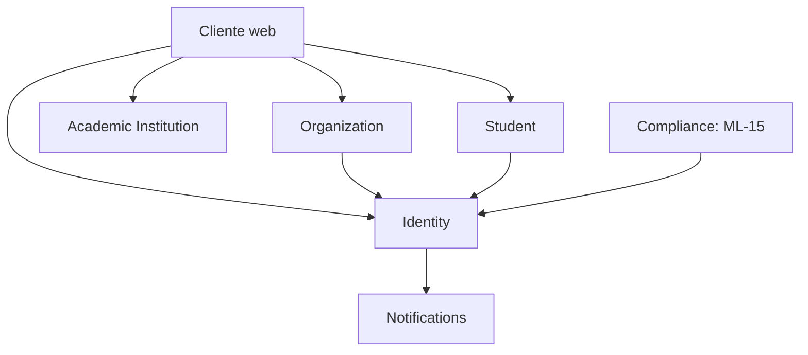
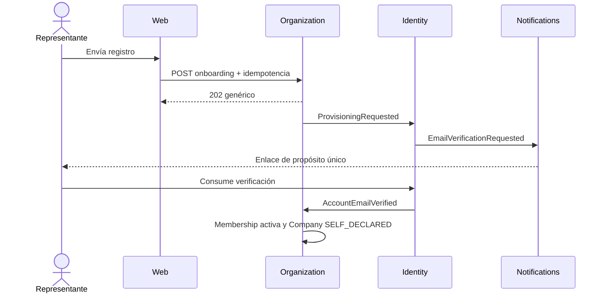

# Plan técnico propuesto — Incremento 1

- Estado: Pendiente de segunda revisión
- Fecha: 2026-09-12
- Rama: `increment/01-company-identity-catalog`
- Resultado: empresa y estudiante con cuentas verificadas, catálogo universitario consultable, declaración académica trazable y aislamiento tenant demostrado.
- Reemplaza: plan inicial revisado en `docs/reviews/revision-adrs-incremento-01.md`.

## 1. Decisiones de producto incorporadas

1. La empresa es el tenant principal y la universidad no necesita cuenta.
2. Verificar el correo activa la cuenta del administrador, pero la empresa queda `SELF_DECLARED`.
3. La verificación empresarial es independiente y será obligatoria antes de publicar ofertas en el Incremento 2.
4. Una `UserAccount` global puede actuar como estudiante y tener membresías en una o varias empresas.
5. El tenant activo se selecciona entre membresías vigentes y se incluye en un access token nuevo.
6. El catálogo inicial contiene universidades españolas gobernadas; la titulación es una declaración textual, no catálogo canónico.
7. La fundación puede desarrollarse con ML-15 pendiente, pero producción no acepta registros personales sin un aviso aprobado y vigente.
8. Cada historia funcional incluye API, OpenAPI, cliente, UI, español/inglés, seguridad y pruebas que le correspondan.

## 2. Puerta de preparación

No se inicia implementación no desechable hasta que los ADR aplicables estén en `Aceptado`.

Antes de exponer el primer registro con datos reales deben estar resueltos:

- finalidad y datos mínimos;
- responsable y contacto de privacidad;
- base jurídica validada;
- aviso versionado y aprobado;
- conservación de onboarding abandonado, verificaciones, idempotencia, outbox y auditoría;
- tratamiento de derechos y eliminación;
- distinción entre información, términos, consentimiento opcional y marketing.

En local/test se podrá usar una fixture claramente no productiva. Esa fixture no se exporta ni promueve. En staging/production, si no existe aviso `APPROVED` vigente, el API devuelve `503 privacy_policy_unavailable` antes de aceptar el body personal.

## 3. Alcance

Incluye:

- fundación reproducible, CI y límites arquitectónicos;
- catálogo consultable de universidades españolas;
- onboarding autónomo de empresa y primer administrador;
- verificación de correo y estados empresariales separados;
- login, refresh, logout y selección de empresa;
- lectura y edición mínima de “mi empresa” con aislamiento tenant;
- onboarding autónomo de estudiante;
- declaración de universidad y titulación;
- frontend mínimo accesible en español e inglés;
- OpenAPI y cliente TypeScript generado;
- observabilidad y pruebas E2E.

No incluye ofertas, candidaturas, entrevistas, prevalidación universitaria, convenios, firmas, prácticas, gates G1–G6, facturación, analytics ni workspace universitario.

## 4. Context map



Las flechas representan contratos públicos o eventos, no acceso a tablas internas. `platform` implementa outbox, idempotencia, auditoría y observabilidad por debajo de los puertos, sin aparecer como actor de negocio.

## 5. Modelo mínimo de datos

| Contexto | Tabla | Propósito |
|---|---|---|
| Identity | `identity_user_account` | Cuenta global, correo normalizado y estado. |
| Identity | `identity_password_credential` | Hash versionado de contraseña. |
| Identity | `identity_email_verification` | Verificación, expiración y consumo atómico. |
| Identity | `identity_refresh_session` | Familias refresh y tenant activo opcional. |
| Organization | `organization_company` | Empresa/tenant y estado de verificación empresarial. |
| Organization | `organization_membership` | Usuario, tenant, rol, estado y versión. |
| Organization | `organization_company_onboarding` | Process manager y evidencia mínima del aviso mostrado. |
| Student | `student_profile` | Identidad funcional del estudiante asociada a `UserId`. |
| Student | `student_onboarding` | Process manager y evidencia mínima del aviso mostrado. |
| Student | `student_academic_declaration` | Institución seleccionada/opcional y titulación declarada. |
| Academic Institution | `academicinstitution_institution` | Universidad catalogada y fuente. |
| Academic Institution | `academicinstitution_catalog_import` | Versión, fuente, hash y resultado de importación. |
| Compliance | `compliance_privacy_notice` | Aviso, finalidad, versión, vigencia y aprobación. |
| Platform | `platform_outbox_event` | Efectos durables. |
| Platform | `platform_event_consumption` | Deduplicación de consumidores. |
| Platform | `platform_idempotency_record` | Idempotencia sin almacenar requests sensibles. |
| Platform | `platform_security_audit` | Auditoría append-only de acciones sensibles. |

La migración de cada historia solo crea tablas necesarias para esa historia. No se crearán tablas futuras vacías.

## 6. Recorrido empresarial durable



Si el correo ya pertenece a una cuenta, la respuesta continúa siendo genérica y se envía al propietario un flujo seguro para autenticarse y continuar el onboarding; no se enlaza por coincidencia silenciosa.

## 7. Historias en orden

### I1-H01 — Fundación ejecutable mínima

**Actor y valor:** equipo de desarrollo; puede construir, probar y desplegar una base reproducible.

**Contextos:** ninguno de negocio; configuración y guardrails.

**Resultado observable:** checkout limpio compila con JDK 21, ejecuta migraciones en PostgreSQL 16, expone health/readiness mínimos y falla CI ante una dependencia arquitectónica prohibida.

**Incluye:**

- perfiles `local`, `test`, `staging`, `production` con diferencias mínimas;
- configuración tipada y validada; secretos externos;
- Flyway y `ddl-auto=validate`;
- ArchUnit con reglas ADR-001/002;
- logging JSON y `correlationId` básico;
- workflow CI backend, análisis de secretos y `git diff --check`;
- benchmark BCrypt documentado;
- esqueleto del contrato OpenAPI y pipeline de validación sin endpoints funcionales.

**Fuera:** tablas de negocio, registro, auth y frontend funcional.

**Pruebas/aceptación:** Maven Wrapper, contexto Spring, migración vacía, PostgreSQL Testcontainers, health/readiness sin secretos y violación ArchUnit de prueba controlada.

**Migración:** solo baseline técnico si es imprescindible; no crear tablas futuras.

### I1-H02 — Catálogo institucional consultable

**Actor y valor:** visitante/estudiante; encuentra una universidad española sin que esta se registre.

**Contexto propietario:** `academicinstitution`.

**Estado inicial/final:** importación gobernada publicada → resultados públicos paginados; el catálogo no crea afiliación ni elegibilidad.

**Contrato:**

- `GET /api/v1/academic-institutions?query=&cursor=&limit=`;
- OpenAPI design-first y cliente TypeScript generado;
- UI de búsqueda reutilizable, estados vacío/error/loading, ES/EN.

**Invariantes:** fuente, versión, fecha y hash de importación; nombres alternativos controlados; solo importaciones publicadas son consultables; “no encontrada” permanece disponible.

**Errores:** validación, rate limit de consulta si fuera necesario y fallo de catálogo sin exponer SQL.

**Eventos:** `InstitutionCatalogPublished` solo si una importación cambia la versión publicada.

**Migraciones:** institution e import metadata. Sin tabla de titulaciones.

**Pruebas:** dominio/importación, persistencia, paginación, OpenAPI, UI ES/EN, accesibilidad y consulta sin crear usuarios.

### I1-H03 — Registrar empresa y primer administrador

**Actor y valor:** representante empresarial; inicia adopción sin intervención universitaria.

**Propietario del proceso:** `organization.CompanyOnboarding`; `identity` actúa mediante eventos en transacción separada.

**Precondición:** aviso ML-15 aprobado en producción, rate limiting e idempotencia operativos.

**Estado final:** onboarding `EMAIL_PENDING` o estado recuperable; API siempre devuelve `202` genérico sin confirmar existencia del correo.

**Contrato/UI:**

- `POST /api/v1/company-onboardings` con `Idempotency-Key`;
- formulario empresa separado, aviso versionado, términos diferenciados, ES/EN;
- pantalla “revisa tu correo”, sin polling público enumerador.

**Datos mínimos propuestos:** razón social, nombre comercial opcional, país, identificador fiscal tipado por país, zona IANA, nombre del administrador, correo y contraseña. La lista final se contrasta con minimización ML-15 antes de aceptar la historia.

**Invariantes:** tenant generado por servidor; empresa inicia `SELF_DECLARED`; cuenta `PENDING_EMAIL`; rol inicial fijo `COMPANY_ADMIN`; no se aceptan IDs/roles del cliente; cuenta existente requiere continuación autenticada.

**Eventos:** `CompanyOnboardingSubmitted`, `AdministratorProvisioningRequested`, resultado de provisioning y `EmailVerificationRequested`.

**Fallos:** duplicados y cuenta existente no se revelan; fallo parcial queda reintentable; timeout conduce a `FAILED`/`EXPIRED` según política.

**Migraciones:** onboarding, company, user/credential, privacidad aplicable, outbox, idempotencia y auditoría necesarias.

**Pruebas:** invariantes, transacciones separadas, reintento, eventos duplicados, idempotencia concurrente, rate limit, enumeración, rollback local, body tenant ignorado/rechazado y no persistencia de contraseña/request.

### I1-H04 — Verificar correo empresarial

**Actor y valor:** administrador pendiente; demuestra control del correo y puede completar el acceso.

**Contextos:** `identity`, `notifications` y reacción de `organization`.

**Estado inicial/final:** cuenta `PENDING_EMAIL` → `ACTIVE`; onboarding `EMAIL_PENDING` → `READY`; membership activa; empresa continúa `SELF_DECLARED`.

**Contrato/UI:**

- el correo apunta a una ruta cliente con token en fragmento para evitar envío automático en logs/referer;
- el cliente elimina el fragmento del historial y ejecuta `POST /api/v1/email-verifications/consume`;
- `POST /api/v1/email-verifications/resend` responde de forma genérica;
- pantallas válida, expirada, usada y reenvío, ES/EN.

**Invariantes:** JWS con audiencia/propósito exclusivos, sin PII, clave separada, TTL; consumo atómico; reenvío invalida/controla versiones anteriores; outbox nunca contiene token utilizable.

**Eventos:** `AccountEmailVerified` y `CompanyOnboardingReady`.

**Migraciones:** verificación y delivery metadata si no fueron creadas en H03.

**Pruebas:** token válido, firma inválida, propósito/audiencia incorrectos, expirado, doble consumo concurrente, reenvío, caída del relay y recuperación sin duplicar efectos.

### I1-H05 — Sesión y acceso a mi empresa

**Actor y valor:** administrador verificado; inicia sesión y administra únicamente su empresa.

**Contextos:** `identity` y `organization` mediante contratos públicos.

**Estado final:** sesión refresh activa, access token en memoria y tenant autorizado seleccionado.

**Contrato/UI:**

- `POST /api/v1/auth/login`;
- `POST /api/v1/auth/refresh`;
- `POST /api/v1/auth/logout`;
- `POST /api/v1/auth/active-tenant`;
- `GET /api/v1/me`;
- `GET` y `PATCH /api/v1/companies/current`;
- login, selector de empresa y configuración mínima, ES/EN.

**Invariantes:** cuenta activa; membership vigente; tenant derivado; access JWT 10 minutos; refresh rotatorio máximo 30 días; CSRF/origin/cookies según ADR-007; versión optimista al editar empresa.

**Errores:** autenticación genérica, tenant no seleccionable, recurso no encontrado cross-tenant, concurrencia y rate limit.

**Eventos/auditoría:** login relevante, refresh reuse, tenant seleccionado, logout y cambio de empresa; sin datos sensibles.

**Migraciones:** refresh sessions y versión de membership/company.

**Pruebas:** login, claims, cookies, CORS, CSRF, Origin ausente/inválido, rotación concurrente, reuse detection, revocación de membresía, selección múltiple y lectura/escritura negativa entre empresas A/B.

### I1-H06 — Registrar y verificar estudiante

**Actor y valor:** estudiante; crea una cuenta independiente de cualquier empresa.

**Propietario del proceso:** `student.StudentOnboarding`; `identity` provisiona o enlaza cuenta mediante flujo seguro.

**Estado final:** `StudentProfile` activo asociado a `UserId`; sin membership empresarial implícita.

**Contrato/UI:**

- `POST /api/v1/student-onboardings` con idempotencia;
- reutiliza consumo/reenvío de verificación sin mezclar formularios;
- formulario y confirmación de estudiante, ES/EN.

**Precondición:** ML-15 aprobado en producción y rate limiting activo.

**Invariantes:** correo único global; cuenta existente requiere login o enlace firmado enviado a su correo; no se crea duplicado ni se enlaza silenciosamente; email institucional es indicio, no elegibilidad.

**Eventos:** `StudentOnboardingSubmitted`, provisioning/continuation y `StudentProfileActivated`.

**Migraciones:** student profile/onboarding y campos estrictamente necesarios.

**Pruebas:** cuenta nueva/existente, no enumeración, idempotencia, rate limit, verificación, ausencia de tenant/membership, acceso de otro usuario y minimización de datos.

### I1-H07 — Declaración académica

**Actor y valor:** estudiante autenticado; declara universidad y titulación para usos posteriores.

**Propietario:** `student`; consulta catálogo mediante contrato público de `academicinstitution`.

**Estado final:** declaración versionada student-owned con institution ID opcional y texto de institución/titulación proporcionado.

**Contrato/UI:**

- `GET /api/v1/students/me/academic-declaration`;
- `PUT /api/v1/students/me/academic-declaration` con versión optimista;
- selector de universidad más “no encontrada”; titulación como texto; ES/EN.

**Invariantes:** solo propietario; catálogo no demuestra afiliación; correo/dominio no confirma elegibilidad; se conserva qué parte fue seleccionada y cuál declarada libremente.

**Errores:** institución despublicada/desconocida, validación, concurrencia y resource not found no revelador.

**Eventos:** `AcademicDeclarationRecorded` con IDs mínimos, sin texto sensible en payload.

**Migraciones:** `student_academic_declaration`; ninguna tabla canónica de programas.

**Pruebas:** encontrada/no encontrada, cambios de catálogo, optimistic locking, estudiante A no lee/escribe declaración B, API/cliente/UI/i18n.

### I1-H08 — Cierre del incremento desplegable

**Actor y valor:** empresa, estudiante y operación; pueden completar y operar el recorrido acordado.

**Incluye:**

- E2E de empresa y estudiante desde navegador;
- prueba E2E con dos empresas y aislamiento de lectura/escritura;
- recuperación de onboarding y outbox;
- observabilidad, dashboards/alertas mínimas y runbook;
- build limpio, migración desde cero y backup/restore smoke test;
- auditoría de dependencias, secretos, accesibilidad e i18n;
- actualización de ADR y documentación con decisiones realmente implementadas.

**Fuera:** cualquier funcionalidad del Incremento 2.

**Aceptación:** versión desplegable que no depende de una historia futura; ML-15 aprobado para habilitar registros en el entorno productivo objetivo.

## 8. Estrategia de commits y revisión

- Un commit coherente por historia o subcambio técnico revisable.
- No empezar la historia siguiente con la anterior en rojo.
- Antes de cada commit:

```bash
npm run check
git diff --check
git diff --stat
git diff
git status --short
```

- Cada entrega documenta comandos ejecutados, resultados, pruebas omitidas y riesgo residual.
- `push`, merge o publicación requieren autorización y remoto autenticado; nunca force push.

## 9. Definition of Done del Incremento 1

- Journeys empresa y estudiante completos en ES/EN.
- Empresa `SELF_DECLARED`; ninguna UI la presenta como jurídicamente verificada.
- Universidad consultable sin registro ni workspace.
- Titulación declarada, no inventada como catálogo canónico.
- Aislamiento tenant y student-owned demostrado con pruebas negativas.
- OpenAPI, cliente y API sincronizados por historia.
- Migraciones reproducibles en PostgreSQL vacío.
- Tokens, idempotencia, outbox y auditoría sin secretos utilizables.
- Onboardings parciales recuperables y observables.
- Registro productivo bloqueado si ML-15 no está aprobado.
- Tests de dominio, aplicación, integración, contrato, frontend y E2E en verde.
- ADR reflejan la implementación; repositorio sin secretos ni artefactos locales.

## 10. Decisiones diferidas explícitamente

- Fuente definitiva y licencia del catálogo universitario: debe resolverse antes de aceptar I1-H02.
- Datos exactos y retención ML-15: requieren validación de privacidad antes de I1-H03/I1-H06 productivos.
- Umbrales concretos de rate limiting: se fijan con el despliegue objetivo antes de exponer cada endpoint.
- Proveedor de correo: adapter seleccionable; no altera dominio.
- Verificación empresarial: se diseñará antes de `G1_PUBLICATION` en el Incremento 2.
- Catálogo canónico de titulaciones: fuera del Incremento 1.

## 11. Condición para aprobar este plan

Una segunda revisión debe confirmar que:

1. los bloqueos B-01 y B-02 están resueltos;
2. ADR-001 a ADR-008 no se contradicen;
3. cada historia satisface Definition of Ready;
4. los pendientes de ML-15 y catálogo tienen owner y puerta explícita;
5. aprobar el plan no aprueba automáticamente textos o interpretaciones jurídicas.
