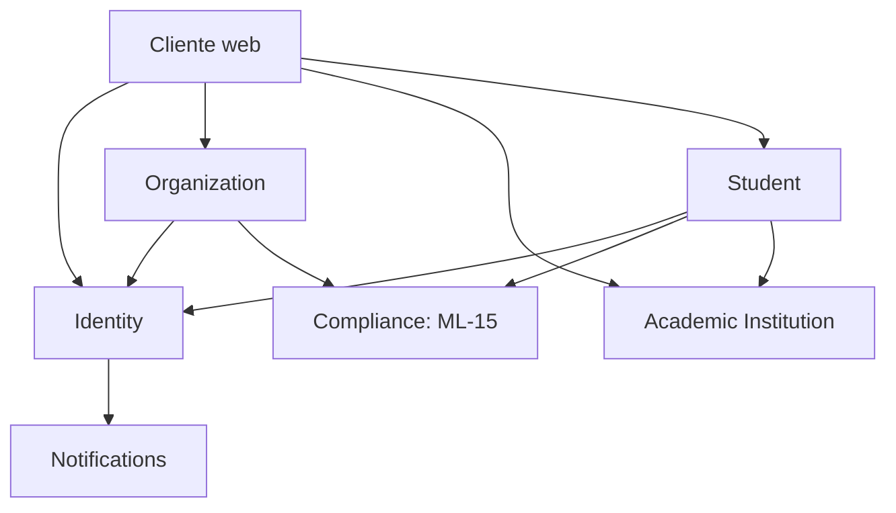

# Plan técnico propuesto — Incremento 1

- Estado: Aprobado — revisión 5
- Fecha: 2026-09-12
- Rama: `increment/01-company-identity-catalog`
- Resultado: empresa y estudiante con cuentas verificadas, catálogo universitario consultable, declaración académica trazable y aislamiento tenant demostrado.
- Reemplaza: revisión 4 aprobada en `docs/reviews/resolucion-revision-final-adrs-incremento-01.md`.

## 1. Decisiones de producto incorporadas

1. La empresa es el tenant principal y la universidad no necesita cuenta.
2. Verificar el correo activa la cuenta del administrador, pero la empresa queda `SELF_DECLARED`.
3. La verificación empresarial es independiente y será obligatoria antes de publicar ofertas en el Incremento 2.
4. Una `UserAccount` global puede actuar como estudiante y tener membresías en una o varias empresas.
5. El tenant activo se selecciona entre membresías vigentes y se incluye en un access token nuevo.
6. El catálogo inicial contiene universidades españolas gobernadas; la titulación es una declaración textual, no catálogo canónico.
7. La fundación puede desarrollarse con ML-15 pendiente, pero producción no acepta registros personales sin un aviso aprobado y vigente.
8. Cada historia funcional incluye API, OpenAPI, cliente, UI, español/inglés, seguridad y pruebas que le correspondan.
9. `student` es propietario del perfil y de la declaración académica; I1 registra una declaración no verificada e I3 la reconfirma para la candidatura.
10. H03 no recibe contraseña; H04 verifica el correo y crea la credencial directamente en `identity`.
11. El primer miembro empresarial usa `COMPANY_OWNER`.
12. País empresarial, locale y jurisdicción legal permanecen separados según D-005.
13. Países, locales, correspondencias y fallback proceden de configuración; toda etiqueta visible procede de i18n.
14. La referencia del aviso enviada por el cliente no es autoritativa: el servidor resuelve el aviso vigente y exige coincidencia exacta antes de escribir datos personales.
15. La unicidad fiscal se conserva durante la rotación mediante blind indexes para todas las versiones HMAC activas y un backfill verificable.
16. `DeliverNotification` pertenece a `notifications`; el handler de `VerificationId` pertenece a `identity`; el wiring vive en `configuration` y no crea la dependencia inversa.
17. Crear y verificar el correo del administrador deja la empresa `SELF_DECLARED`; la verificación/aprobación empresarial es un proceso separado del Incremento 2 y bloquea `G1_PUBLICATION`.
18. H03 rechaza dominios de correo público/común mediante `CompanyEmailAdmissionPolicy` versionada; un dominio corporativo propio sigue permitido aunque use Google Workspace o Microsoft 365 como proveedor.
19. La comprobación de ruta de correo es la validación técnica principal después de la política; `NO_MAIL_ROUTE` y un fallo DNS/infraestructura `INDETERMINATE` no rechazan la solicitud, la mantienen pendiente de verificación y activan reintentos.
20. Cada incremento aprobado se despliega en un único entorno AWS `staging`; H01 prepara y valida la baseline cloud portable definida por ADR-009.

## 2. Gates de preparación

No se inicia implementación no desechable hasta que los ADR aplicables estén en `Aceptado`.

| Gate | Estado | Owners | Bloquea | Resultado requerido |
|---|---|---|---|---|
| `D0_DECISIONS` | `CLOSED` | Producto + Arquitectura + Seguridad | I1-H01 | ADR-001 a ADR-009 aceptados; contextos, credencial, roles, duplicados, contratos, correo y despliegue alineados. |
| `F0_CLIENT_BASELINE` | `CLOSED` | Arquitectura + Frontend | I1-H02 | Versiones exactas, generador OpenAPI, router, i18n, testing, lockfile y política de actualización aprobados. |
| `C0_CATALOG` | `PENDING` | Producto + Datos + Legal/licencias | I1-H02 | Fuente, licencia, formato, actualización, publicación, rollback y fixture aprobados. |
| `B0_COMPANY_EMAIL_POLICY` | `PENDING` | Producto + Seguridad | I1-H03 | Revisión V1 completada; falta aprobar/publicar la versión inicial, revisar cobertura, ejercitar actualización/rollback y probar política, MX, `INDETERMINATE` y no enumeración. |
| `P0_PRIVACY` | `PENDING` | Producto + Privacidad/Legal + Seguridad | I1-H03 e I1-H06 con datos reales | ML-15, finalidad, campos, evidencia, base jurídica, derechos y retención aprobados. |
| `S0_PUBLIC_ENDPOINTS` | `PENDING` | Seguridad + Operaciones | Exposición pública de I1-H02 a I1-H06 | Límites por operación, claves pseudonimizadas, TTL, fail-closed, métricas, alertas y pruebas `429`/`Retry-After`. |
| `E0_EMAIL` | `PENDING` | Arquitectura + Operaciones + Seguridad + Privacidad/Legal | I1-H04 con correo real | Adapter, remitente/dominio, templates i18n, TTL, métricas, runbook, rol contractual, región, subencargados, retención/borrado, redacción e incident response aprobados. |
| `CL0_CLOUD_STAGING` | `PENDING` | Producto + Arquitectura + Operaciones + Seguridad | Cierre desplegado de I1-H01 y releases posteriores | Cuenta/modalidad AWS, MFA, región, presupuesto/alertas, OIDC, secretos, URL/TLS, backup/restore, despliegue/rollback y vencimiento de créditos aprobados. |

Los gates son decisiones/evidencias y no historias de implementación. `C0`, `B0`, `P0`, `S0`, `E0` y `CL0` pueden prepararse durante I1-H01 sin introducir funcionalidad anticipada. H01 está `READY` y puede construir la automatización portable; no puede declararse desplegada ni cerrar su aceptación cloud hasta cerrar `CL0_CLOUD_STAGING`. Cerrar D0 o aceptar los ADR no habilita datos reales, correo real ni endpoints públicos mientras sus gates permanezcan pendientes.

### Baseline F0 aprobada

| Capacidad | Versión/decisión |
|---|---|
| React / React DOM | 19.3.0 |
| TypeScript | 7.0.2 |
| Vite / plugin React | 8.3.0 / 6.1.1 |
| Router | React Router DOM 7.18.3 |
| i18n | i18next 26.4.2 / react-i18next 17.0.13 |
| Estado/formularios | TanStack React Query 5.102.8, Zustand 5.0.15, React Hook Form 7.88.0 y Zod 4.6.2 |
| Cliente OpenAPI | `@hey-api/openapi-ts` 0.99.0, Fetch generado |
| Tests | Vitest 5.0.0, Testing Library React 16.3.3, user-event 14.6.7 y Playwright 1.63.0 |

`package-lock.json` es obligatorio y CI usa `npm ci`. Los cambios mayores, el router, el generador o una nueva librería estructural requieren actualizar un ADR; menores/parches requieren pull request, pruebas y verificación del cliente generado.

### Contenido obligatorio de S0

Antes de exponer una operación pública, Seguridad y Operaciones registran por endpoint:

- límite, ventana y clave de configuración versionada;
- combinación de IP pseudonimizada, cuenta u otro sujeto permitido;
- versiones HMAC activas, TTL y procedimiento de rotación;
- comportamiento fail-closed y excepción operativa explícita, si existiera;
- `429 rate_limited`, `Retry-After` y copy resuelto por i18n;
- métricas, umbrales, alertas y runbook sin PII;
- pruebas de límite, recuperación, concurrencia y caída del adapter.

Antes de exponer el primer registro con datos reales deben estar resueltos:

- política versionada de dominios empresariales admitidos y comportamiento fail-closed;
- comprobación técnica principal de ruta de correo con resultados `MAIL_CAPABLE`, `NO_MAIL_ROUTE` e `INDETERMINATE`, sin rechazo por fallo de infraestructura;
- finalidad y datos mínimos;
- responsable y contacto de privacidad;
- base jurídica validada;
- aviso versionado y aprobado;
- conservación de onboarding abandonado, verificaciones, idempotencia, outbox y auditoría;
- tratamiento de derechos y eliminación;
- distinción entre información, términos, consentimiento opcional y marketing.

En local/test se podrá usar una fixture claramente no productiva. Esa fixture no se exporta ni promueve. En staging/production, si no existe aviso `APPROVED` vigente, el API devuelve `503 privacy_policy_unavailable` antes de aceptar el body personal.

## 3. Alcance

Incluye:

- fundación reproducible, CI y límites arquitectónicos;
- catálogo consultable de universidades españolas;
- onboarding autónomo de empresa y primer administrador;
- verificación de correo y estados empresariales separados;
- login, refresh, logout y selección de empresa;
- lectura y edición mínima de “mi empresa” con aislamiento tenant;
- onboarding autónomo de estudiante;
- declaración de universidad y titulación;
- frontend mínimo accesible en español e inglés;
- OpenAPI y cliente TypeScript generado;
- observabilidad y pruebas E2E.

No incluye ofertas, candidaturas, entrevistas, prevalidación universitaria, convenios, firmas, prácticas, gates G1–G6, facturación, analytics ni workspace universitario.

## 4. Context map



Las flechas van del consumidor al proveedor de un contrato público o capacidad; no representan acceso a tablas internas. `identity` prepara destinatario y enlace en memoria y solicita la entrega a `notifications`; no existe la dependencia inversa. `platform` implementa outbox, idempotencia, rate limiting, auditoría y observabilidad por debajo de los puertos, sin aparecer como actor de negocio.

## 5. Modelo mínimo de datos

| Contexto | Tabla | Propósito |
|---|---|---|
| Identity | `identity_user_account` | Cuenta global, correo normalizado y estado. |
| Identity | `identity_password_credential` | Hash versionado de contraseña. |
| Identity | `identity_email_verification` | Verificación, expiración y consumo atómico. |
| Identity | `identity_refresh_session` | Familias refresh y tenant activo opcional. |
| Organization | `organization_company` | Empresa/tenant, país, locale y estado de verificación. |
| Organization | `organization_company_tax_fingerprint` | Blind indexes por empresa y versión HMAC activa para evitar duplicados durante rotaciones. |
| Organization | `organization_membership` | Usuario, tenant, rol, estado y versión. |
| Organization | `organization_company_onboarding` | Process manager y referencia autoritativa del aviso resuelta por servidor. |
| Student | `student_profile` | Identidad funcional del estudiante asociada a `UserId`. |
| Student | `student_onboarding` | Process manager y referencia autoritativa del aviso resuelta por servidor. |
| Student | `student_academic_declaration` | Institución seleccionada/opcional y titulación declarada. |
| Academic Institution | `academicinstitution_institution` | Universidad catalogada y fuente. |
| Academic Institution | `academicinstitution_catalog_import` | Versión, fuente, hash y resultado de importación. |
| Compliance | `compliance_privacy_notice` | Aviso, finalidad, versión, vigencia y aprobación. |
| Platform | `platform_outbox_event` | Efectos durables. |
| Platform | `platform_event_consumption` | Deduplicación de consumidores. |
| Platform | `platform_idempotency_record` | Idempotencia sin almacenar requests sensibles. |
| Platform | `platform_security_audit` | Auditoría append-only de acciones sensibles. |
| Platform | `platform_rate_limit_bucket` | Ventanas y contadores por fingerprints HMAC con TTL. |

La migración de cada historia solo crea tablas necesarias para esa historia. No se crearán tablas futuras vacías.

## 6. Recorrido empresarial durable

```mermaid
sequenceDiagram
    actor Admin as Representante
    participant Web
    participant Org as Organization
    participant Id as Identity
    participant Mail as Notifications
    Admin->>Web: Envía empresa, país, locale y correo; sin contraseña
    Web->>Org: POST onboarding + idempotencia
    Org-->>Web: 202 genérico
    Org->>Id: ProvisioningRequested(OnboardingId)
    Id->>Mail: Entrega transitoria de enlace
    Mail-->>Admin: Enlace de propósito único
    Admin->>Id: Verifica correo y crea contraseña
    Id->>Org: AccountEmailVerified
    Org->>Org: Membership activa y Company SELF_DECLARED
```

Si el correo ya pertenece a una cuenta, la respuesta continúa siendo genérica y se envía al propietario un flujo seguro para autenticarse y continuar el onboarding; no se enlaza por coincidencia silenciosa.

## 7. Historias en orden

### Matriz historia → ADR y gates de entrada

| Historia | ADR aplicables | Gates/predecesoras antes de empezar |
|---|---|---|
| I1-H01 | ADR-001, ADR-002, ADR-006, ADR-007, ADR-008, ADR-009 | `D0_DECISIONS` cerrado. ADR-004 se difiere hasta la primera historia que use IDs, reloj o concurrencia. `CL0_CLOUD_STAGING` no bloquea el inicio, pero sí declarar H01 desplegada/cerrada. |
| I1-H02 | ADR-001, ADR-002, ADR-004, ADR-005, ADR-006, ADR-007, ADR-008, ADR-009 | H01 + `C0_CATALOG` + `F0_CLIENT_BASELINE` + `S0_PUBLIC_ENDPOINTS`. |
| I1-H03 | ADR-001 a ADR-009 | H01 + `B0_COMPANY_EMAIL_POLICY` + `P0_PRIVACY` + `S0_PUBLIC_ENDPOINTS`. |
| I1-H04 | ADR-001 a ADR-009 | H03 + `E0_EMAIL` + `S0_PUBLIC_ENDPOINTS`. |
| I1-H05 | ADR-001 a ADR-009 | H04 + `S0_PUBLIC_ENDPOINTS`. |
| I1-H06 | ADR-001 a ADR-009 | H04 + H05 + `P0_PRIVACY` + `S0_PUBLIC_ENDPOINTS`. |
| I1-H07 | ADR-001 a ADR-009 | H02 + H06. |

La matriz identifica adopción documental. La conformidad de cada ADR se demuestra en las pruebas y evidencias de la historia; aceptar un ADR no da por ejecutadas esas pruebas.

### I1-H01 — Fundación ejecutable mínima

**Actor y valor:** equipo de desarrollo; puede construir, probar y desplegar una base reproducible.

**Contextos:** ninguno de negocio; configuración y guardrails.

**Precondición:** `D0_DECISIONS` cerrado y ADR-001, ADR-002, ADR-006, ADR-007, ADR-008 y ADR-009 aceptados. H01 no crea todavía las primitivas de ADR-004; se incorporan en H02, donde tienen un consumidor real. El trabajo local/CI puede empezar con `CL0_CLOUD_STAGING` pendiente, pero el despliegue real y el cierre cloud no.

**Resultado observable:** checkout limpio compila con JDK 21, ejecuta migraciones en PostgreSQL 16, expone health/readiness mínimos, falla CI ante una dependencia arquitectónica prohibida y produce una release OCI desplegable y verificable en el `staging` de ADR-009.

**Incluye:**

- perfiles `local`, `test`, `staging`, `production` con diferencias mínimas;
- configuración tipada y validada; secretos externos;
- catálogo de países/locales y fallback configurable, sin etiquetas de UI en código;
- Flyway y `ddl-auto=validate`;
- ArchUnit con reglas ADR-001/002;
- logging JSON y `correlationId` básico;
- workflow CI backend, análisis de secretos y `git diff --check`;
- imágenes OCI multi-arquitectura o compatibles con la arquitectura aprobada, etiquetadas por SHA y fijadas por digest en un manifiesto de release;
- Docker Compose de `staging`, Caddy/HTTPS, PostgreSQL privado, límites de recursos y configuración externa;
- workflow de despliegue con GitHub Environment, OIDC AWS, migración, readiness, smoke test y rollback;
- backup lógico cifrado y procedimiento de restauración, ejecutables cuando `CL0_CLOUD_STAGING` esté cerrado;
- benchmark BCrypt documentado;
- esqueleto del contrato OpenAPI y pipeline de validación sin endpoints funcionales.

**Fuera:** tablas de negocio, registro, auth y frontend funcional.

**Pruebas/aceptación:** Maven Wrapper, contexto Spring, migración vacía, PostgreSQL Testcontainers, health/readiness sin secretos, violación ArchUnit de prueba controlada, `docker compose config`, build de imágenes, ausencia de secretos, manifiesto inmutable y dry-run del workflow. Con `CL0` cerrado: despliegue, smoke test, rollback y restauración de backup en `staging`.

**Migración:** solo baseline técnico si es imprescindible; no crear tablas futuras.

### I1-H02 — Catálogo institucional consultable

**Actor y valor:** visitante/estudiante; encuentra una universidad española sin que esta se registre.

**Contexto propietario:** `academicinstitution`. Owners del dato: Producto + Datos + Legal/licencias mediante `C0_CATALOG`.

**Precondición:** H01 terminada y `C0_CATALOG`, `F0_CLIENT_BASELINE` y `S0_PUBLIC_ENDPOINTS` cerrados.

**Estado inicial/final:** importación gobernada publicada → resultados públicos paginados; el catálogo no crea afiliación ni elegibilidad.

**Contrato:**

- `GET /api/v1/academic-institutions?query=&cursor=&limit=`;
- puerto administrativo `PublishInstitutionCatalog` que recibe un artefacto CSV UTF-8 con esquema versionado, identificador de fuente, licencia/permiso, fecha efectiva y hash;
- la publicación es atómica; volver atrás significa republicar una versión anterior como nueva decisión auditada, nunca editar una importación histórica;
- OpenAPI design-first y cliente TypeScript generado;
- UI de búsqueda reutilizable, estados vacío/error/loading, ES/EN.

**Invariantes:** fuente, versión, fecha y hash de importación; nombres alternativos controlados; solo importaciones publicadas son consultables; “no encontrada” permanece disponible.

**Errores:** formato o licencia ausente, identificador duplicado/ambiguo, publicación concurrente, validación, rate limit configurado y fallo de catálogo sin exponer SQL.

**Eventos:** `InstitutionCatalogPublished` solo si una importación cambia la versión publicada.

**Migraciones:** institution e import metadata. Sin tabla de titulaciones.

**Criterios:** dado un artefacto válido y C0 aprobado, al publicarlo todas las consultas observan una sola versión; dado un artefacto inválido, la versión anterior permanece disponible; una institución no encontrada puede declararse como texto posteriormente.

**Pruebas:** dominio/importación, rollback de publicación fallida, persistencia, paginación, OpenAPI, UI ES/EN, accesibilidad, paridad i18n, consulta sin crear usuarios y `429` con `Retry-After` según S0.

### I1-H03 — Registrar empresa y primer administrador

**Actor y valor:** representante empresarial; inicia adopción sin intervención universitaria.

**Propietario del proceso:** `organization.CompanyOnboarding`; un handler durable invoca el puerto idempotente de `identity` fuera de la transacción de `organization`, y los resultados regresan mediante eventos.

**Precondición:** H01 terminada; `B0_COMPANY_EMAIL_POLICY`, `P0_PRIVACY` y `S0_PUBLIC_ENDPOINTS` cerrados antes de usar datos reales o exponer el endpoint; rate limiting e idempotencia operativos.

**Estado final:** onboarding `EMAIL_PENDING` o estado recuperable. Una solicitud que supera guards y validaciones devuelve `202` genérico sin confirmar existencia del correo o de la empresa; las políticas indisponibles, el aviso obsoleto y las violaciones de entrada conservan sus códigos estables.

**Contrato/UI:**

- `POST /api/v1/company-onboardings` con `Idempotency-Key`;
- request exacto: `legalName`, `tradeName?`, `registeredCountry`, `taxIdentifierType`, `taxIdentifier`, `timeZone`, `preferredLocale?`, `administratorName`, `administratorEmail` y `privacyNoticeReference { noticeId, version }`;
- no admite contraseña, tenant, estado ni rol;
- formulario empresa separado, aviso versionado, términos diferenciados y todas las etiquetas desde i18n;
- pantalla “revisa tu correo”, sin polling público enumerador.

**País e idioma:** `registeredCountry` se valida contra el catálogo configurado. Puede conservar un país cuya jurisdicción legal aún no esté soportada; esto no habilita ofertas o prácticas. El tipo/validador fiscal se resuelve por registro de estrategias, no por condicionales en `Company`. `preferredLocale` debe estar soportado o se resuelve mediante país→locale y fallback configurado, inicialmente `es`.

**Correo empresarial:** `administratorEmail` se normaliza y su dominio exacto se evalúa con la versión activa de `CompanyEmailAdmissionPolicy`. Los dominios públicos/comunes configurados se rechazan con `company_email_domain_not_allowed`; una política ausente o inválida produce `company_email_policy_unavailable` y cierra H03. La lista no vive en Java, TypeScript o JSX y todos los mensajes se resuelven mediante i18n.

Después, `EmailDomainRoutingVerificationPort` actúa como comprobación técnica principal. `MAIL_CAPABLE` continúa normalmente; `NO_MAIL_ROUTE`, calculado después de considerar la ruta implícita admitida, mantiene la solicitud pendiente de verificación y programa una nueva comprobación; timeout, `SERVFAIL`, resolver caído o fallo equivalente devuelven `INDETERMINATE` y hacen lo mismo con backoff. Ninguno rechaza H03. No se identifica ni bloquea al proveedor MX: un dominio propio alojado en Google Workspace, Microsoft 365 u otro servicio sigue permitido. Una verificación de enlace completada resuelve el estado técnico pendiente del onboarding.

**Invariantes:** tenant generado por servidor; empresa inicia `SELF_DECLARED`; cuenta `PENDING_EMAIL` sin credencial; rol inicial fijo `COMPANY_OWNER`; no se aceptan IDs/roles del cliente; cuenta existente requiere `ONBOARDING_CONTINUATION` y autenticación/reautenticación.

**Duplicado empresarial:** país, tipo fiscal y fingerprints HMAC normalizados para todas las versiones activas impiden otro tenant automático. El API conserva `202`; no revela coincidencia ni realiza claim. La continuación exige miembro autenticado o caso administrativo con evidencia independiente. Una rotación mantiene lectura/escritura de versiones activas, backfill verificable y unicidad durante altas concurrentes.

**Aviso autoritativo:** después del binding y antes de idempotencia o escritura con PII, `organization` resuelve en `compliance` el aviso vigente para onboarding empresarial. La referencia enviada debe coincidir exactamente. Si fue sustituida o manipulada responde `409 privacy_notice_changed`; la UI presenta el aviso nuevo y solicita confirmación explícita. Solo se persiste la referencia devuelta por el servidor.

**Eventos:** `CompanyOnboardingSubmitted`, `EmailDomainRoutingRecheckRequested` cuando corresponda, `AdministratorProvisioningRequested`, resultado de provisioning y `EmailVerificationRequested`.

**Estados y fallos:** `SUBMITTED → IDENTITY_PENDING → EMAIL_PENDING → READY`; `NO_MAIL_ROUTE` o `INDETERMINATE` conservan la progresión, dejan una comprobación técnica recuperable y nunca producen `READY` sin consumir el enlace; errores recuperables conservan el estado anterior y backoff; error terminal pasa a `FAILED`; una verificación no completada dentro del TTL configurado inicial `P7D` pasa a `EXPIRED`. Mientras la retención ML-15 conserve el onboarding, un reenvío al mismo correo puede crear una verificación nueva y devolverlo a `EMAIL_PENDING`; cambiar correo o reclamar una empresa coincidente exige recuperación autenticada o caso administrativo.

**Migraciones:** onboarding, company, `organization_company_tax_fingerprint`, user sin credencial, privacidad aplicable, outbox, idempotencia, rate limiting y auditoría necesarias. La PII mínima del process manager se cifra y se elimina o redacta según el valor aprobado en ML-15.

**Criterios:** dado un request válido, dominio admitido, ruta `MAIL_CAPABLE`, aviso autoritativo coincidente y empresa no duplicada, responde `202` y llega a `EMAIL_PENDING`; dado el mismo caso con `NO_MAIL_ROUTE` o `INDETERMINATE`, devuelve igualmente `202`, conserva evidencia mínima y programa reintento; dado un retry con la misma clave/fingerprint, devuelve la misma operación; ante cuenta o empresa coincidente, la respuesta no cambia y no se crea ni enlaza otro tenant; solo un dominio bloqueado o una política indisponible impiden crear el onboarding por esta decisión; un aviso ausente, expirado, sustituido, manipulado o de finalidad equivocada no crea idempotencia derivada del body ni persiste PII.

**Pruebas:** invariantes, país/locale soportado y fallback, jurisdicción no soportada sin fallback legal, correo Gmail/Outlook/Hotmail u otro dominio de fixture bloqueado, normalización/case, coincidencia exacta, dominio corporativo con hosting externo permitido, política ausente fail-closed, `MAIL_CAPABLE`, ruta implícita admisible, `NO_MAIL_ROUTE`, timeout, `SERVFAIL`, resolver caído, `INDETERMINATE` no bloqueante, backoff, adapter DNS determinista sin Internet, códigos/i18n, transacciones separadas, eventos duplicados, idempotencia concurrente, `429`/`Retry-After`, enumeración, duplicado fiscal antes/durante/después de rotación HMAC, dos altas concurrentes, todos los casos del aviso autoritativo, rollback local, body tenant ignorado/rechazado y ausencia de contraseña/request en persistencia.

### I1-H04 — Verificar correo y crear credencial empresarial

**Actor y valor:** administrador pendiente; demuestra control del correo y puede completar el acceso.

**Contextos:** `identity`, `notifications` y reacción de `organization`.

**Precondición:** H03 terminada y `E0_EMAIL` y `S0_PUBLIC_ENDPOINTS` cerrados antes de exponer verificación/reenvío o enviar correo real.

**Estado inicial/final:** cuenta `PENDING_EMAIL` → `ACTIVE`; onboarding `EMAIL_PENDING` → `READY`; membership activa; empresa continúa `SELF_DECLARED`.

**Contrato/UI:**

- el correo apunta a una ruta cliente con token en fragmento para evitar envío automático en logs/referer;
- el cliente elimina el fragmento del historial y ejecuta `POST /api/v1/email-verifications/complete` con token y contraseña nueva directamente contra `identity`;
- `POST /api/v1/email-verifications/resend` responde de forma genérica;
- pantallas válida, expirada, usada y reenvío, ES/EN.

**Entrega:** el outbox contiene solo `VerificationId`; un handler de `identity` recupera destinatario, genera JWS y llama al puerto de correo con datos transitorios. `notifications` no persiste destinatario/enlace/token ni consulta `identity`.

**Invariantes:** `INITIAL_CREDENTIAL_SETUP` permite crear una única credencial; `ONBOARDING_CONTINUATION` nunca cambia la credencial y exige autenticación/reautenticación; JWS sin PII, clave separada y TTL configurable; consumo y alta del hash atómicos; la contraseña no llega a idempotencia/eventos; reenvío invalida enlaces anteriores; outbox nunca contiene token utilizable.

**Eventos:** `AccountEmailVerified` y `CompanyOnboardingReady`.

**Migraciones:** verificación y credencial si no fueron creadas en H03; ninguna tabla propia de `notifications` en I1.

**Errores:** respuesta no enumeradora para token/reenvío, validación de contraseña, propósito inválido, expiración y `429 rate_limited` con `Retry-After`.

**Criterios:** dado un token válido y contraseña aceptable, se consume una vez, se crea el hash y la cuenta queda `ACTIVE`; un segundo consumo o un token invalidado nunca cambia credenciales; la empresa permanece `SELF_DECLARED`; verificación y reenvío respetan los límites aprobados en S0.

**Pruebas:** token válido, firma inválida, propósito/audiencia incorrectos, contraseña inválida, expirado, doble consumo concurrente, reenvío, `429`/`Retry-After` por operación, datos transitorios no registrados, caída del relay y recuperación sin duplicar efectos de dominio.

### I1-H05 — Sesión y acceso a mi empresa

**Actor y valor:** administrador verificado; inicia sesión y administra únicamente su empresa.

**Contextos:** `identity` y `organization` mediante contratos públicos.

**Precondición:** H04 terminada y `S0_PUBLIC_ENDPOINTS` cerrado antes de exponer login, refresh o selección de tenant.

**Estado final:** sesión refresh activa, access token en memoria y tenant autorizado seleccionado.

**Contrato/UI:**

- `POST /api/v1/auth/login`;
- `POST /api/v1/auth/refresh`;
- `POST /api/v1/auth/logout`;
- `POST /api/v1/auth/active-tenant`;
- `GET /api/v1/me`;
- `GET` y `PATCH /api/v1/companies/current`;
- login, selector de empresa y configuración mínima; etiquetas y mensajes desde i18n.

**Seguridad de selección:** `active-tenant` exige bearer y no usa refresh cookie. `refresh` usa cookie, CSRF y Origin; puede recibir un tenant preferido no secreto, pero vuelve a comprobar la membership. Toda lectura/escritura tenant-owned de I1 revalida membership en application y filtra tenant en persistencia.

**Idioma inicial:** preferencia explícita del usuario → locale empresarial → correspondencia configurada de `registeredCountry` → fallback configurado `es`. El resultado no altera jurisdicción ni reglas legales.

**Invariantes:** cuenta activa; membership vigente; tenant derivado; access JWT 10 minutos; refresh rotatorio máximo 30 días; CSRF/origin/cookies según ADR-007; versión optimista al editar empresa.

**Errores:** autenticación genérica, tenant no seleccionable, recurso no encontrado cross-tenant, concurrencia y rate limit.

**Eventos/auditoría:** login relevante, refresh reuse, tenant seleccionado, logout y cambio de empresa; sin datos sensibles.

**Migraciones:** refresh sessions y versión de membership/company.

**Criterios:** una cuenta con varias memberships solo obtiene un token tenant para una membership activa; revocarla impide selección, refresh y acceso a “mi empresa”; cambiar locale no cambia país ni jurisdicción.

**Pruebas:** login, claims, cookies, CORS, CSRF, Origin ausente/inválido, `active-tenant` sin bearer, refresh con tenant no autorizado, rotación concurrente, reuse detection, revocación de membresía, selección múltiple, `429`/`Retry-After` en login y demás operaciones públicas definidas por S0, fallback i18n y lectura/escritura negativa entre empresas A/B.

### I1-H06 — Registrar y verificar estudiante

**Actor y valor:** estudiante; crea una cuenta independiente de cualquier empresa.

**Propietario del proceso:** `student.StudentOnboarding`; `identity` provisiona o enlaza cuenta mediante flujo seguro.

**Estado inicial/final:** onboarding `SUBMITTED → IDENTITY_PENDING → EMAIL_PENDING → READY`; `StudentProfile` activo asociado a `UserId`; sin membership empresarial implícita.

**Contrato/UI:**

- `POST /api/v1/student-onboardings` con idempotencia;
- request exacto: `name`, `email`, `preferredLocale?` y `privacyNoticeReference { noticeId, version }`; no admite contraseña, tenant o rol;
- responde `202` genérico y reutiliza creación inicial de credencial/reenvío sin mezclar formularios;
- formulario y confirmación de estudiante con textos i18n.

**Precondición:** H04 y H05 terminadas; `P0_PRIVACY` y `S0_PUBLIC_ENDPOINTS` cerrados antes de usar datos reales o exponer el endpoint.

**Invariantes:** correo único global; cuenta nueva usa `INITIAL_CREDENTIAL_SETUP`; cuenta existente usa `ONBOARDING_CONTINUATION` y exige autenticación/reautenticación; no se crea duplicado ni se enlaza silenciosamente; email institucional es indicio, no elegibilidad.

**Aviso autoritativo:** `student` resuelve el aviso vigente para onboarding estudiantil después del binding y antes de idempotencia o escritura. Ausencia, expiración, sustitución, manipulación o finalidad equivocada se resuelven igual que H03; solo se persiste la referencia devuelta por el servidor.

**Fallos:** backoff para provisioning/entrega; error terminal `FAILED`; verificación no completada dentro del TTL configurado `P7D` produce `EXPIRED`; mientras exista por retención, reenviar al mismo correo puede devolverlo a `EMAIL_PENDING`; todo resultado público evita enumeración.

**Eventos:** `StudentOnboardingSubmitted`, provisioning/continuation y `StudentProfileActivated`.

**Migraciones:** student profile/onboarding y campos estrictamente necesarios.

**Criterios:** un estudiante nuevo con aviso autoritativo coincidente completa verificación y credencial sin crear membership; una cuenta existente solo vincula el perfil después de autenticación; retries no duplican perfil ni cuenta; un aviso inválido no crea idempotencia derivada del body ni persiste PII.

**Pruebas:** cuenta nueva/existente, reautenticación, estados/expiración, no enumeración, idempotencia, todos los casos del aviso autoritativo, `429`/`Retry-After`, verificación, ausencia de tenant/membership, acceso de otro usuario, i18n y minimización de datos.

### I1-H07 — Declaración académica

**Actor y valor:** estudiante autenticado; declara universidad y titulación para usos posteriores.

**Propietario:** `student`; consulta catálogo mediante contrato público de `academicinstitution`.

**Estado final:** declaración versionada student-owned con institution ID opcional, snapshot del nombre mostrado y texto de institución/titulación proporcionado. Es personal, editable y `UNVERIFIED`.

**Contrato/UI:**

- `GET /api/v1/students/me/academic-declaration`;
- `PUT /api/v1/students/me/academic-declaration` con versión optimista;
- selector de universidad más “no encontrada”; titulación como texto; ES/EN.

**Invariantes:** solo propietario; catálogo no demuestra afiliación; correo/dominio no confirma elegibilidad; se conserva qué parte fue seleccionada, el snapshot histórico y cuál fue declarada libremente. Incremento 3 exige reconfirmación para la candidatura.

**Catálogo cambiante:** no se puede seleccionar de nuevo una institución despublicada. Una declaración existente la conserva con snapshot y estado `INSTITUTION_UNAVAILABLE`; el estudiante puede mantenerla históricamente o sustituirla. La lectura nunca falla solo porque el catálogo cambió.

**Errores:** institución no seleccionable, validación, concurrencia y resource not found no revelador.

**Eventos:** `AcademicDeclarationRecorded` con IDs mínimos, sin texto sensible en payload.

**Migraciones:** `student_academic_declaration`; ninguna tabla canónica de programas.

**Criterios:** guardar una selección publicada conserva ID+snapshot; “no encontrada” conserva texto; despublicar después no borra ni invalida la lectura histórica; cada actualización incrementa versión.

**Pruebas:** encontrada/no encontrada, institución despublicada antes/después de declarar, optimistic locking, estudiante A no lee/escribe declaración B, API/cliente/UI/i18n.

### Gate R1 — Cierre del incremento desplegable

No es una historia funcional ni acumula API/UI diferida. Verifica que empresa, estudiante y operación pueden completar y operar el recorrido construido en H01–H07.

**Incluye:**

- E2E de empresa y estudiante desde navegador;
- prueba E2E con dos empresas y aislamiento de lectura/escritura;
- recuperación de onboarding y outbox;
- observabilidad, dashboards/alertas mínimas y runbook;
- build limpio, migración desde cero y backup/restore smoke test;
- despliegue del manifiesto aprobado en AWS `staging`, health checks, smoke tests y rollback al manifiesto anterior;
- auditoría de dependencias, secretos, accesibilidad e i18n;
- actualización de ADR y documentación con decisiones realmente implementadas.

**Fuera:** cualquier funcionalidad del Incremento 2.

**Salida:** versión desplegada y validada en `staging` que no depende de una historia futura; ML-15 aprobado para habilitar registros reales en el entorno productivo objetivo. `Staging` permanece con datos sintéticos mientras las puertas de privacidad aplicables estén pendientes.

## 8. Estrategia de commits y revisión

- Un commit coherente por historia o subcambio técnico revisable.
- No empezar la historia siguiente con la anterior en rojo.
- Antes de cada commit:

```bash
npm run check
git diff --check
git diff --stat
git diff
git status --short
```

- Cada entrega documenta comandos ejecutados, resultados, pruebas omitidas y riesgo residual.
- `push`, merge o publicación requieren autorización y remoto autenticado; nunca force push.

## 9. Definition of Done del Incremento 1

- Journeys empresa y estudiante completos en ES/EN.
- Toda etiqueta, validación, acción, estado y error visible procede de i18n; CI verifica paridad y ausencia de literales de presentación no permitidos.
- Empresa `SELF_DECLARED`; ninguna UI la presenta como jurídicamente verificada.
- País, locale y jurisdicción permanecen separados; añadir configuración de país/locale no modifica aggregates y no existe fallback jurídico.
- Universidad consultable sin registro ni workspace.
- Titulación declarada, no inventada como catálogo canónico.
- Aislamiento tenant y student-owned demostrado con pruebas negativas.
- OpenAPI, cliente y API sincronizados por historia.
- Migraciones reproducibles en PostgreSQL vacío.
- Tokens, idempotencia, outbox y auditoría sin secretos utilizables.
- Onboardings parciales recuperables y observables.
- Comprobación técnica de correo principal con `NO_MAIL_ROUTE` e `INDETERMINATE` recuperables y no bloqueantes; la cuenta nunca se activa sin consumir el enlace.
- Registro productivo bloqueado si ML-15 no está aprobado.
- Tests de dominio, aplicación, integración, contrato, frontend y E2E en verde.
- Release identificada por SHA/digest, desplegada en AWS `staging` mediante aprobación, con rollback y restauración de backup probados.
- ADR reflejan la implementación; repositorio sin secretos ni artefactos locales.

## 10. Gates externos aún pendientes

- `C0_CATALOG`: fuente definitiva, licencia y fixture antes de I1-H02.
- `B0_COMPANY_EMAIL_POLICY`: el código y la lista de V1 ya fueron contrastados; falta revisar cobertura, aprobar/publicar la versión inicial y demostrar actualización, rollback, política determinista, MX principal, `INDETERMINATE` no bloqueante y tests sin DNS real antes de I1-H03.
- `P0_PRIVACY`: finalidad, datos, base jurídica, evidencia, derechos y retención ML-15 antes de I1-H03/I1-H06 con datos reales.
- `S0_PUBLIC_ENDPOINTS`: límites, pseudonimización, TTL, fail-closed, métricas, alertas y pruebas antes de exponer cualquier endpoint público de I1-H02 a I1-H06.
- `E0_EMAIL`: proveedor, remitente, templates i18n, rol contractual, región/subencargados, retención/borrado, redacción, incident response y configuración operativa antes de I1-H04 con correo real.
- `CL0_CLOUD_STAGING`: cuenta/modalidad AWS, MFA, región, presupuesto/alertas, OIDC, secretos, URL/TLS, backup/restore, despliegue/rollback y vencimiento de créditos antes de declarar H01 desplegada.
- Verificación empresarial: se diseñará antes de `G1_PUBLICATION` en el Incremento 2.
- Catálogo canónico de titulaciones: fuera del Incremento 1.

## 11. Autorización de ejecución

La revisión 5 conserva resueltos BF-01 a BF-04, acepta ADR-001 a ADR-009 y mantiene `D0_DECISIONS` cerrado. Por tanto:

- I1-H01 queda `READY` y es la única historia autorizada para comenzar;
- I1-H02 a I1-H06 permanecen bloqueadas hasta cerrar los gates indicados en la matriz;
- I1-H07 permanece bloqueada por sus predecesoras;
- H01 puede implementar los artefactos cloud portables, pero no puede declararse desplegada/cerrada hasta resolver `CL0_CLOUD_STAGING` con el propietario de la cuenta;
- aceptar el plan no aprueba ML-15, licencias, valores de rate limiting, proveedor de correo ni verificación empresarial;
- ninguna historia puede omitir sus pruebas de conformidad por el hecho de que su ADR esté aceptado.
