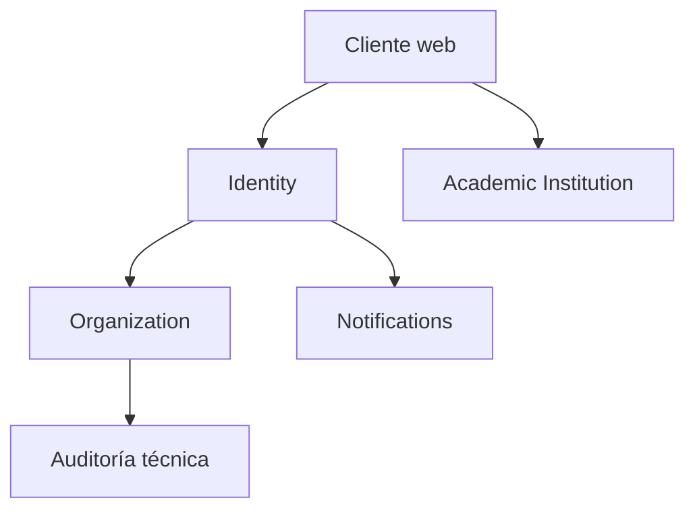
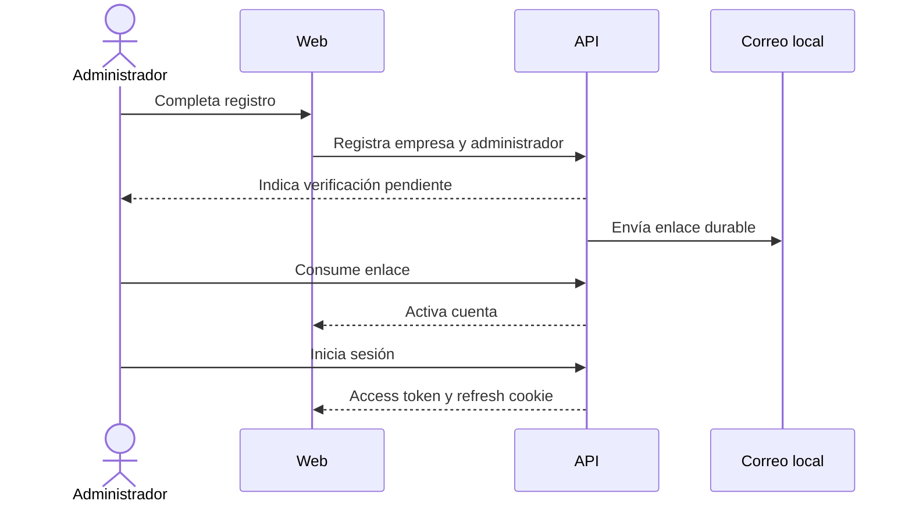
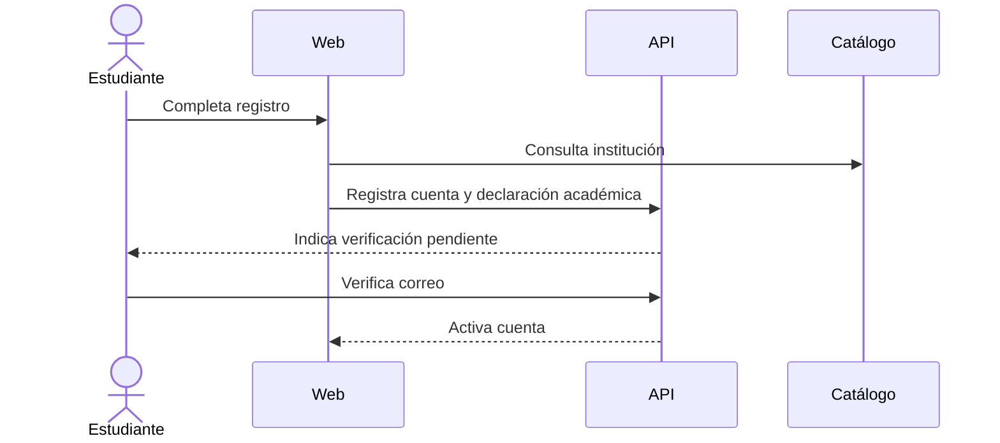

# Plan técnico propuesto — Incremento 1

- Estado: Pendiente de aprobación
- Fecha: 2026-09-12
- Rama: `increment/01-company-identity-catalog`
- Resultado: empresa, administrador y estudiante registrados y verificados; catálogo institucional consultable; aislamiento tenant demostrado.

## 1. Condición de inicio

No se implementará una historia funcional hasta que ADR-001 a ADR-008 estén en estado `Aceptado` o sus preguntas se hayan resuelto expresamente.

## 2. Alcance

Incluye:

- registro autónomo de empresa y primer administrador;
- verificación del correo;
- autenticación, renovación y cierre de sesión;
- registro autónomo de estudiante y verificación del correo;
- catálogo inicial de universidades y titulaciones declarables;
- consulta institucional sin workspace universitario;
- aislamiento entre empresas;
- frontend mínimo en español e inglés;
- migraciones, observabilidad, CI y pruebas necesarias para el recorrido.

No incluye:

- ofertas, candidaturas, entrevistas o selección;
- notificaciones a universidades;
- prevalidación académica;
- convenios, firmantes o documentos;
- prácticas, compliance o puertas legales posteriores;
- facturación, analytics o administración universitaria.

## 3. Context map inicial



- `identity` posee cuentas, credenciales, verificaciones y sesiones.
- `organization` posee empresas y membresías.
- `academicinstitution` posee el catálogo externo; una universidad no es tenant.
- `notifications` entrega correo desde eventos durables.
- Auditoría técnica registra acciones de seguridad sin convertirse todavía en un bounded context de negocio independiente.

## 4. Modelo mínimo de datos propuesto

| Contexto | Tabla | Propósito |
|---|---|---|
| Identity | `identity_user_account` | Cuenta, tipo de actor, estado y correo normalizado. |
| Identity | `identity_password_credential` | Hash y cambios de contraseña. |
| Identity | `identity_email_verification` | Token hasheado, expiración y consumo. |
| Identity | `identity_refresh_session` | Familias de refresh, rotación y revocación. |
| Organization | `organization_company` | Empresa tenant y estado de verificación. |
| Organization | `organization_membership` | Primer administrador y futuras membresías. |
| Academic Institution | `academicinstitution_institution` | Universidad o centro catalogado. |
| Academic Institution | `academicinstitution_email_domain` | Dominios declarados, sin asumir elegibilidad. |
| Academic Institution | `academicinstitution_program` | Titulaciones visibles cuando exista fuente mantenible. |
| Platform | `platform_outbox_event` | Efectos asíncronos durables. |
| Platform | `platform_idempotency_record` | Respuestas de operaciones repetibles. |

Las tablas definitivas se concretarán historia a historia. No se creará `internship`, `offer` ni `application` en este incremento.

## 5. Recorridos E2E

### Empresa



### Estudiante



El correo institucional es evidencia de afiliación aparente, no prueba de elegibilidad ni aprobación universitaria.

## 6. Historias y orden de implementación

### I1-H01 — Fundación ejecutable

Valor: el equipo puede levantar y validar el producto de forma reproducible.

- Configurar JDK 21, PostgreSQL 16, perfiles `local` y `test`.
- Añadir Flyway, ArchUnit, health check y logging estructurado mínimo.
- Crear CI backend y controles de secretos.
- Mantener `/actuator/health` sin exponer información sensible.
- Pruebas: contexto Spring, migración en base vacía, arquitectura y composición local.

### I1-H02 — Registrar empresa y primer administrador

Valor: una empresa puede iniciar su adopción sin intervención universitaria.

- Crear `Company`, `UserAccount` y `Membership` mediante un único caso de uso transaccional.
- Estado inicial pendiente de verificación.
- Normalizar correo y evitar duplicados sin revelar cuentas existentes.
- Exigir idempotencia.
- No aceptar tenant ni rol privilegiado desde el cliente.
- Pruebas: invariantes, rollback completo, duplicados, idempotencia y validación HTTP.

### I1-H03 — Verificar correo empresarial

Valor: el primer administrador demuestra control del correo y activa su acceso.

- Emitir evento durable y enviar enlace de un solo uso.
- Consumir token con expiración y respuesta segura ante repetición.
- Activar cuenta y empresa según la decisión de producto aprobada.
- Pruebas: token válido, expirado, consumido, desconocido y reintento de entrega.

### I1-H04 — Iniciar, renovar y cerrar sesión

Valor: el administrador accede de forma segura a su tenant.

- Implementar login, JWT corto, refresh cookie rotatoria y logout.
- Añadir CSRF, origin allowlist, rate limit y detección de reutilización.
- Derivar `CurrentActor` y `TenantId` desde la autenticación.
- Pruebas: credenciales inválidas, cuenta no verificada, rotación, reuse detection, CSRF y acceso cruzado.

### I1-H05 — Registrar y verificar estudiante

Valor: un estudiante dispone de cuenta independiente para futuros procesos.

- Formulario y caso de uso separados de empresa.
- Cuenta global sin membresía empresarial.
- Verificación de correo con las mismas garantías de seguridad.
- Pruebas: separación de roles, duplicados, enumeración y verificación.

### I1-H06 — Consultar catálogo y declarar institución

Valor: el estudiante declara universidad y titulación sin obligar a la institución a registrarse.

- Cargar un catálogo inicial trazable y administrado por migración o importación controlada.
- Permitir búsqueda paginada.
- Registrar una declaración académica separada del catálogo canónico.
- Marcar correo/dominio como indicio, nunca como elegibilidad validada.
- Pruebas: catálogo, institución desconocida, declaración y ausencia de permisos universitarios.

### I1-H07 — Cerrar recorrido desplegable

Valor: empresa y estudiante completan el flujo en español e inglés.

- Integrar frontend React/TypeScript y cliente generado desde OpenAPI.
- Añadir estados de carga, error, reenvío y expiración.
- Crear E2E prioritarios y prueba negativa multi-tenant.
- Completar observabilidad y guía de despliegue.
- Ejecutar build limpio desde checkout vacío.

## 7. Estrategia de pruebas

| Nivel | Alcance |
|---|---|
| Dominio | Invariantes sin Spring ni base de datos. |
| Aplicación | Casos de uso con puertos falsos y reloj controlado. |
| Persistencia | PostgreSQL real mediante Testcontainers. |
| Seguridad | Autorización, tenant, CSRF, rotación y enumeración. |
| Contrato | OpenAPI frente a API y cliente generado. |
| Frontend | Componentes y formularios en `es` y `en`. |
| E2E | Registro/verificación/login de empresa y estudiante. |

## 8. Puertas de revisión por historia

Antes de cada commit:

```bash
npm run check
git diff --check
git diff --stat
git diff
git status --short
```

Cada historia tendrá un commit coherente y una demostración del comportamiento. No se iniciará la siguiente si la actual no compila, no pasa sus pruebas o deja migraciones inconsistentes.

## 9. Decisiones de producto que requieren aprobación

1. ¿La empresa queda activada solo con verificar el correo o requiere una revisión interna adicional?
2. ¿El registro de estudiante será completamente autónomo desde el primer lanzamiento?
3. ¿Qué datos mínimos de empresa se pedirán: razón social, nombre comercial, país, identificador fiscal y zona horaria?
4. ¿El catálogo inicial incluirá solo universidades españolas o también centros adscritos?
5. ¿Quién mantendrá el catálogo y con qué fuente verificable?
6. ¿Se ofrecerá selección “institución no encontrada” para revisión manual?

## 10. Evidencia exigida al finalizar el incremento

- URL o procedimiento de despliegue reproducible.
- OpenAPI y cliente sincronizados.
- migraciones sobre base vacía;
- resultados de tests backend, frontend y E2E;
- prueba negativa entre dos tenants;
- idiomas español e inglés completos;
- ADR aceptados y documentación actualizada;
- diff revisado y repositorio sin secretos ni artefactos generados.
